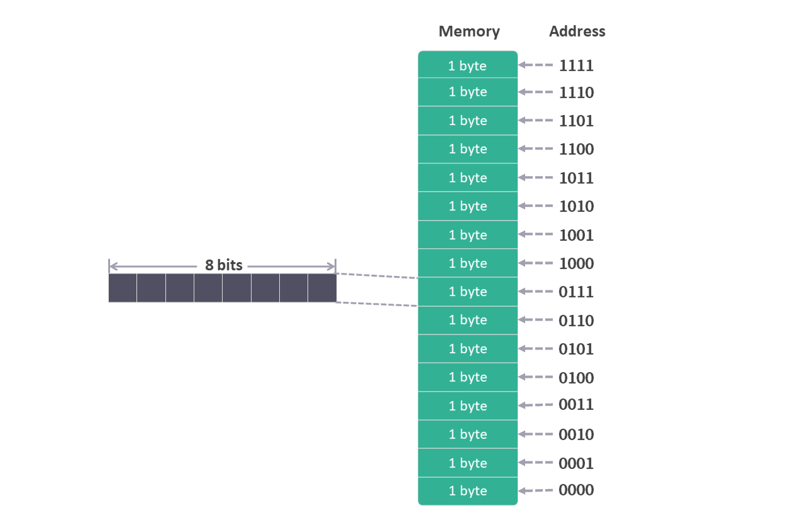
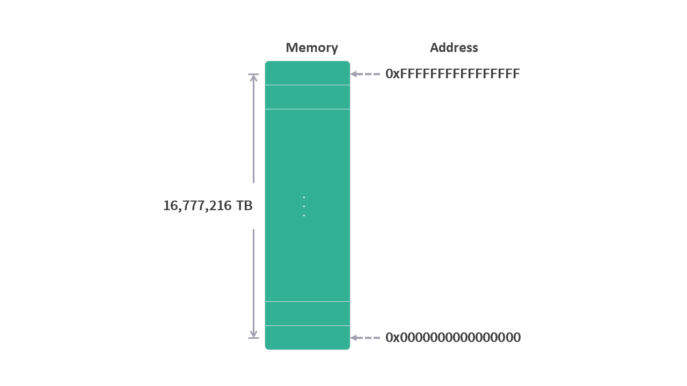

# 01 从程序的角度看，内存是什么？

这个系列是我学习《深入理解计算机系统》的笔记。

本篇文章是学习第三章内容的第一篇笔记，对应书本第 13 页的内容。

第三章中其实并没有专门讲解内存的定义，只是在之前的章节有所提及。第一篇笔记之所以从介绍内存开始，是因为我希望在进入正题之前能从全局的角度了解一下内存，毕竟之后的内容中主要操作的存储单元之一就是内存。

如果说程序就是一个状态机的话，内存就是保存状态的地方。

本文分为 4 个部分：
* 内存的基本概念
* 64 位操作系统内存空间
* 48 位寻址空间
* 虚拟内存

现在，让我们进入笔记的正题吧。

## 1. 内存的基本概念

从程序的角度，我们可以把内存想象成一个连续的数组，数组中的每个元素的大小是 1 字节（byte）。

在数组中访问一个元素可以使用索引，同样在内存中为了能访问元素，也为每个元素配置了地址。

在上面的这个类比中我们可以看出，内存对于程序来说有这么几个特性：

1. 内存的最小空间是1个字节（byte），也就是 8 位（bit）。

2. 内存是由许多这样的空间组合在一起的。

3. 每个空间都有一个地址。

以一个 4 位寻址空间的内存为例，我们用图形的方式来模拟一下内存的样子。

什么是 4 位寻址空间？这是指内存地址的范围是用 4 位（bit）的二进制表示，从 0000 到 1111，换算成十进制就是 0 ~ 15。

因为每个地址只能保存 1 个字节（byte）的数据，所以这个内存的容量就是 16 个字节( $2^{4}$ =16 )。

<figure>
    
</figure>

## 2. 64 位操作系统内存空间

现代的操作系统都是 64 位，也就是说理论上支持 64 位寻址空间的内存，用二进制表示：

0000000000000000000000000000000000000000000000000000000000000000（64个0）

~

1111111111111111111111111111111111111111111111111111111111111111（64个1）

二进制的字符太长，换算成十六进制（每 4 位二进制数转换成 1 位十六进制数）：

0x0000000000000000（16个0）~ 0xFFFFFFFFFFFFFFFF（16个F）

这么大的寻址空间如果都填满，内存最多可以存储多少数据呢？

$2^{64}$ = 18,446,744,073,709,551,616 字节（byte），大概是16,777,216 TB。

<figure>
    
    <figcaption align="center">
</figure>

## 3. 48 位寻址空间

64 位的寻址空间实在是太大了，根据 AMD64 架构的规定，其实内存地址只用 48 位地址，具体规则如下：

>一个表示内存地址的 64 位指针只有低 48 位有效，并带符号扩展到64位。换句话说，其高 16 位必须是全 1 或全 0，而且必须与低48位的最高位（第 47 位）一致。

根据上面的规则，内存地址分为如下两段：

1. 二进制表示：

    0000000000000000 000000000000000000000000000000000000000000000000（64个0）

    ~

    0000000000000000 011111111111111111111111111111111111111111111111（17个0，47个1）

    十六进制表示：0x0000000000000000 ~ 0x00007FFFFFFFFFFF（128T）

2. 二进制表示：

    1111111111111111 100000000000000000000000000000000000000000000000（17个1，47个0）

    ~

    1111111111111111 111111111111111111111111111111111111111111111111（64个1）

    十六进制表示：0xFFFF800000000000 ~ 0xFFFFFFFFFFFFFFFF（128T）

<figure>
    
</figure>

## 4. 虚拟内存

上面提到的内存，跟我们日常生活中见到的内存条好像有些不同。现实中，我们没有见过以 T 为单位的内存条，大多数的内存条都是 8G / 16G / 32G等。

可以想象一个内存使用的场景，一台有 32 G 物理内存的计算机，正在运行着浏览器，Word 等程序。这时候内存的使用情况大概是什么样子呢？

如果操作系统是 Windows，打开任务管理器就能看到，每个程序都占用着一定数量的物理内存空间。这时候我们可能会认为，程序可以直接操作分配给应用程序的物理内存空间。

然而真实情况是，程序本身是无法直接操作物理内存的，程序所能操作的是虚拟内存。

虚拟内存有这么几个特点：
1. 每个程序都感觉自己单独拥有系统的整个内存。
2. 每个程序实际可以使用的内存寻址空间是 0x0000000000000000 ~ 0x00007FFFFFFFFFFF （通常程序的起始地址也不是从 0 开始的，详情请看下一篇文章）。
3. 0x0000800000000000 ~ 0xFFFFFFFFFFFFFFFF 这段寻址空间的内存属于操作系统内核虚拟内存。

<figure>
    
</figure>

也就是说每个程序都感觉自己单独拥有完整的系统内存。

看到这里我们肯定会有一堆疑问：

* 虚拟内存是什么技术？

* 虚拟内存如何映射到物理内存？

* 虚拟内存这么大，如果程序使用的范围超出物理内存的空间，会发生什么情况？ 

* 程序之间是如何通信的？
* ...

这些问题在《深入理解计算机系统》这本书里面都有解释，我们以后都会了解。现阶段我们可粗略地认为，有一种叫虚拟内存的技术可以将程序使用的内存映射到物理内存上。

<figure>
    
</figure>

*注：映射过程中，不仅会用到物理内存，可能还会涉及到对硬盘空间的使用，图中没有画出。

## 总结

这篇文章我们从程序的角度，了解到内存是什么样子，以及可以操作多少内存空间。

每个程序都认为自己单独拥有整个内存，每个程序可操作的内存地址空间也是一样的。

下面一篇文章，我们将介绍程序可以操作的这一部分内存空间是如何布局的。

---

笔记列表：
 1. [前言 - 学习笔记](./00前言.md)

如果你对这份笔记有兴趣，可以直接关注这个公众号“dingtingli-pub”。我会每周更新三篇笔记。
<figure>
    
</figure>