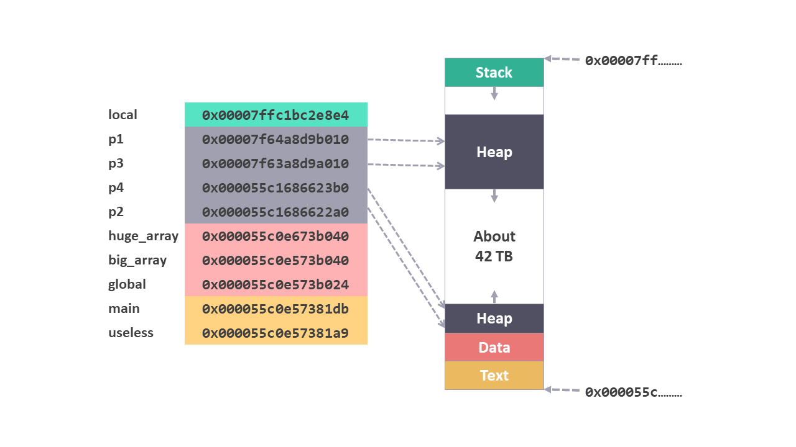
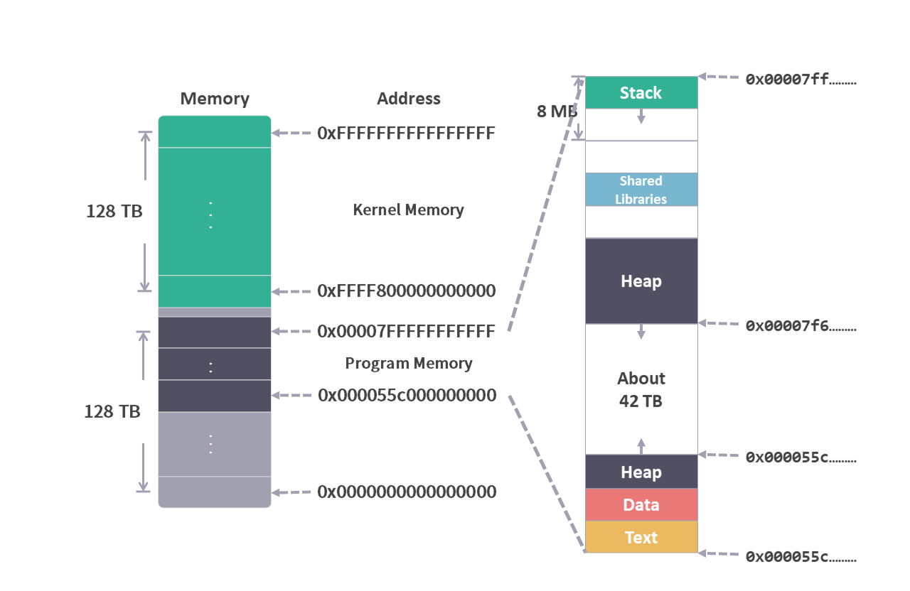

# 02 内存的布局

这个系列是我学习《深入理解计算机系统》的笔记。

本篇文章是学习第三章内容的第二篇笔记，对应书本第 13 页的内容。

[上一篇文章](./01内存.md)中，我们已经了解了从程序的视角来看，内存是什么。那么程序是如何使用内存的呢？想要知道这个内容首先需要了解内存的布局。

本文通过书本的作者 Randal E. Bryant 在课堂 [<sup>1</sup>](#jump01)中使用的一个示例为基础，来探讨内存的布局是什么样子。

文章分为几个部分：
* 示例代码
* 示例的内存布局
* 完整的内存布局

让我们一起进入笔记的正题吧。

## 1. 示例代码

这段 c 语言代码是从 CMU 15-213 CSAPP 课件中找到的，大致形式如下：

```c
char big_array1[1L << 24];  /*16M*/
char huge_array[1L << 31];  /*2G*/

int global = 0;

int useless() { return 0; }

int main()
{
    void *p1, *p2, *p3, *p4;
    int local = 0;
    p1 = malloc(1L << 28);  /*256M*/
    p2 = malloc(1L << 8);   /*256Byte*/
    p3 = malloc(1L << 32);  /*4G*/
    p4 = malloc(1L << 8);   /*256Byte*/

    //some print points statements
}
```
我们先来解读一下这段代码：

1. char big_array1[1L << 24];

    * 1L 是一个值为 1 的 long 类型（64位）数值；

    * 1L << 24 是将 1 左移 24，得到的值等于 2 的 24 次方，16,777,216。

    * char 类型的值是 1 个字节，所以 char big_array1[1L << 24]; 这个数组需要 16,777,216 个字节，也就是 16 M。

2. big_array1，huge_array 和 global 为全局变量。

3. useless 是一个全局函数。

4. local 是 main 中的局部变量。

5. malloc 函数的作用是在内存中手动分配空间，参数为分配空间的字节数。

6. p1， p2， p3， p4 定义为指针，指向 malloc 分配内存空间的起始地址。

这段代码没有什么实际用途，主要任务就是在内存中分配空间。我们可以通过输出变量或者函数的内存地址，来查看它们都在内存的什么位置，从而推演出内存的布局。

*注意：示例中省略了输出功能，完整的示例代码我放在了 Github [<sup>2</sup>](#jump02) 上。

## 2. 示例的内存布局

示例输出的内容我们整理到了这张表中：

* 第一列：内存所在区域的功能名称：stack，heap，data，text

* 第二列：代码中的变量和函数的名称

* 第三列：变量和函数对应内存的起始地址

* 第四列：第三列 16 进制数据的 10 进制表示

|section|name|memory address|address dec|
|:--|:--|:--|:--|
|stack | local         |0x00007ffc1bc2e8e4 |140720774244580|
|heap |p1         |0x00007f64a8d9b010 |140070306295824|
|heap |p3         |0x00007f63a8d9a010 |140066011324432|
|heap |p4         |0x000055c1686623b0 |94289168573360|
|heap |p2         |0x000055c1686622a0 |94289168573088|
|data |huge_array |0x000055c0e673b040 |94286988423232|
|data |big_array  |0x000055c0e573b040 |94286971646016|
|data |global     |0x000055c0e573b024 |94286971645988|
|text |code main  |0x000055c0e57381db |94286971634139|
|text |code useless       |0x000055c0e57381a9 |94286971634089|

将表中的内容整理成图片，我们可以看到内存布局的概况：

<figure>
    
</figure>

从图的下方往上看：

1. Text：代码文件编译成的可执行文件（由机器码组成）存放在这里。

2. Data：global，big_array，huge_array这些全局变量都存放在这里，另外局部的 static 变量也会保存到这里。

3. Heap：堆。
    * 在 c 语言中，使用 malloc 等函数手动分配内存的对象，都保存在这里。

    * p1 和 p3 两个分配内存较大的对象，它们的内存地址靠近 stack

    * p2 和 p4 两个分配内存较小的对象，它们的内存地址靠近 data

    * 在面向对象语言中，new 出来的对象实例也被分配在这里。

    * 另外，垃圾回收机制也是用来处理内存中的 heap 区域。

4. Stack：栈。

    * 函数中使用的局部变量保存在这里。

    * 可执行文件中的指令主要就是使用这块区域的变量。

    * 如果要调用 heap / data 中的数据，需要在 stack 中保存相应的内存地址。

**Stack 是理解程序运行的关键，后面的文章会详细介绍。**

## 3. 完整的内存布局

在 Linux 环境中，我们还可以使用 pmap [<sup>2</sup>](#jump02)（report memory map of a process）命令，来查看虚拟内存具体的使用情况。

上面的示例，在代码中插入 puase() 语句，可将程序暂停，这时候在命令行窗口使用 pmap 命令。

*注意：示例代码在 Linux 环境中执行。可以使用 WSL 来进行环境配置，具体方法已经发布在 Github 上[<sup>3</sup>](#jump03)。


从输出中可以发现，在 Heap 上方有一段内存空间保存着 libc ，这部分是用来保存共享库（Shared Libraries）的。比如 C 语言中的 printf 这类在代码中使用到的共享库（这部分跟编译过程中的链接（Linking）有关）。

最后，我们来看看 Stack 的空间大小（因为它实在是太重要了，是我们之后介绍的重点）。

Stack 的大小是由操作系统决定的，在 Ubuntu 中使用下面的命令查看。

```cmd
ulimit -a
```


从图中可以看到 Stack 空间的大小为 8M。

```
...
stack size      (kbytes,-s) 8921
...
```

最终，我们得到这样的内存布局：

<figure>
    
</figure>

## 总结

根据上面的介绍，我们知道了内存的布局是什么样子，可执行文件，全局变量，共享库，Stack，Heap，都可以在内存布局中找到相应的位置。

结合[上一篇文章](./01内存.md)中内存的内容，我们能够看到程序视角中内存的详细情况：

<figure>
    
</figure>

*注意：有些教程中使用的环境，程序从 0x0000400000000000 开始。本文中的测试环境，程序从 0x000055c0e5737000 开始。

接下来我们可以进一步探索程序在运行时内存的变化，其中最主要是 Stack 区域发生的变化。当然，在这之前，我们先要了解一些指令集的基本概念。

这次就到这里了，我们下一个笔记再见！

---

笔记列表：
 1. [前言 - 学习笔记](./00前言.md)
 2. [从程序的角度看，内存是什么？](./01内存.md)

如果你对这份笔记有兴趣，可以直接关注这个公众号“dingtingli-pub”，我会每周更新三篇笔记。

<figure>
    
</figure>

参考链接：

<span id="jump01">[1]</span> [课程视频](https://www.bilibili.com/video/BV1iW411d7hd?p=9)

<span id="jump02">[2]</span> [完整代码和pmap命令](../程序角度的内存布局.md)

<span id="jump03">[3]</span> [WSL 环境配置](../准备Linux环境.md)