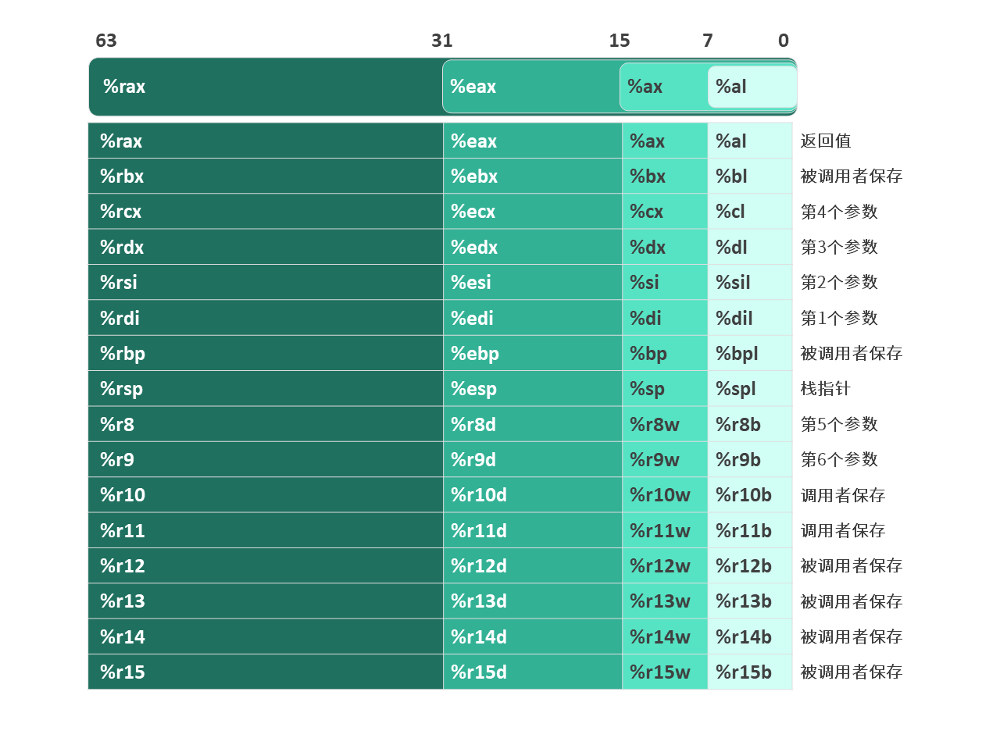
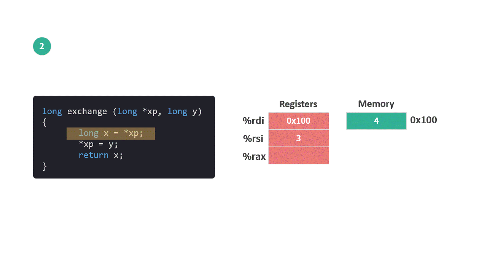
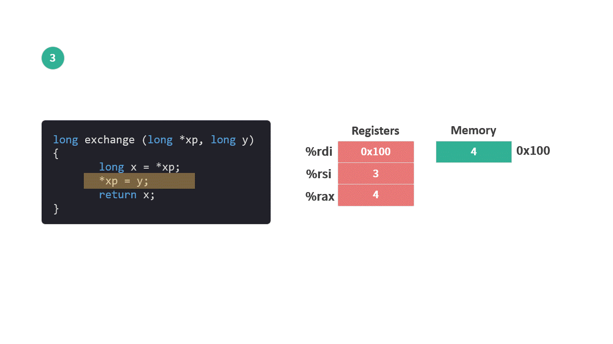

# 03 寄存器

这个系列是我学习《深入理解计算机系统》的笔记。

本篇文章是学习第三章内容的第三篇笔记，对应书本 3.4 节第 120 页和 125 页的内容。

[前面的笔记](./02内存的布局.md)中我们已经介绍了关于内存的相关内容。在学习指令集之前，我们还需要了解一个概念——寄存器。

平时大家没有机会使用到寄存器，因为现代的编程语言将这个概念给封装起来，大家看不到。但是，对于指令集来说寄存器非常重要。

笔记分为 2 个部分：
* 寄存器的概念
* 使用寄存器进行数据传送

让我们一起进入笔记的正题吧。

## 1. 寄存器的概念

寄存器（Register）是 CPU 内部的存储单元。可以用来暂存程序指令，数据和内存地址。因为存在于 CPU 内部，所以它的读写速度要比内存快得多。

**在寄存器和内存之间，还有一层存储介质叫缓存（Cache）。缓存也在 CPU 内部，访问速度比寄存器慢，比内存快。对于程序而言缓存是透明的，不可操作。*

有三类寄存器与程序的运行关系密切：

1. 整数寄存器文件：有 16 个寄存器，每个寄存器空间为 64 位，可以存放内存地址和整数数据。

2. PC（Program Counter）程序计数器：存放程序将要执行的下一条指令在内存中的地址，用 %rip 表示。

3. 条件码寄存器（condition code register）：主要有 4 个寄存器，每个寄存器空间为 1 位，用于存储最近执行的算术或逻辑指令的状态信息。主要是用来实现编程语言中的条件语句，比如 if，while 等。

**除了上面提到的寄存器，还有其他寄存器，比如多个处理浮点运算的128位寄存器等。*

这次我们先介绍第一类寄存器，让大家对寄存器这个概念有一个了解，其他两类寄存器在使用到的时候再做讲解。

寄存器作为一类存储空间，有多大？

为了可以存储 X64 系统中一个完整的内存地址，每个寄存器大小都是 64 位。

怎么访问寄存器？

就像每个内存空间都有自己的内存地址，这 16 个整数寄存器，也都有自己的名称，以便于访问。

同时为了兼容之前的系统，寄存器根据使用的位数不同，名称也会有差别，64 位有一个名字，32 位，16 位，8 位都有自己的名字，具体形式如下图。

<figure>
    
</figure>

现在我们知道了，每个寄存器都有名字和固定的大小。那么寄存器和内存之间有什么关系呢？

前面提到，寄存器可以用来暂存程序指令，数据和内存地址。所以寄存器和内存之间的关系就是传递这几种类型的数据，以便于 CPU 进行计算。

<figure>
    
</figure>

## 2. 数据传递

这么介绍有点抽象，我们用一个简单的例子来演示一下程序在运行期间寄存器和内存之间是如何一起工作的。

先看一段示例代码：

```c
long exchange (long *xp, long y){
    long x = *xp;
    *xp = y;
    return x;
}

int main(){
    long a = 4;
    long b = exchange(&a, 3);
}
```

这段代码的主要功能：

* 将 main 函数中变量 a 的地址 和 数值 3 传递给 exchange 函数。

* 在 exchange 函数中，将变量 a 的值变成 3。

* main 函数中，变量 b 被赋值为 4 （即调用 exchange 函数之前变量 a 的值）。

我们来按步骤查看一下 exchange 函数运行时，内存和寄存器的变化。

1. exchange 函数的初始状态

    * 变量 a （数值 4 ）保存在内存中，这里假设该内存的起始地址为 0x100 。
    * **参数 xp** 中存放的是数值 4 的内存地址，**该地址存放在寄存器 %rdi 中。**
    * **参数 y** 中的数值是 3，**该值保存在寄存器 %rsi 里**。

<figure>
    
</figure>

**注：图中 Memory 一格为 8 个连续的字节（long 类型需要 8 个字节，占用 8 个内存地址），右侧的地址为这 8 个字节的起始地址。*

2. 执行 `long x = *xp;` 语句，变量 x 保存在寄存器 %rax 中。

    * 从 %rid（参数 xp ）所指向的内存中读取数值 4。
    * 将读取到的数值 4 保存到寄存器 %rax （变量 x）中。

<figure>
    
</figure>

3. 执行  `*xp = y;` 语句，将参数 y 的值赋给参数 xp 所指向的内存。

    * 从 %rsi （参数 y）中取出数值3，将其保存到 %rid 所指向的内存中。
    
<figure>
    
</figure>

寄存器 %rax 是保存函数返回值的地方，编译器非常聪明，在一开始就用 %rax 来保存变量 x 。因为变量 x 被赋值之后没有变化，所以最后一句 `return x;` 在这里不需要额外的指令来执行。

整个函数完整的执行过程就像下面这张动图：

<figure>
    
</figure>

而函数 exchange 最终转换成指令集（汇编代码）正好对应着这两步操作：

```arm
movq (%rdi),%rax
movq %rsi,(%rdi)
```

上面的指令什么意思🤯？如何查看代码转换后的机器指令😵‍💫？

这些问题现在一定让你很困惑。不要着急，我们会在之后的笔记中详细介绍。

## 总结

因为编程语言的封装，大家在平时开发过程中接触不到寄存器。但对于机器指令来说，寄存器则是必不可少的。

通过书中的示例，我们尝试以一种直观的方式让大家初步理解寄存器，以及它和内存之间是如何一起工作的。**CPU 进行运算时所需要的数据，都必须先从内存传送到寄存器。**

接下来让我们一起进入指令的世界吧。

今天就到这里了，我们下一个笔记再见！

---

笔记列表：
 1. [前言 - 学习笔记](./00前言.md)
 2. [从程序的角度看，内存是什么？](./01内存.md)
 3. [内存的布局](./02内存的布局.md)

如果你对这份笔记有兴趣，可以直接关注这个公众号“dingtingli-pub”，我会每周更新三篇笔记。

<figure>
    
</figure>