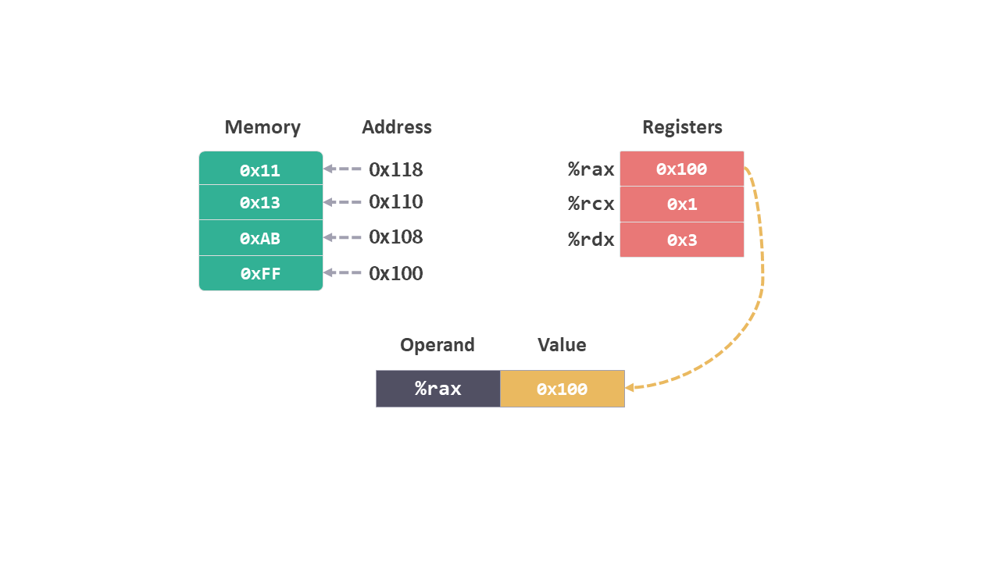
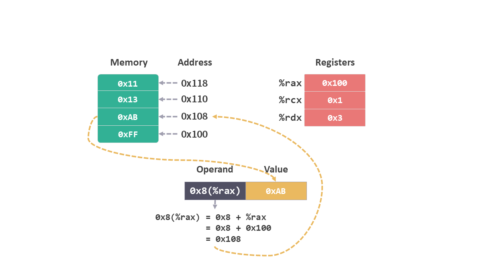
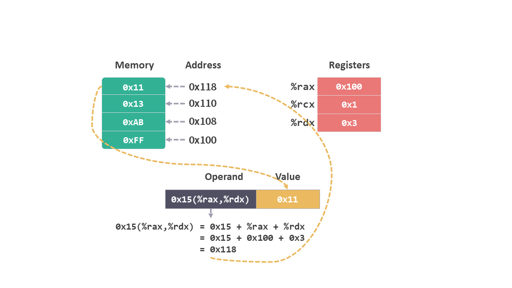
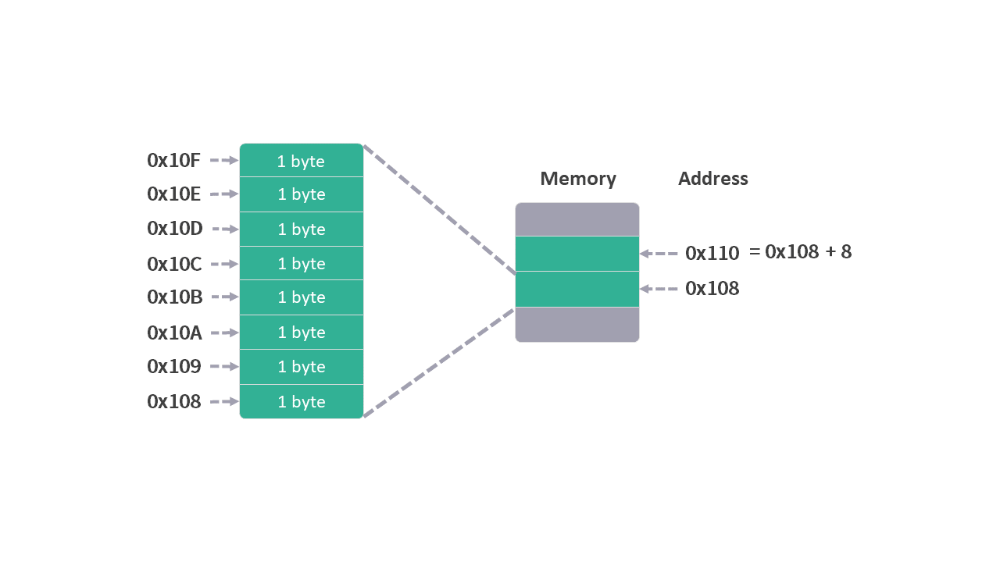

# 04 MOV 指令

这个系列是我学习《深入理解计算机系统》的笔记。

本篇文章是学习第三章内容的第四篇笔记，对应书本 3.4.1 节和 3.4.2 节的内容。

前面的笔记中我们已经介绍了关于内存和寄存器相关的内容，并且看到了一些简单的指令。

接下去学习的进度分为 3 个部分：

1）先学习一些基本指令；2）然后结合 c 语言代码，了解指令和代码的对应关系；3）最后观察程序运行时内存的使用情况。

从这篇笔记开始，我们就进入指令的相关内容。

笔记分为 3 个部分：
* 指令的介绍
* 操作数的格式
* MOV 指令

## 1. 指令的介绍

大家平时都是用 c 或者 java 这类高级语言来编写代码，其实计算机并不能直接解读这些代码，高级语言的编译器会将代码转换成相应的指令，然后指令会一条一条地被 CPU 执行，这就是代码执行的大致流程。

每个类型的 CPU 都有一套自己理解的格式和行为，称为指令集架构（ISA，Instruction Set Architectue），它定义了 CPU 状态，指令的格式以及每条指令对状态的影响。

这里的指令其实就是大家平时所说的汇编。书本中介绍的汇编指令的格式，是 c 语言编译器 gcc 的默认格式，它跟其他汇编指令的格式，比如 intel 的格式会有些差别。阅读其他材料时需要注意，可能会看到不同的汇编指令格式。

### 1.1 指令的形式

指令的形式大概是这样的：一条指令，后面跟着一个或者多个这条指令需要的操作数。

比如在[上一篇笔记寄存器](./03寄存器)中最后提到的指令：

```arm
movq (%rdi),%rax
```

movq 就是一条指令，(%rdi) 和 %rax 就是这条指令需要的两个操作数（operand）。

## 2. 操作数的格式

上一条指令的操作数中有直接的寄存器 `%rax`，也有寄存器加括号的形式 `(%rdx)`。

这些属于操作数的不同格式，我们先来看看操作数都有哪些格式，然后再配合具体指令了解详细的含义。

操作数的格式有下面几种形式：

### 2.1 寄存器

操作数就是一个寄存器，对应的值就是该寄存器中的值。

比如 `%rax`，在图中对应该寄存器中的 `0x100`。

<figure>
    
    <br><br>
</figure>

### 2.2 绝对地址

操作数是内存地址，对应的值是该地址指向的内存空间中的值。

比如内存地址 `0x108`，在图中对应内存中保存的值 `0xAB`。

<figure>
    
</figure>

### 2.3 立即数

操作数的前面加上 `$` 符号，表示该操作数是一个立即数，对应的值就是该数值，跟内存和寄存器没有关系。

比如 `$0x101`，在图中对应的值是 `0x101`。

<figure>
    
</figure>

*该值会跟随汇编代码，一起保存在内存的text部分。*

### 2.4 间接地址

操作数是用 `()` 将寄存器包起来，就会从寄存器的值所对应的内存地址中读取相应内存空间中的内容。

比如 `(%rax)`，在图中先会找到 `%rax` 的值 `0x100`，然后查找内存地址为 `0x100` 所对应内存空间，最后读取其中保存的值 `0xFF`。

<figure>
    
</figure>

### 2.5 变换地址

从间接地址的格式中，还演变出几种需要计算的地址形式。

比如 `0x8(%rax)`，需要先将 `%rax` 中的值 `+ 0x8`，图中得到 `0x100 + 0x8 = 0x108`，然后再从内存地址 `0x108` 中找到所对应的值 `0xAB`。

<figure>
    
</figure>

这类需要计算的操作数形式还有如下几种变化：

```arm
0x15(%rax,%rdx) = 0x15 + %rax + %rdx
```
<figure>
    
</figure>

```arm
(%rax,%rdx,0x8) = %rax + %rdx * 0x8
```

<figure>
    
</figure>

```arm
0xFC(,%rcx,0x4) = 0xFC + %rcx * 0x4
```
<figure>
    
</figure>

## 3. MOV 指令

知道了操作数的格式，我们来看看之前提到的 mov 指令。该指令的格式如下：

```arm
mov S, D
```

mov 指令中有两个操作数，整个指令意思是将数据从一个位置（操作数 S）复制（move）到另一个位置（操作数 D）。

我们以[上一篇寄存器笔记](./03寄存器.md)中见到的一段指令为例：

```arm
movq (%rdi),%rax
movq %rsi,(%rdi)
```
*你可能会奇怪，为什么 mov 后面会加 q？这个 q 我们后面会解释，现在暂时先忽略。*

首先假设这两条指令在运行之前的初始状态：

* `%rdi` 中存放的是内存地址 `0x100`。

* `%rsi` 中存放的是数值 3。

* `%rax` 中没有值。

* 内存地址 `0x100` 对应内存空间的值为 4。

上面的初始状态如图中所示。

<figure>
    
</figure>

执行第一条指令：

```arm
movq (%rdi),%rax
```
这句指令的意思是，将 `(%rdi)` 代表的数据复制到 `%rax` 中。

从操作数的格式中可以知道，操作数 `(%rdi)` 意思是： `%rdi` 中的数据 `0x100` 是内存地址，从该地址中读取内存空间的值 `4`。

mov 指令会将这个数值 `4` 复制到寄存器 `%rax` 中。

<figure>
    
</figure>

执行第二条指令：

```arm
movq %rsi,(%rdi)
```

这句指令的意思是：将 `%rsi` 中的数据复制到 `(%rdi)` 中， `(%rdi)` 中原来的数据将会被替换掉。

<figure>
    
</figure>

### movq

理解完了 `mov` 指令后，我们再回过头来看看 `mov` 指令后面的 **q** 有什么意义。

在[上一篇寄存器笔记](./03寄存器.md)中，我们看到同一个寄存器根据使用位数的不同，会有不同的名字，比如 64 位的叫 %rax，32 位的叫 %eax，16 位的叫 %ax，8 位的叫 %al。

为了操作不同位数的数据，指令也会在的结尾加上缩写，如下表所示：

|缩写|位数|字节|全称|
|:--|:--|:--|:--|
|b|8 位|1 字节| byte|
|w|16 位|2 字节| word|
|l|32 位|4 字节| double words|
|q|64 位|8 字节| quad words|

* 其中 1 个字节是 byte ，简称 'b'。

* intel 用术语 'word'（字）表示 16 位数据类型，简称 'w'。

* 32 位数据类型称为 'double words'（双字），因为 32 位数字曾经被看成 'long word'（长字），所以被简称为 'l'。

* 64 位数据类型称为 'quad words'（四字），简称 'q'。

所以 **`movq`** 这条指令就是处理 64 位数据的。 如果是 32 位数据可以使用 `movl`，比如：

```arm
movl $0x4050, %eax
```

这句指令的意思，就是将数值 `0x4050` 复制到 32 位寄存器 `%eax` 中。

32 位的 `movl` 指令跟其他后缀有些不同，它不仅会处理这 32 位的数字，而且还会将该寄存器中高位的 4 个字节（32 位）也设置成 0。

也就是说 `movl $0x4050, %eax`，除了设置 32 位的 %eax，同时还会将 %rax 中的高位 4 个字节也设置成 0。这个操作保证了 64 位系统可以兼容 32 位系统的应用。

另外，`mov` 指令不可以将数据从内存直接复制到内存，这个操作必须经过寄存器。

## 总结

从这篇笔记开始，我们正式进入指令的世界。这次学习的宗旨，不是为了用汇编语言编写程序，只是为了能够看懂汇编语言，所以不必望而却步。

这次的笔记中，我们先介绍了操作数的几种格式，然后学习了第一条指令 mov，是不是很好理解？再学几条这种指令，我们就可以看懂 c 语言编译成的汇编代码了。

今天就到这里了，我们下一个笔记再见！

---

最后，在这里补充说明一下以后图示中内存的表示方法。

前面介绍[内存](./01内存.md)的时候说过，一个内存地址指向的内存空间大小为 1 个字节。所以之前图示中一格内存的大小也是 1 个字节。

<figure>
    
</figure>

以后为了表示方便，图示中一格内存的大小为 8 个字节（64 位），这样正好可以完整保存一个整数寄存器中的内容。

<figure>
    
</figure>

---

笔记列表：
 1. [前言 - 学习笔记](./00前言.md)
 2. [从程序的角度看，内存是什么？](./01内存.md)
 3. [内存的布局](./02内存的布局.md)
 4. [寄存器](./03寄存器.md)

如果你对这份笔记有兴趣，可以直接关注这个公众号“dingtingli-pub”，我会每周更新三篇笔记。

<figure>
    
</figure>