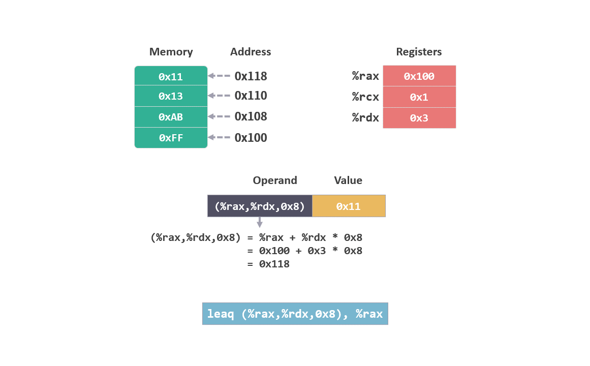
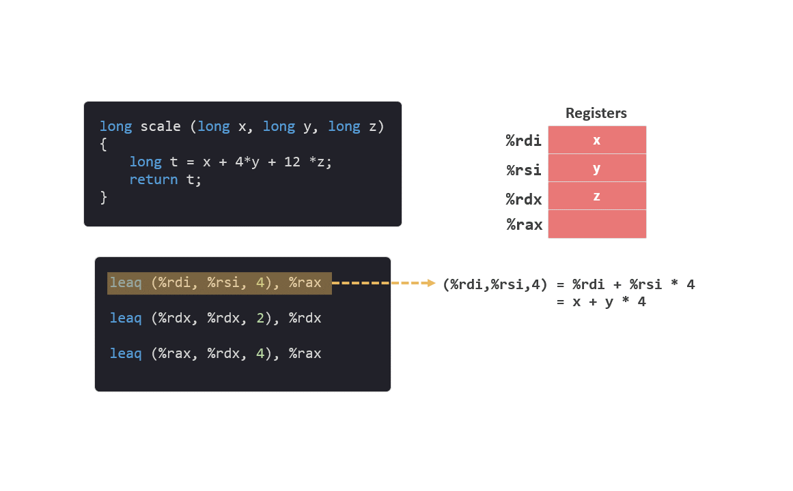
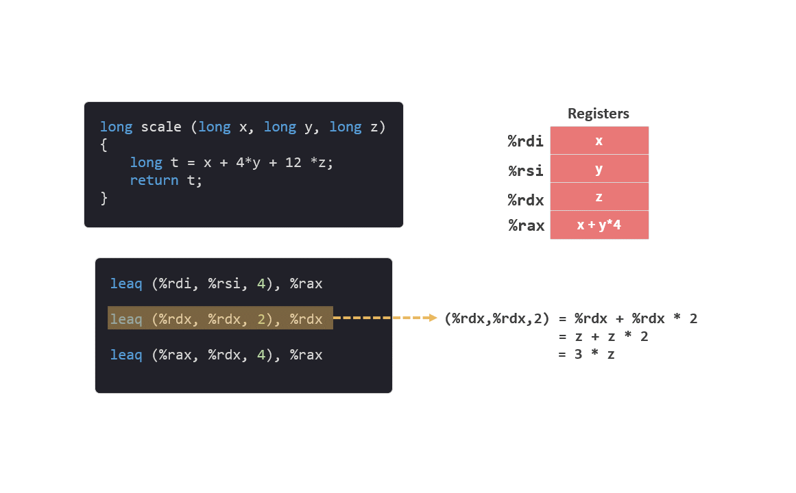

# 05 LEA 指令

这个系列是我学习《深入理解计算机系统》的笔记。

本篇文章是学习第三章的第五篇笔记，对应书本 3.5.1 节的内容。

前面的笔记中介绍了 [mov 指令](./04指令1MOV.md)，这次我们再来看一个新的指令 **lea**。

笔记分为 3 个部分：
* movq 指令回顾
* leaq 指令介绍
* c 语言示例

## 1. movq 指令回顾

在[上一篇笔记](./04指令1MOV.md)介绍操作数格式时，我们看到过下面这种格式：

```arm
(%rax,%rdx,0x8)
```

这个操作数的意思是，计算出 %rax + %rdx * 0x8 的值，然后以该值为地址读取相应内存中的内容。

<figure>
    
</figure>

如果在 `movq` 中使用这个操作数，指令如下：

```arm
movq (%rax,%rdx,0x8)，%rax
```

该指令会将从内存中读出的值 `0x11`，写入 `%rax`。

<figure>
    
</figure>

## 2. leaq 指令介绍

这次介绍的 leaq 指令，其实是 movq 指令的变形，全称叫做“加载有效地址（load effective address）”。

leaq 指令在形式上跟 movq 类似，也有两个操作数。但不一样的是，**第二个操作数必须是寄存器**。

比如将上面示例中的 movq 指令变成 leaq 指令：

```arm
leaq (%rax,%rdx,0x8)，%rax
```

该指令会将 `%rax + %rdx * 0x8` 计算出来的值 `0x118`，直接写入 `%rax` 中。

<figure>
    
</figure>

虽然 leaq 指令从名字上看是用来计算有效地址的， 但从执行结果来看，该指令已经超越了它的名字，它会做一次计算并保存计算结果，不管这个结果是不是一个有效地址。

## c 语言示例

为了演示 leaq 指令的作用，我们来看一段 c 语言代码：

```c
long scale(long x, long y, long z)
{
    long t = x + 4 * y + 12 * z;
    return t;
}
```

代码很简单，就是做了一个计算，我们来看看转换后的指令：

```arm
leaq (%rdi, %rsi, 4), %rax
leaq (%rdx, %rdx, 2), %rdx
leaq (%rax, %rdx, 4), %rax
```

试着解读一下这段指令。

函数的初始状态是这样的：

1. 参数 x 保存在 %rdi 中。

2. 参数 y 保存在 %rsi 中。

3. 参数 z 保存在 %rdx 中。

4. 返回值保存至 %rax 中。

**函数的参数和返回值的传递方式，会在之后的笔记中详细介绍。*

执行第一条指令：

```arm
leaq (%rdi, %rsi, 4), %rax
```

该指令计算 `%rdi + %rsi * 4`，对照初始状态即 `x + y * 4`，并将值直接写入 %rax。

<figure>
    
</figure>

执行第二条指令：

```arm
leaq (%rdx, %rdx, 2), %rdx
```

该指令计算 `%rdx + %rdx * 2`， 即 `z + z * 2 = 3 * z`，并将值直接写入 %rdx。

<figure>
    
</figure>

执行第三条指令：

```arm
leaq (%rax, %rdx, 4), %rax
```

该指令计算 `%rax + %rdx * 4`，即 `x + y * 4 + （3z） * 4 = x + 4 * y + 12 * z`，并将值直接写入 %rdx。

<figure>
    
</figure>

我们看到, c 语言中的一句 `long t = x + 4 * y + 12 * z;` 被分解成了 3 条 leaq 指令来运行。

```arm
leaq (%rdi, %rsi, 4), %rax
leaq (%rdx, %rdx, 2), %rdx
leaq (%rax, %rdx, 4), %rax
```
## 总结

leaq 指令虽然是 load effective address（加载有效地址）的简称，但它根本就没有引用内存，更多的是被用来描述复杂的计算逻辑。

你可能会奇怪，为什么要用 leaq 指令来做计算，没有直接用来计算的指令吗？答案是有的。

指令集中有 add，sub 等直接用于计算的指令，但是 leaq 指令在表达一些计算时更简洁。

今天就到这里了，我们下一个笔记再见！

---

笔记列表：
 1. [前言 - 学习笔记](./00前言.md)
 2. [从程序的角度看，内存是什么？](./01内存.md)
 3. [内存的布局](./02内存的布局.md)
 4. [寄存器](./03寄存器.md)
 5. [MOV 指令](./04指令1MOV.md)

如果你对这份笔记有兴趣，可以直接关注这个公众号“dingtingli-pub”，我会每周更新三篇笔记。

<figure>
    
</figure>