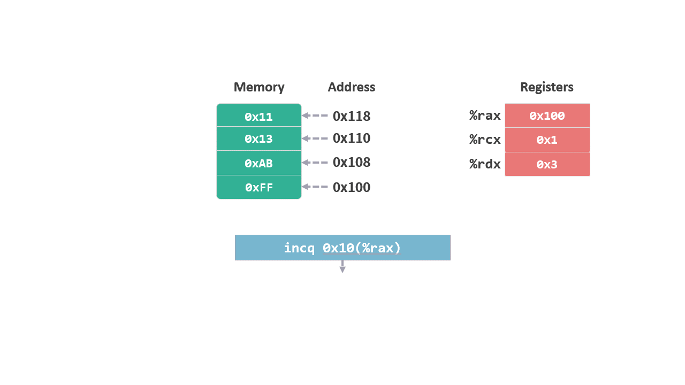
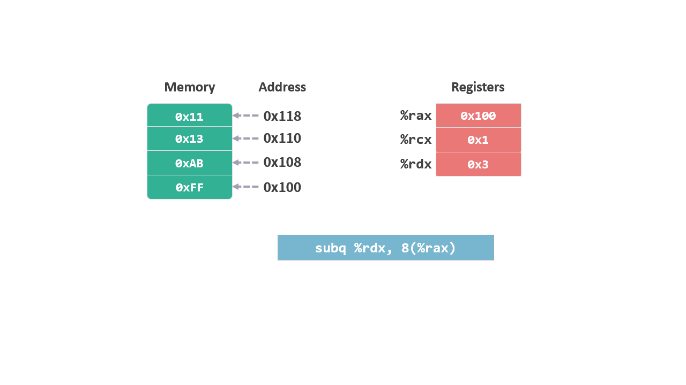

# 算术和逻辑指令

这个系列是我学习《深入理解计算机系统》的笔记。

本篇文章是学习第三章的第六篇笔记，对应书本 3.5.2，3.5.3 和 3.5.5 节的内容。

前面的笔记中介绍了 mov 指令 和 lea 指令。其中 lea 指令有一定的计算功能，这次我们就来看看具体的算术和逻辑指令。

笔记分为 3 个部分：
* 一元操作指令
* 二元操作指令
* 移位操作指令

## 1. 一元操作指令

我们之前看到的指令都有两个操作数，其实有些指令只需要一个操作数就够了，这个操作数即使源又是目标。这种指令被称为一元操作。

### 1.1 inc 指令

inc（Increment，自增），将操作数加 1, 相当于 c 语言中的 `++`。指令形式如下：

```arm
inc D
```

比如指令 `incq 0x10(%rax)` ，就需要找到操作数所指的内存，然后对该内存的值加 1。

<figure>
    
</figure>

### 1.2 dec 指令

dec（decrement，自减），将操作数减 1, 相当于 c 语言中的 `--`。指令形式如下：

```arm
dec D
```

比如指令 `decq %rcx` ，需要找到操作数所指的位置（寄存器 %rcx），然后对该位置的值减 1。

<figure>
    
</figure>

### 1.3 neg 指令

neg（negative，取负），获取操作数的**补码**（方法是对操作数的每一位取反，然后将结果再加 1）。

**注：二进制的减法：是将减数转换成补码，然后再将被减数和补码进行相加。*

指令格式如下：

```arm
neg D
```

### 1.4 not 指令

not（取反），将操作数的每一位取反(`0` 变成 `1`，`1` 变成 `0`)。指令格式如下：

```arm
not D
```

## 2. 二元操作指令

上面介绍的指令只需要一个操作数，下面介绍需要两个操作数的算术和逻辑指令，称为二元操作指令。

### 2.1 add 指令

add（加法），对两个操作数进行加法运算，并将结果写入第二个操作数。指令格式如下：

```arm
add S, D
```

比如指令 `add %rcx, (%rax)` ，需要将寄存器 `%rcx` 中的值和 `(%rax)` 所指向的内存中的值相加，并将结果写入 `(%rax)` 所指向的内存中。

<figure>
    
</figure>

### 2.2 sub 指令

sub（subtraction，减法），对两个操作数进行减法运算，并将结果写入第二个操作数。指令格式如下：

```arm
sub S, D
```

注意：**减法操作是 D-S，也就是第二个操作数减去第一个操作数。**

比如指令 `sub %rdx, 8(%rax)`，需要将 `8(%rax)` 所指向的内存中的值，减去寄存器 `%rdx` 中的值 ，并将结果写入 `8(%rax)` 所指向的内存中。

<figure>
    
</figure>

### 2.3 imul 指令

上面介绍了加法和减法指令，这两个指令针对的都是 64 位以内的整数。有了加减法，自然会想到乘法和除法指令，但这两个操作有些特别，先来看看乘法指令。

imul（multiplication，乘法），有两种形式。其中一种跟前面看到的加减法一样，有两个操作数。指令格式如下：

```arm
imul S, D
```

我们知道，两个 64 位的数相乘，其结果可能需要 128 位来表示。但是第二个操作数最多只有 64 位。所以该指令会截取结果的低 64 位保存到第二个操作数中。

`imul` 指令前面的 '`i`' 表示操作数有符号，你可能会想有没有代表无符号的乘法指令 '`mul`'？在两个操作数的指令格式中，因为是截取结果的低 64 位，此时有符号和无符号的操作行为是一样的，所以这种形式只有一种指令格式 'imul S, D'。

`imul` 指令还有一种形式，可以保存 128 位的结果。指令格式如下：

```arm
imulq S
```

该指令只有一个操作数，需要将另一个操作数先保存到寄存器 `%rax` 中，然后将操作数 `S` 与 `%rax` 相乘。运算结果保存在两个寄存器中，低位的 64 位保存在 `%rax` 中, 高位的 64 位保存在 `%rdx` 中。

因为可以保存完整的 128 位结果，所以也有对应的无符号乘法指令，格式为 `mulq S`。

### 2.4 idiv 指令

div（division，除法），跟乘法指令还有些不同。两个整数相除，结果会分成两个部分，商和余数。两个部分无法保存在一个操作数上，因此除法指令没有双操作数的格式。

一元操作的除法指令格式如下：

```arm
idivq S
```

被除数先被保存到寄存器 `%rax` 中，然后计算 `%rax / S`。结果中的商保存到 `%rax` 中，余数保存到 `%rdx` 中。

对应的无符号除法法指令为 '`divq S`'。

### 2.5 逻辑运算

逻辑运算有 `AND`（与），`OR`（或） 和 `XOR`（异或）。

使用方式和 `SUB` 指令一样，都是用第二个操作数与第一个操作数进行逻辑运算，并将结果保存到第二个操作数中。指令的格式如下：

```arm
and S, D
or S, D
xor S,D
```

需要注意的是，除了正常的逻辑运算，`xor` 指令有时候会用作其他用途，比如对同一个操作数进行异或运算：

```arm
xor %eax, %eax
```

因为异或的原理是 ‘`0^0 =0`’ ，‘`1^1=0`’，所以这个指令导致的结果就是将操作数 `%eax` 设置为 0 。


| ^| 0| 1|
|:--|:--|:--|
|**0**|0|1|
|**1**|1|0|

该操作等同于指令 `mov $0, %eax`，但是 CPU 的执行效率更高。

## 3. 移位运算

乘法指令的实现比较复杂，需要更多的时钟周期。二进制的乘法可以使用效率更高的移位指令来替代。

将数值左移一位，相当于将该数值乘以 2^1（$ 2^1 $），左移两位相当于乘以 2^2（$ 2^2 $）。

SAL （shift arithmetic left，算术左移），指令的格式如下：

```arm
SAL k, D
```

该指令对操作数 D，左移 k 位。类似于 c 语言中的 `D << k`。

同样，SAR（shift arithmetic right，算术右移） 会对操作数进行右移操作。

```arm
SAR k, D
```

位移时需要考虑有符号和无符号数，上面两个指令都是针对有符号数的位移，被称之为算术位移（shift arithmetic）。

无符号数的位移，称之为逻辑位移，对应的指令是 `SHL`（SHift  Left）和 `SHR`（SHift Right）。

* 左移时向低位填 0，所以算术和逻辑左移指令 `SAL` 和 `SHL` 的作用是一样的。

* 右移时向高位填值，算术位移 `SAR` 向高位填入符号位，逻辑位移 `SHR` 向高位填入 0。

## 总结

这次的笔记介绍了与算术和逻辑运算相关的 15 个指令，

包括一元操作指令：

* inc（Increment，自增）
* dec（decrement，自减）
* neg（negative，取负）
* not（取反）

二元操作指令：
* add（加法）
* sub（subtraction，减法）
* imul（multiplication，乘法）（有一元和二元）
* div（division，除法）（一元）
* and（与）
* or（或）
* xor（异或）

移位指令：
* sal（shift arithmetic left，算术左移）
* shl（shift left，逻辑左移）
* sar（shift right，算术右移）
* shr（shift right，逻辑左移）

希望通过这篇笔记，能让大家快速地理解算术和逻辑运算相关的指令。

今天就到这里了，我们下一个笔记再见！

---

笔记列表：
 1. [前言 - 学习笔记](./00前言.md)
 2. [从程序的角度看，内存是什么？](./01内存.md)
 3. [内存的布局](./02内存的布局.md)
 4. [寄存器](./03寄存器.md)
 5. [MOV 指令](./04指令1MOV.md)
 6. [LEA 指令](./05指令2LEA.md)

如果你对这份笔记有兴趣，可以直接关注这个公众号“dingtingli-pub”，我会每周更新三篇笔记。

<figure>
    
</figure>
