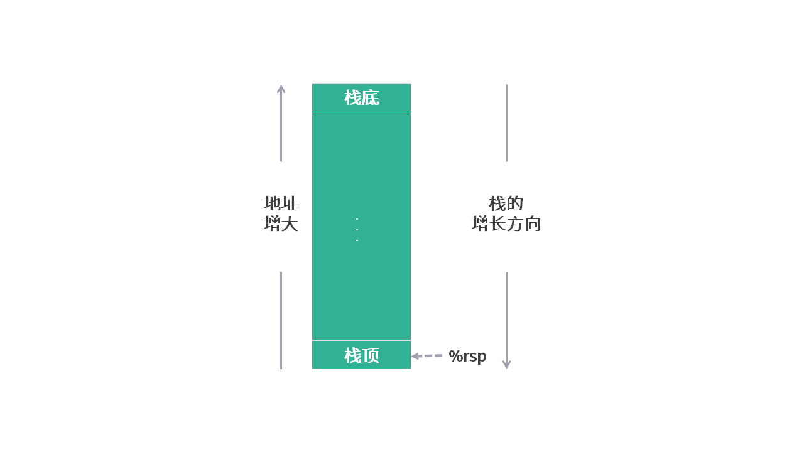
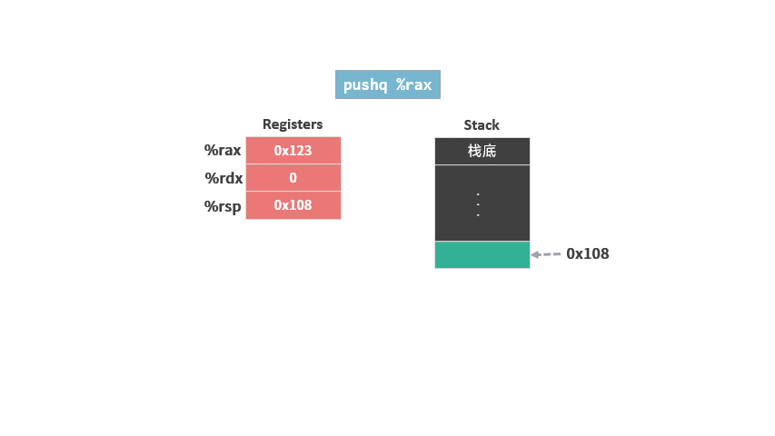

# PUSH 和 POP 指令

这个系列是我学习《深入理解计算机系统》的笔记。

本篇文章是学习第三章的第七篇笔记，对应书本 3.4.4 节的内容。

前面的笔记中已经介绍了 [mov 指令](./04指令1MOV.md)， [lea 指令](./05指令2LEA.md) 和 [算术和逻辑指令](./06指令算术和逻辑.md)。

在内存布局中，我们知道内存是分成不同的功能区域的。这次就来学习一下操作 stack（栈）的两条指令，push 和 pop。

<figure>
    
</figure>

**stack（栈）在内存布局的最上面。*

Stack（栈）的功能主要有两个：
* 函数中使用的局部变量保存在这里。
* 可执行文件中的指令主要就是使用这块区域的变量。

所以它是函数执行是非常重要的一部分。

笔记分为 3 个部分：
* 栈的结构
* push指令
* pop指令

## 1. 栈的结构

这一块内存之所以称为栈（stack），是因为操作系统将以栈这种数据结构来管理这块内存区域。

栈这种数据结构添加删除数据，要遵循“后进先出”（LIFO：Last In First Out）原则。

为了配合栈的操作，这块内存区域首先必须是一块地址连续的区间，然后需要将一端“封住”，称为“栈低”，所有数据从另外一端进出，称为“栈顶”。

栈顶元素的内存地址保存在专门的寄存器 %rsp 中（rsp: register stack point）。

通常，“栈底”在高位的内存地址，“栈顶”在低位的内存地址。由于我们画内存示意图的时候，习惯将低位内存地址放在下面，高位在上面，所以栈的示意图像一个倒扣过来的桶，桶口朝下。

<figure>
    
</figure>

## 2. push 指令

向栈中添加数据的动作称为“Push（压入）”，指令的格式如下：

```arm
push S
```

该操作会执行两个步骤：

1. 修改栈指针 %rsp。

2. 将操作数 S 写到内存新的栈顶地址。

我们用示例演示一下 `push` 指令的具体操作。

首先假设指令开始之前，内存和寄存器的状态是这样的:

<figure>
    
</figure>

此时执行指令：

```arm
pushq %rax
```

具体操作如下：
1. 修改栈指针，将栈指针减去 8 （即 8 个字节的地址），以扩展栈的空间。
2. 将 `%rax` 的内容写到新的栈顶地址所指的内存空间。

<figure>
    
</figure>

## 3. pop 指令

将栈中数据读出的动作称为“pop（弹出）”，指令的格式如下：

```arm
pop D
```

pop 与 push 的操作正好相反：

1. 从栈顶读取数据，写到 操作数 D 中。

2. 修改栈指针 `%rsp`。

沿用之前的初始状态，执行如下指令：

```arm
popq %rdx
```

具体操作如下：

1. 将栈顶数据写到 %rdx 中，

2. 修改栈指针，将栈指针加上 8 ，以减小栈的空间。

<figure>
    
</figure>

需要注意的是，我们只是修改了栈顶指针，原来栈顶的地址的数据并没有删除（图中标灰的部分）。

## 总结

初学者可能会搞混两个概念，内存中栈和数据结构中栈。

内存中栈，其实只是将一块连续的地址内存空间分配出来，然后用栈这种数据结构来管理。

不知道你是否还记得，在[内存布局的笔记]()中我们曾经介绍过，栈的大小是 8 M。

因为这个空间不大，当使用超过这个空间限制时，就会发生栈溢出（stack overflow），这也是 stackoverflow 这个网站名字的由来。什么时候会产生栈溢出的问题，我们以后再介绍。

今天就到这里了，我们下一个笔记再见！

---
笔记列表：
 1. [前言 - 学习笔记](./00前言.md)
 2. [从程序的角度看，内存是什么？](./01内存.md)
 3. [内存的布局](./02内存的布局.md)
 4. [寄存器](./03寄存器.md)
 5. [MOV 指令](./04指令1MOV.md)
 6. [LEA 指令](./05指令2LEA.md)
 7. [算术和逻辑指令](./06指令算术和逻辑.md)

如果你对这份笔记有兴趣，可以直接关注这个公众号“dingtingli-pub”，我会每周更新三篇笔记。

<figure>
    
</figure>