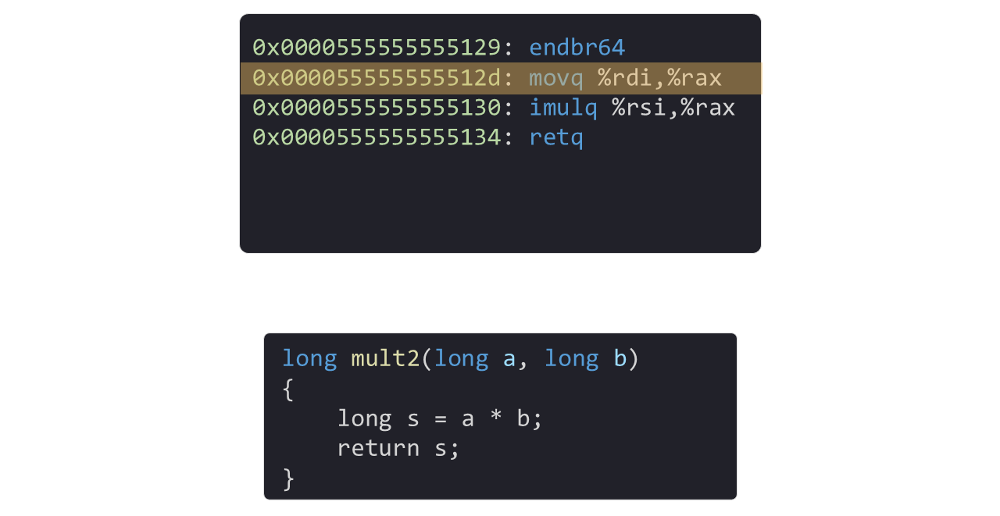
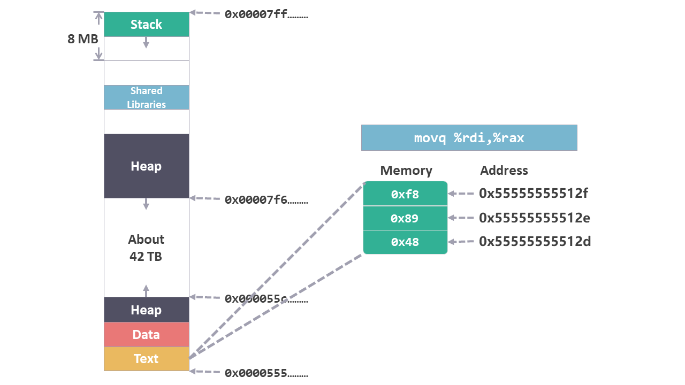
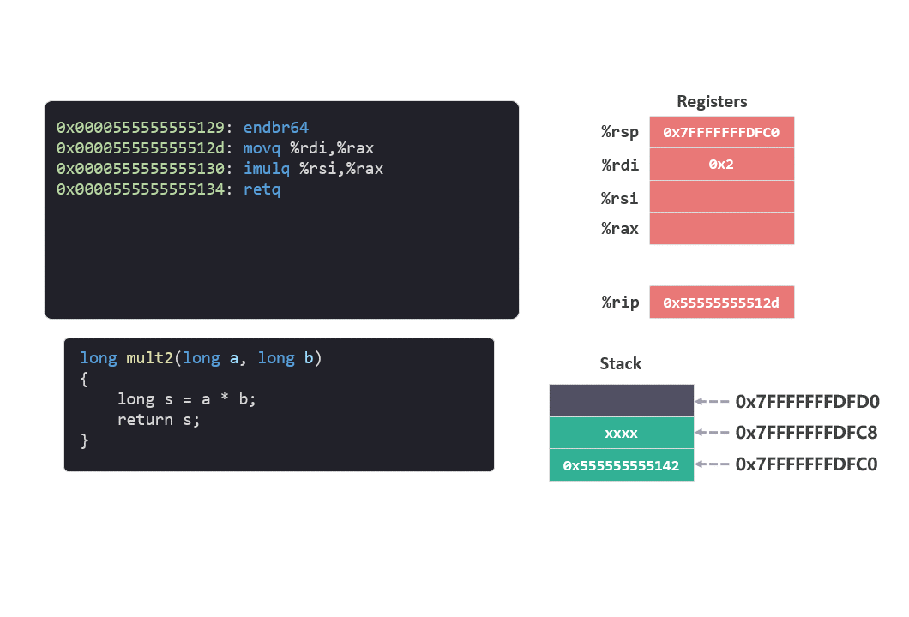
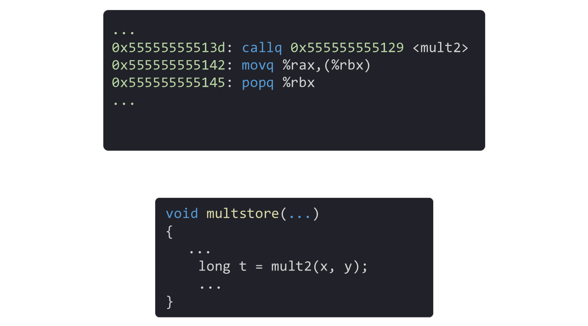
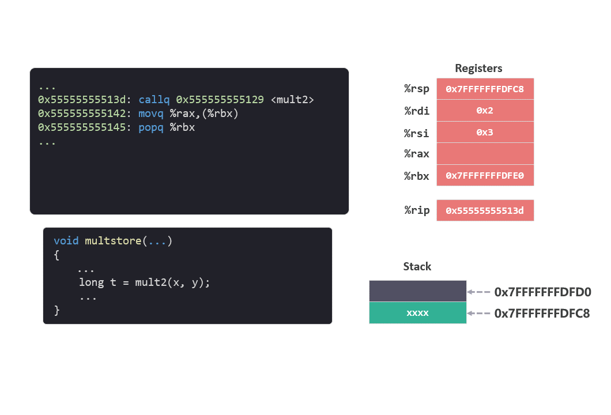
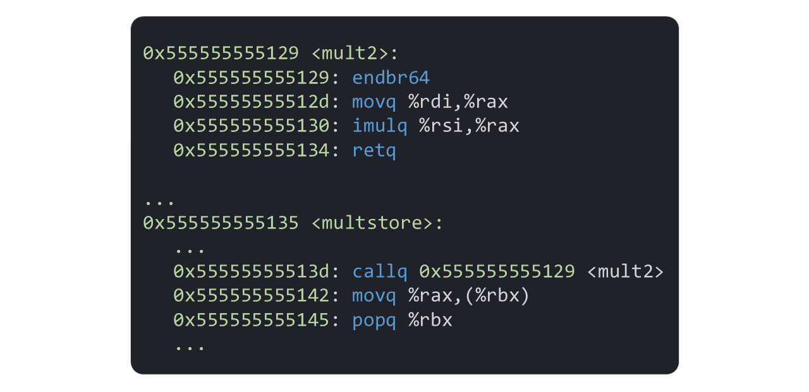
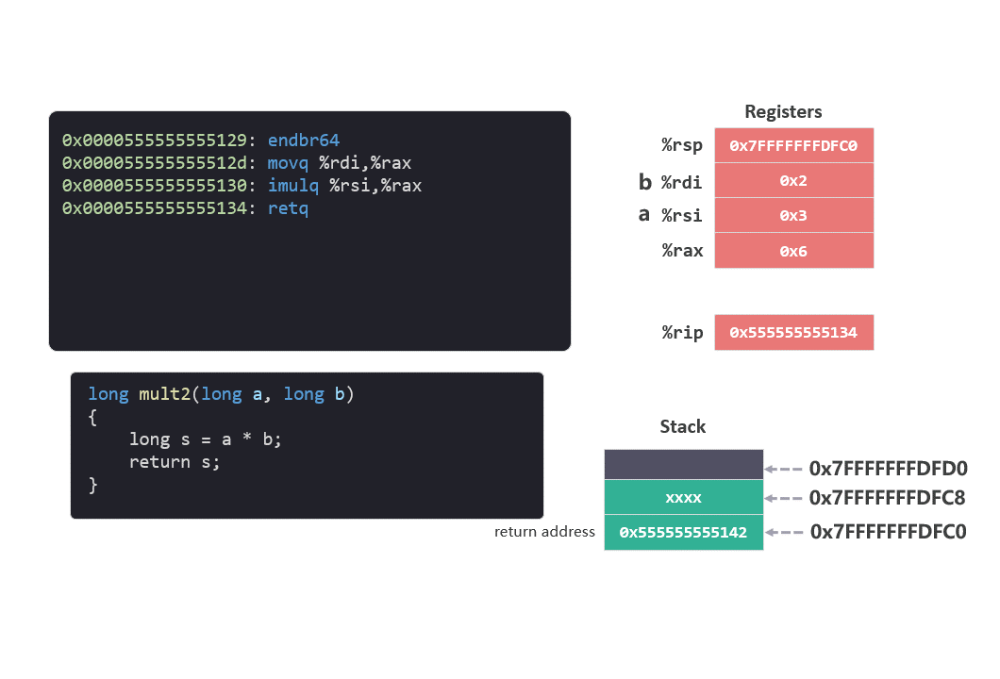

# call 和 ret 指令

这个系列是我学习《深入理解计算机系统》的笔记。

本篇文章是学习第三章的第八篇笔记，对应书本 3.7.2 节的内容。

前面的笔记中介绍了栈相关的操作[指令 push 和 pop](./07指令push和pop.md)。

栈中主要存放的是函数中使用的局部变量，今天我们再来介绍两个跟函数调用相关的指令 call 和 ret。

笔记分为 3 个部分：
* 函数
* 程序计数器
* call 指令
* ret 指令

## 1. 函数

假设我们正在编写汇编指令，有一个地方需要把两个数相乘，因此我们就编写了一段用于两数相乘的指令。

然后在另一个地方我们发现需要再次对两数进行相乘，因为前面已经写过类似的指令，所以这次我们希望最好能重复使用之前的代码。

这该怎么实现呢？

我们可以在所有执行两数相乘的地方，跳转到先前写的那段乘法指令的位置，执行完成后再返回到当前的指令。

你可能会想，这不就是我们每天都在使用的函数嘛？是的。对于指令集来说，实现函数调用是其基本的组成部分。

下面，我们先用 c 语言写一个两数相乘的函数：

```c
long mult2(long a, long b)
{
    long s = a * b;
    return s;
}
```

通过 gdb 可以查看该函数运行时在内存中对应的指令：

```arm
    0x0000555555555129:       endbr64 
    0x000055555555512d:       movq    %rdi,%rax
    0x0000555555555130:       imulq   %rsi,%rax
    0x0000555555555134:       retq  
```

<figure>
    
</figure>

第一次看到这种格式有点陌生，没关系，我们以第二行指令为例解释一下，该指令分为三段，含义如下：

* `0x55555555512d` 表示指令在内存中的起始地址。
* `48 89 f8` 表示指令的机器码，并被保存到内存中。
* `movq  %rdi,%rax` 是指令的可读形式，相当于注释，不保存到内存中。

结合之前[内存布局](./02内存的布局.md)的相关知识，指令在内存中大概这样保存：

<figure>
    
</figure>

## 2. 程序计数器

我们现在已经知道了指令在内存中的样子。在了解调用函数之前，我们先来了解一个知识点——程序计数器（PC：Program Counter）。

之前介绍[寄存器](./03寄存器.md)的时候，我们曾经提过程序计数器的寄存器用 `%rip` 来表示。

程序计数器的作用是提供下一条将要执行的指令地址。

比如，`0x55555555512d` 地址中的指令执行结束时，`%rip` 中地址会变成下一条指令的地址 `0x555555555130`。

<figure>
    
</figure>

## 3. call 指令

现在可以试着调用 mult2 函数了。

我们假设有这么一个函数，在该函数的代码中调用了之前的两数相乘的函数 mult2：

```c
void multstore(...)
{
    ...
    long t = mult2(x, y);
    ...
}
```

同样，通过 gdb 我们也找到了在 multstore 中调用 mult2 函数的相关指令：

```arm
    0x000055555555513d:       callq   0x555555555129 <mult2>
    0x0000555555555142:       movq    %rax,(%rbx)
    0x0000555555555145:       popq    %rbx
```
<figure>
    
</figure>

现在我们就可以研究一下 call 指令会做哪些操作。

call 指令会完成两步操作：

1. 在栈中扩展 8 个字节，用于存放 call 指令下面一条指令的内存地址，作为返回地址。

2. 将程序计数器 `%rip` 设置成 call 指令操作数中的地址。

在我们这个例子中:

1. 首先会扩展栈，栈指针 `%rsp` 变为 `0x7fffffffdfc0`，并在该地址保存 call 指令的下面一条指令 `movq  %rax,(%rbx)` 的地址 `0x555555555142`。

2. 将操作数 `0x555555555129` 写入程序计数器 `%rip`。

<figure>
    
</figure>

## 4. ret 指令

上面的 callq 指令执行完成后，程序计数器将会指向 mult2 函数指令的起始位置 `0x555555555129`。 

在 mult2 函数中，会执行 'imulq' 指令将两数相乘并返回。

```arm
0x0000555555555129 <mult2>:
    0x0000555555555129:       endbr64 
    0x000055555555512d:       movq    %rdi,%rax
    0x0000555555555130:       imulq   %rsi,%rax
    0x0000555555555134:       retq  

0x0000555555555135 <multstore>:
    ...
    0x000055555555513d:       callq   0x555555555129 <mult2>
    0x0000555555555142:       movq    %rax,(%rbx)
    0x0000555555555145:       popq    %rbx
    ...
```

<figure>
    
</figure>

函数执行完两数相乘之后，mult2 中最后一条指令是 ret。

ret 指令正好和 call 指令相反，它会做两个操作：

1. 将栈顶弹出的返回地址写入程序计数器（PC %rip），保证了下一条执行的指令是返回地址上的指令。

2. 从栈顶弹出返回地址。

在我们这个例子中：

1. 将栈顶弹出的返回地址 `0x555555555142` 写入程序计数器（PC %rip）中。这个地址也是返回到 multstore 函数中的位置，即 multstore 函数中 callq 指令下面一条指令 `movq %rax,(%rbx)` 的地址。

2. 从栈中弹出栈顶的返回地址 `0x555555555142`。

<figure>
    
</figure>

## 总结

函数是所有编程语言中重要的组成部分，因此在指令集中实现函数调用也极为重要。

这篇文章介绍的两个指令 call 和 ret 可以实现函数调用以及返回原函数。当然在函数调用中还有其他功能需要考虑，比如参数和返回值的传递。这些内容我们将在之后的笔记中详细介绍。

今天就到这里了，我们下一个笔记再见！

---

笔记列表：
 1. [前言 - 学习笔记](./00前言.md)
 2. [从程序的角度看，内存是什么？](./01内存.md)
 3. [内存的布局](./02内存的布局.md)
 4. [寄存器](./03寄存器.md)
 5. [MOV 指令](./04指令1MOV.md)
 6. [LEA 指令](./05指令2LEA.md)
 7. [算术和逻辑指令](./06指令算术和逻辑.md)
 8. [PUSH 和 POP 指令](./07指令push和pop.md)

如果你对这份笔记有兴趣，可以关注这个公众号“dingtingli-pub”，我会每周更新笔记。

<figure>
    
</figure>