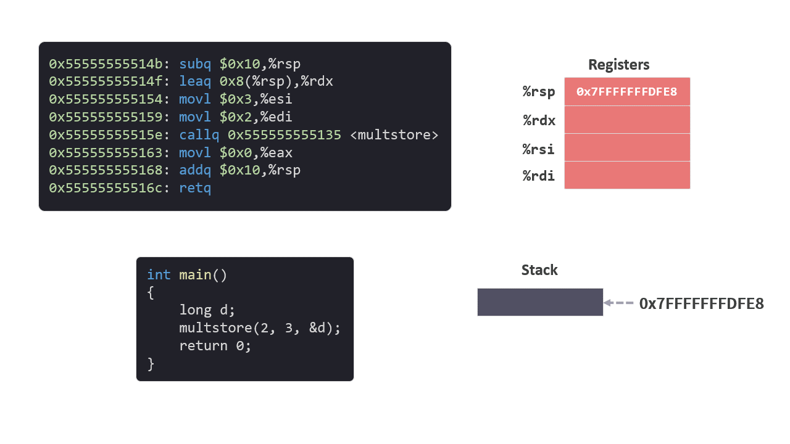

# 程序运行时的栈

在之前的文章中我们已经介绍了[内存](./01%E5%86%85%E5%AD%98.md)和[内存的布局](./02%E5%86%85%E5%AD%98%E7%9A%84%E5%B8%83%E5%B1%80.md)，以及许多指令。

其中比较重要的是操作 Stack（栈）的 [push 和 pop 指令](./07%E6%8C%87%E4%BB%A4push%E5%92%8Cpop.md)，支持函数调用的 [call 和 ret 指令](./08%E6%8C%87%E4%BB%A4call%E5%92%8Cret.md)。

虽然还有一些重要的指令没有学习，比如跳转指令。但已经学习的这些指令足够我们来理解一段完整的 c 语言代码所生成的指令。

直接跟踪一段完整的 c 语言代码的运行，可以跟踪代码运行时栈的具体情况，让我们对栈这个概念有更深刻的理解。

笔记分为 5 个部分：
* 示例代码
* 分配栈空间和参数传递
* 转移控制
* 被保存的寄存器
* 再次转移控制
* 返回值

## 1. 示例代码

首先我们准备一个 c 语言文件 msstore.c，内容如下：

```c
long mult2(long a, long b)
{
    long s = a * b;
    return s;
}

void multstore(long x, long y, long *dest)
{
    long t = mult2(x, y);
    *dest = t;
}

int main()
{
    long d;
    multstore(2, 3, &d);
    return 0;
}
```

文件有 3 个函数，`main`，`mulstore`，`mult2`。我们来解读一下这 3 个函数具体的作用，如果你能够看懂，可以直接跳过这一段。

### 1.1 `main` 函数

`main` 函数是 c 语言程序的入口，代码会从这里开始执行。

函数中定义了一个 `long` 类型的变量 `d`，然后调用 `multstore` 函数。

传递给 `multstore` 函数的有 3 个参数: 数值 `2`, `3` 和变量 `d` 的内存地址 `&d`。

最后的 return 语句，在这里不影响整个功能，可以先不用管它。

### 1.2 `multstore` 函数

函数名 `multstore`，是 “multiplication store” （存储乘法运算）的简称。作用是将前两个参数的乘积，保存到第三个参数（内存地址）指定的内存中。

首先计算前两个参数的乘积。通过调用函数 `mult2`，并且将 `main` 函数传来的参数 `2` 和 `3` 作为参数传给了函数 `mult2` 来实现。函数 `mult2` 的返回值被赋值给变量 `t`。

然后将结果保存到指定内存。变量 `t` 会被写入 `main` 函数传来的地址（第三个参数）所对应的内存中，也就是变量 `d` 中。

### 1.3 `mult2` 函数

函数名 `mult2`，是 “multiplication 2” （两数相乘）的简称。

`mult2` 将传来的两个参数相乘，并返回乘积。

**从 `main` 函数的角度来看，所有函数调用最终实现的结果，就是将  `2` 和 `3` 的乘积赋给了变量 `d`。** 

### 1.4 指令

上面的 c 语言代码最终会编译成机器指令保存在内存的 Text 区域。

通过 gdb 可以查看代码运行时在内存中对应的指令详情：

```arm
0x0000555555555129 <mult2>:
    0x0000555555555129:       f3 0f 1e fa             endbr64 
    0x000055555555512d:       48 89 f8                movq    %rdi,%rax
    0x0000555555555130:       48 0f af c6             imulq   %rsi,%rax
    0x0000555555555134:       c3                      retq   

0x0000555555555135 <multstore>:
    0x0000555555555135:       f3 0f 1e fa             endbr64 
    0x0000555555555139:       53                      pushq   %rbx
    0x000055555555513a:       48 89 d3                movq    %rdx,%rbx
    0x000055555555513d:       e8 e7 ff ff ff          callq   0x555555555129 <mult2>
    0x0000555555555142:       48 89 03                movq    %rax,(%rbx)
    0x0000555555555145:       5b                      popq    %rbx
    0x0000555555555146:       c3                      retq   

0x0000555555555147 <main>:
    0x0000555555555147:       f3 0f 1e fa             endbr64 
    0x000055555555514b:       48 83 ec 10             subq    $0x10,%rsp
    0x000055555555514f:       48 8d 54 24 08          leaq    0x8(%rsp),%rdx
    0x0000555555555154:       be 03 00 00 00          movl    $0x3,%esi
    0x0000555555555159:       bf 02 00 00 00          movl    $0x2,%edi
    0x000055555555515e:       e8 d2 ff ff ff          callq   0x555555555135 <multstore>
    0x0000555555555163:       b8 00 00 00 00          movl    $0x0,%eax
    0x0000555555555168:       48 83 c4 10             addq    $0x10,%rsp
    0x000055555555516c:       c3                      retq   
```
*注：这段 c 语言生成的指令不止我们现在看到的这些，完整的指令可以参考资料部分，我们节选了需要的内容，其他内容现阶段可以不用考虑。*

这种样式我们在[上一篇笔记](./08%E6%8C%87%E4%BB%A4call%E5%92%8Cret.md) 已经介绍过来。这里遇到指令我们在之前的笔记中也已经详细介绍过了，具体内容可以通过下面这张表来查看。

 `endbr64` [<sup>[1]</sup>](#jump01) 指令不影响内存使用，这里可以忽略。

|指令|参考|
|:--|:--|
|mov|[指令 1 - MOV](./04%E6%8C%87%E4%BB%A41MOV.md)|
|leaq|[指令 2 - LEA](./05%E6%8C%87%E4%BB%A42LEA.md)|
|addq|[指令 3 - 算术和逻辑](./06指令算术和逻辑.md)|
|subq|[指令 3 - 算术和逻辑](./06指令算术和逻辑.md)|
|pushq|[指令 4 - PUSH / POP](./07指令push和pop.md)|
|popq|[指令 4 - PUSH / POP](./07指令push和pop.md)|
|imulq|[指令 3 - 算术和逻辑](./06指令算术和逻辑.md)|
|callq|[指令 5 - CALL / RET](./08指令call和ret.md)|
|retq|[指令 5 - CALL / RET](./08指令call和ret.md)|

接下来我们将会按步骤执行这段指令，并且跟踪内存和寄存器中的变化。

## 2. 分配栈空间和参数传递

我们先从 main 函数开始。

```c
int main()
{
    long d;
    multstore(2, 3, &d);
    return 0;
}
```

该函数对应的指令如下：

```arm
0x0000555555555147 <main>:
    0x0000555555555147:       endbr64 
    0x000055555555514b:       subq    $0x10,%rsp
    0x000055555555514f:       leaq    0x8(%rsp),%rdx
    0x0000555555555154:       movl    $0x3,%esi
    0x0000555555555159:       movl    $0x2,%edi
    0x000055555555515e:       callq   0x555555555135 <multstore>
    0x0000555555555163:       movl    $0x0,%eax
    0x0000555555555168:       addq    $0x10,%rsp
    0x000055555555516c:       retq   
```

### 2.1 分配栈空间

### `subq $0x10,%rsp`

执行 `subq $0x10,%rsp` 之前，我通过 gdb 调试器确认栈指针 `%rsp` 具体的值为 `0x7fffffffdfe8`。

`subq $0x10,%rsp` 指令为 main 函数在 Stack（栈）中分配了 16 个字节的空间。

执行完成后，栈指针 `%rsp` 为 `0x7fffffffdfd8` (`= 0x7fffffffdfe8 - 0x10`)。

<figure>
    
</figure>

### 2.2 参数传递

### `leaq 0x8(%rsp),%rdx`

`leaq 0x8(%rsp),%rdx` 指令的意思是将 main 函数在 Stack 分配的内存中的前面 8 个字节的起始地址保存到 `%rdx` 中。

为什么是 `%rdx`？`%rdx` 在寄存器中的含义是第三个参数。

<figure>
    
</figure>

我们可以看到，在 c 语言中，第三个参数是 `&d`, 即变量 `d` 的内存地址。

```c
    multstore(2, 3, &d);
```

因此，可以知道变量 `d` 的值就保存在 Stack 的前 8 个字节中，而 `%rdx` 中保存的是变量 `d` 的内存地址。

<figure>
    
</figure>

### `movl    $0x3,%esi`

`movl    $0x3,%esi` 指令是将立即数 `3` 保存到 `%esi` 中。

还是在这句 c 语言中，我们可以看到 `3` 是第二个参数。`%rsi` 在寄存器中的含义正好是第二个参数。

```c
    multstore(2, 3, &d);
```

<figure>
    
</figure>

### `movl    $0x2,%edi`

`movl    $0x2,%edi` 指令是将立即数 `2` 保存到 `%edi` 中。

就像在 c 语言中看到的那样，`2` 是第一个参数。`%rdi` 在寄存器中的含义是第一个参数。

```c
multstore(2, 3, &d);
```

<figure>
    
</figure>

*注意：你可能已经发现了，栈中虽然申请了 16 个字节，但其实只用了前 8 个字节，多申请的 8 个字节并没有使用。*

`main` 函数的前四条指令：

```arm
subq    $0x10,%rsp
leaq    0x8(%rsp),%rdx
movl    $0x3,%esi
movl    $0x2,%edi
```

这四条指令做了 3 件事情：
1. 为 `main` 函数在 Stack（栈）中申请了 16 个字节的空间。

2. 确定了变量 `d` 在 Stack（栈）中的位置，并将地址保存到 `%rdx`。

3. 将 `multstore` 函数需要的参数，按顺序保存到相应寄存器中。

所有的这些事情都是为下一句指令准备的，调用 mulstroe 函数：

```arm
callq   0x555555555135 <multstore>
```

## 3. 转移控制

前面的指令已经将 `multstore` 函数需要的参数都准备好了。

```c
multstore(2, 3, &d);
```

接下来就可以调用 `multstore` 函数，该指令为：

### `callq   0x555555555135 <multstore>`

我们之前介绍过 [call](./08%E6%8C%87%E4%BB%A4call%E5%92%8Cret.md) 指令，它会完成以下两步操作：

1. 首先会扩展 Stack（栈），栈指针%rsp 变为 `0x7fffffffdfd0`，并在刚刚扩展的地址中保存 `call` 下面一条指令 `movl    $0x0,%eax` 的地址 `0x555555555163`。

2. 将操作数 `0x555555555135` 写入程序计数器 `%rip`。

<figure>
    
</figure>

这样下一步将会执行 `0x555555555135` 地址上的指令，也就是 `multstore` 函数，换句话说程序将控制权转移到了 `main` 函数。

之后 `main` 函数会暂停，直到控制权从 `multstore` 函数返回。

## 4. 被保存的寄存器

执行完 `main` 函数的 `call` 指令后，程序的将要执行的下一条指令就是 `multstore` 函数中的第一条指令。

我们先来看看 `main` 函数为了调用 `multstore` 函数在寄存器中准备的参数。

<figure>
    
</figure>

```c
void multstore(long x, long y, long *dest)
{
    long t = mult2(x, y);
    *dest = t;
}
```

`multstore` 函数对应的指令如下：

```arm
0x0000555555555135 <multstore>:
    0x0000555555555135:       endbr64 
    0x0000555555555139:       pushq   %rbx
    0x000055555555513a:       movq    %rdx,%rbx
    0x000055555555513d:       callq   0x555555555129 <mult2>
    0x0000555555555142:       movq    %rax,(%rbx)
    0x0000555555555145:       popq    %rbx
    0x0000555555555146:       retq   
```

### 4.1 被保存的寄存器

### `pushq %rbx`

`multstore` 中第一条有效的指令是 `pushq   %rbx`，其中操作数 `%rbx` 的作用是**被调用者保存**。

意思就是说接下来的指令会用到 `%rbx`，但不知道之前的函数会在 `%rbx` 中保存什么值，所以要先将其中的值保存到 Stack（栈）上，用完之后再使用 `popq    %rbx` 指令将其从 Stack（栈）中复制回 %rbx，从而恢复原样。

<figure>
    
</figure>

所以，这里 `%rbx` 中原来的是什么值对 `multstore` 函数来说并不重要，我们只需要先将其复制到 Stack（栈）中即可。

参考之前介绍的 [push 指令](./07%E6%8C%87%E4%BB%A4push%E5%92%8Cpop.md)，它将会完成以下两步操作：

<figure>
    
</figure>

`%rbx` 将会用来干什么呢？

### `movq %rdx,%rbx`

我们知道 `%rdx` 中保存的是 `main` 函数中变量 `d` 的地址。`movq %rdx,%rbx` 会将 `%rdx` 复制到 `%rbx`，接下来的指令中就不需要直接使用 `%rdx`。

这样的好处是，不需要改变通过参数传过来的地址。如果传过来的地址是一个数组的起始地址，我们既可以在 `%rdx` 保持数组的起始地址不变，同时还可以通过直接修改 `%rbx` 来计算数组元素的偏移地址。

*当然，在我们这个简单的示例中这个操作看不出有什么优势。*

<figure>
    
</figure>

## 5. 再次转移控制

### 5.1 准备参数

接下去就要调用 `mult2` 函数了。在调用之前，需要在寄存器中准备好 `mult2` 函数所需要的参数。

```c
mult2(x, y);
```

因为参数 `x` 和 `y` 目前仍然保存在 `%rdi` 和 `%rsi` 中，所以不需要额外的指令来准备参数。

然而，如果我们做一个小小的修改，将 x 和 y 的顺序换一下：

```c
void multstore(long x, long y, long *dest)
{
    long t = mult2(y, x); //chang the position of x and y.
    *dest = t;
}
```
这时候我们就可以从指令中看到变化：

```arm
 1 pushq	%rbx
*2 movq	%rdi, %rax
*3 movq	%rsi, %rdi
 4 movq	%rdx, %rbx
*5 movq	%rax, %rsi
 6 call	mult2
 7 movq	%rax, (%rbx)
 8 popq	%rbx
```
第 2，3， 5 行指令将 `%rdi` 和 `%rsi` 中的值做了调换。

*注意：使用了 `%rax` 作为调换的中转，因为 `%rax` 不是被调用者保存的寄存器，所以不需要先 `Push`。而且 `%rax` 的作用是用来保存返回值，在执行 `Call` 之后，如果函数有返回值， `%rax` 会自动改变。*

### 5.2 再次转移控制

### `callq 0x555555555129 <mult2>`

首先是在 Stack（栈）上申请空间，将 `call` 下面一条指令`movq    %rax,(%rbx)` 的地址 `0x555555555142` 存入 Stack（栈）中，

然后将程序计数器中的值修改为 call 中的操作数 `0x555555555129`。

<figure>
    
</figure>

接下来，程序将控制权再次转移到了 `mult2` 函数。

## 6. 返回值

经过了两次 `call` 指令的转移，我们来到了最后一个函数 `mult2`。

```c
long mult2(long a, long b)
{
    long s = a * b;
    return s;
}
```

`mult2` 函数对应的指令如下：

```arm
0x0000555555555129 <mult2>:
    0x0000555555555129:       endbr64 
    0x000055555555512d:       movq    %rdi,%rax
    0x0000555555555130:       imulq   %rsi,%rax
    0x0000555555555134:       retq  
```

### 6.1 计算返回值

`mult2` 函数的作用，是将两个参数相乘，并返回相乘的结果。

`%rax` 寄存器的作用就是保存返回值。

<figure>
    
</figure>

### `movq    %rdi,%rax`

我们看到，第一条指令 `movq %rdi,%rax`，将第一个参数 `a` 复制到返回值 `%rax` 中。

### `imulq %rsi,%rax`

第二条指令 `imulq %rsi,%rax`，将第二个参数 `b` 与刚刚复制到 `%rax` 中的第一个参数 `a` 相乘，并将结果保存 `%rax` 中。

<figure>
    
</figure>

我们注意到，`mult2` 函数没有在 Stack（栈）上申请空间。

### 6.2 ret 指令返回

### `retq `

返回值在 `%rax` 中保存好之后，就可以执行最后一条指令 `retq`。

我们之前介绍过 [ret](./08%E6%8C%87%E4%BB%A4call%E5%92%8Cret.md) 指令，它会完成以下两步操作：

1. 将栈顶的返回地址 `0x555555555142` 写入程序计数器（PC %rip）中。这个地址也是 `mult2` 函数要返回到 `multstore` 函数中的位置，即 `multstore` 函数中 `callq` 指令下面一条指令 `movq    %rax,(%rbx)` 的地址。

2. 从 Stack 中弹出栈顶返回地址 `0x555555555142`。

<figure>
    
</figure>

### 6.3 返回 `multstore` 函数

`ret` 指令执行之后，程序控制权将会返回 `multstore` 函数。

我们回忆一下，在 `multstore` 函数中的 `callq   0x555555555129 <mult2>` 指令执行之后，Stack 和 寄存器的情况如下：

<figure>
    
</figure>

`ret` 指令返回后，在执行 `movq    %rax,(%rbx)` 之前，Stack 和 寄存器的情况如下：

<figure>
    
</figure>

从中可以看到 `mult2` 函数执行完成后所带来的变化：

1.  `mult2` 函数的返回值 `0x6` 保存在 `%rax` 中。

2. 栈顶指针为 `0x7FFFFFFFDFC8`，返回地址已经从 Stack（栈）中弹出。

3. 程序计数器为 `0x555555555142`，即马上要执行的指令 `movq    %rax,(%rbx)` 的地址。

### 6.4 继续执行 `multstore` 函数

接下来继续执行 `multstore` 函数剩余的指令。

### `movq    %rax,(%rbx)`

其中 `movq    %rax,(%rbx)` 将返回值 `%rax` 复制到 `%rbx`地址指示的内存中。这一步操作其实是实现了 c 语言中的语句 `*dest = t;`。

### `popq    %rbx`

`popq    %rbx` 用于恢复被调用者保存的寄存器，将 `%rbx` 中原来的值从 Stack 中弹出并返回给 `%rbx`。

<figure>
    
</figure>

### 6.5  ret 指令再次返回

`multstore` 函数来到了最后条指令。

### `retq`

跟之前的 `ret` 指令一样，首先将栈顶的返回地址 `0x555555555163` 写入程序计数器（PC %rip）中，然后从 Stack 中弹出栈顶的返回地址。

<figure>
    
</figure>

**因为 `multstore` 函数没有返回值，所有函数中没有处理 `%rax` 的指令。*

### 6.6  继续执行 `main` 函数

`multstore` 函数中的 `ret` 指令执行完成后，程序控制权将会返回 `main` 函数。

程序计数器中下一条指令的地址 `0x555555555163` 指向了  `main` 函数中的指令 `movl    $0x0,%eax`。

在执行该指令之前，我们先来看一下 Stack 具体情况：

变量 `d` 中保存了 `2` 和 `3` 的乘积 `6`，说明 c 语言中的 `multstore(2, 3, &d);` 已经完成。

<figure>
    
</figure>

接下来继续执行 `main` 函数剩余的指令。

### `movl    $0x0,%eax`

指令 `movl    $0x0,%eax` 会将返回值 `%rax` 设置为 0， 对应了 c 语言中的 `return 0`。

### `addq $0x10,%rsp`
指令 `addq $0x10,%rsp` 将 `main` 函数之前申请的 16 个字节的 Stake（栈）空间收回，栈指针变成了 main 函数执行之前的位置。

<figure>
    
</figure>

`main` 函数中 `retq` 指令返回之前调用的函数。我们知道整个 c 语言代码生成的指令不止我们分析的这些，关于 `main` 函数的返回我们这次暂时不讨论。

至此，所有代码都执行完成。

## 总结

我们在之前的笔记中已经知道了内存中的栈。这篇笔记我们通过一段完整的 c 语言代码，详细地跟踪了每条指令的执行。

如果说程序就是状态机，那么栈就是保存状态的地方。而且每个函数都有属于自己的栈空间，叫做栈帧，在我们的示例图中使用绿色表示 `main` 函数的栈帧，黄色表示`multstore` 函数的栈帧。

<figure>
    
</figure>

在同一时间，只有一个函数对程序有控制权，函数进行调用时控制权也将转移， `call` 指令就是用来实现控制转移的。

函数的调用过程中还涉及到一些细节，比如参数的传递，返回值的传递，这些需要了解寄存器的具体功能。

之前介绍都是指令的含义，希望这次可以结合完整的示例，让我们在指令和代码之间搭起一架桥梁，以便于理解。

今天就到这里了，我们下一个笔记再见！

---

参考链接：

<span id="jump01">[1]</span>  如果想了解 `endbr64` 指令，可以访问：
https://stackoverflow.com/questions/56905811/what-does-the-endbr64-instruction-actually-do

---

笔记列表：
 1. [前言 - 学习笔记](./00前言.md)
 2. [从程序的角度看，内存是什么？](./01内存.md)
 3. [内存的布局](./02内存的布局.md)
 4. [寄存器](./03寄存器.md)
 5. [MOV 指令](./04指令1MOV.md)
 6. [LEA 指令](./05指令2LEA.md)
 7. [算术和逻辑指令](./06指令算术和逻辑.md)
 8. [PUSH 和 POP 指令](./07指令push和pop.md)
 9. [CALL 和 RET 指令](./08指令call和ret.md)

如果你对这份笔记有兴趣，可以关注这个公众号“dingtingli-pub”，我会每周更新笔记。

<figure>
    
</figure>
