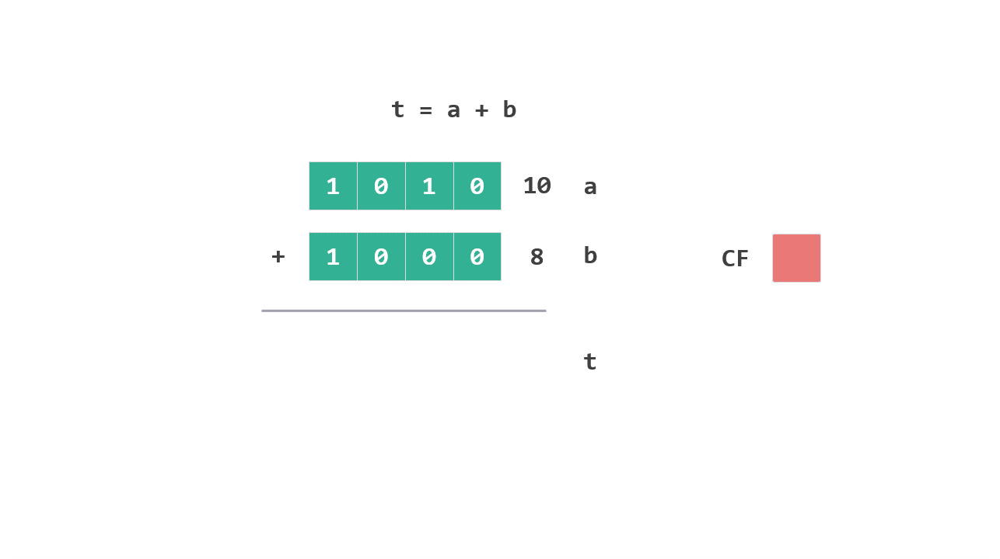
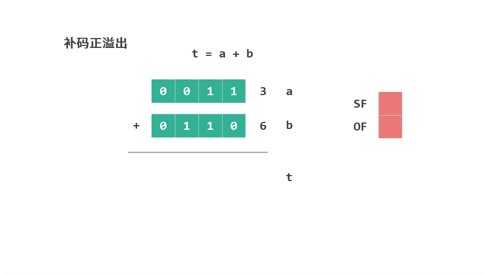
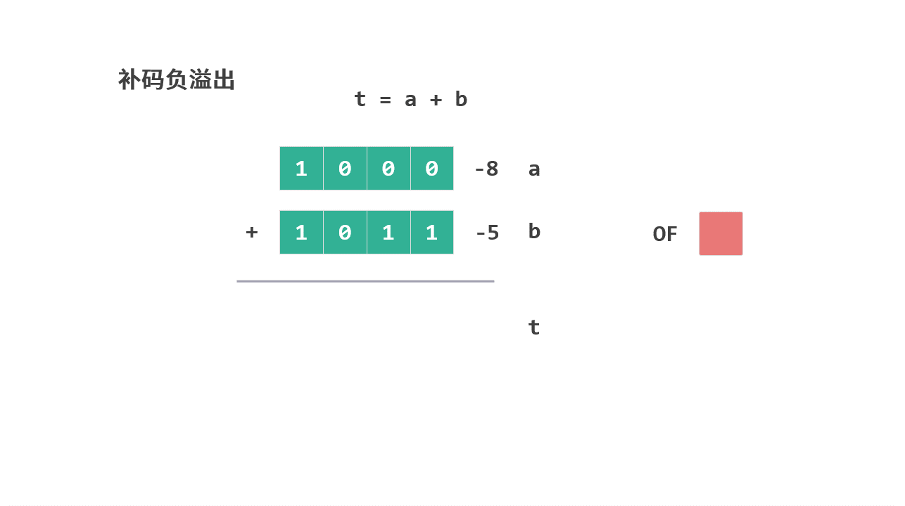
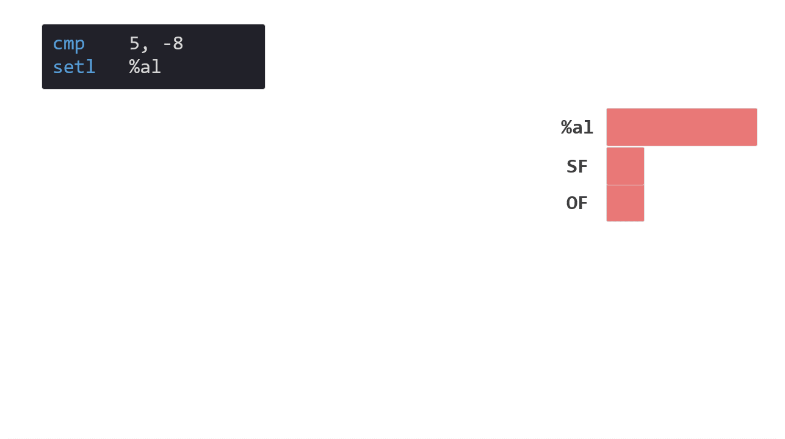

# 条件码寄存器

这个系列是我学习《深入理解计算机系统》的笔记。

本篇文章是学习第三章的第九篇笔记，对应书本 3.6.1节的内容。

前面的笔记中我们介绍了函数的调用以及函数对应栈帧的具体情况。

接下来我们将会用几篇笔记来介绍如何实现编程中另外一个重用概念——循环。

这次我们先来了解循环的开端，条件判断。笔记分为 4 个部分：

* 条件码寄存器（condition code register）
* 对条件码寄存器产生影响的指令
* cmp 和 test 指令
* set 指令

## 1. 条件码寄存器

条件判断是编程中经常使用的语句，为了更好的了解条件判断的相关指令，我们首先知道 CPU 是如何执行条件判断的。

在介绍[寄存器](./03寄存器.md)时，我们说过有三类寄存器。前两类寄存器（整数寄存器和程序计数器）都已经介绍了，今天我们就来看看最后一类跟条件判断执行相关的寄存器——条件码寄存器（condition code register）。

条件码寄存器是一组寄存器的统称，主要由 4 个寄存器标志位组成，每个寄存器标志位的大小是 1 位，用于存储最近执行的算术或逻辑指令的状态信息。

这 4 个寄存器标志位分别是：

* CF（carry flag）：进位标志，检查无符号操作的溢出情况，有溢出时设为 1。
* ZF（zero flag）：零标志，最近操作结果为 0 时设为 1。
* SF（sign flag）：符号标志，最近操作结果为负数时设为 1。
* OF（overflow flag）：溢出标志，最近有符号数操作导致补码溢出——正溢出或者负溢出，有补码溢出时设为 1。

接下来我们就以 `t = a + b` 这条语句为例，学习一下在执行这条语句时这几个寄存器标志是如何发生变化的。

### 1.1 ZF 零标志 和 SF 符号标志

首先介绍两个简单的标志：

* 如果`t = a + b` 这条语句结果等于 `0 `，ZF 零标志设为 `1`。用公式表示： `t == 0` 时，`ZF = 1`

* 如果`t = a + b` 这条语句结果为负数，SF 符号标志设为 `1`。用公式表示： `t < 0` 时，`SF = 1`

### 1.2 CF 进位标志

CF 进位标志，是在 `a` 和 `b` 都是无符号数的情况下发生的。

当 `a + b` 的结果 `t` 小于 `a` 或者 `b` 时，就将 CF 进位标志设为 `1`。

我们以 4 位的无符号整数为例，假设 `a = 10（二进制 1010）`，`b = 8（二进制  1000）`，`a + b` 的情况如下：

<figure>
    
</figure>

`a + b` 的计算结果 `18`（二进制 10010），超出了 4 位无符号整数的最大值 `15`（二进制 1111）。超出的位数将会丢弃，最终结果 `t` 为 `2`（二进制 0010）。这种情况就是无符号操作的溢出，因为产生了溢出，所以 CF 进位标志将设置为 `1`。

简化成公式就是 `(unsigned) t < (unsigned) a` 时，`CF = 1`。

*这里 `t` 只要跟任意一个加数`a` 或者 `b`比较即可，因为 t 比这两个数都小。

### 1.3 OF 溢出标志

OF 溢出标志是为了有符号的补码出现溢出情况时准备的。

我们以 4 位的有符号整数为例，首先考虑补码正溢出的情况。假设 `a = 3（二进制 0011）`， `b = 6（二进制 0110）`，这时候 `a + b` 的情况如下：

<figure>
    
</figure>

`a + b` 的结果 `t` 是 `9`（二进制 01001）， 但作为 4 位的有符号整数，这个二进制表示为 `-7`（二进制 1001），这就是所谓的补码正溢出的情况，两个正数相加的结果却是负数。

出现这种情况，OF 溢出标志将设置为 `1`，同时因为结果为负数，所以还会将 SF 符号标志也设置为 `1`。

简化成公式，就是 `a >= 0 && b >= 0 && t < 0` 时，`OF = 1` 并且 `SF = 1`。

*注意公式中 `= 0` 的情况，考虑一下 `a` 和 `b` 都是 `0`。

再来看看补码负溢出的情况，假设 `a = -8（二进制 1000）`，`b = -5（二进制 1011）`，这时候 `a + b` 的情况如下：

 <figure>
    
</figure>

`a + b` 的结果 `t` 是 `-13`（二进制 10011）， 但作为 4 位的有符号整数，超出的位数将会丢弃，结果就变成了 `3`（二进制 0011）。这就是所谓的补码负溢出的情况，两个负数相加的结果是正数。

出现这种情况，OF 溢出标志将设置为 `1`。

简化成公式，就是 `a < 0 && b < 0 && t >= 0` 时，`OF = 1`。

*注意公式中 `= 0` 的情况，考虑一下 `a` 和 `b` 都是 `-8`。

上面介绍了补码正溢出和负溢出的情况。我们将两个公式一起看一下：

* 补码正溢出时的公式：

    `a >= 0 && b >= 0 && t < 0`

* 补码负溢出时的公式：

    `a < 0 && b < 0 && t >= 0`

书中将这两个公式合成了一个公式：

```
 ((a<0) == (b<0)) && (t<0) != (a<0)
```

* 公式的前半段是 `(a<0) == (b<0)`。

    这种写法除了 `a >= 0 && b >= 0` 时成立，在 `a < 0 && b < 0` 时也成立。

    所以，公式的前半段已经保证了 `a` 和 `b` 要么同时 `>=0`，要么同时 `<0`。

* 公式的后半段是 `(t<0) != (a<0)`。

    如果 `(t<0)` 为 `true` 并且 `a<0` 为 `false` 时，公式成立，此时对应的是补码正溢出。

    如果 `(t<0)`为 `false` 并且 `a<0` 为 `true` 时，公式成立，此时对应的是补码负溢出。

    **公式后半段也可以写成 `(t<0) == (a>=0)`。*

### 1.4 标志位对应公式

现在，我们得到了四个条件码在 `t = a + b` 情况下所对应的的公式：

* CF（carry flag），进位标志：

    `(unsigned) t < (unsigned) a`

* ZF（zero flag），零标志：

    `t == 0`

* SF（sign flag），符号标志：

    `t < 0`

* OF（overflow flag），溢出标志：

    `((a<0) == (b<0)) && (t<0) != (a<0)`

## 2. 对条件码寄存器产生影响的指令

之前在[算术和逻辑指令](./06指令算术和逻辑.md)中介绍过，加法对应的指令为 `add`，而该指令在执行时除了会修改操作数的结果之外，同时还会修改条件码寄存器中的标志。

[算术和逻辑指令](./06指令算术和逻辑.md)中介绍的所有指令都会设置条件码寄存器中的标志。

那些不做运算的指令，比如 `mov`，`leaq`，`push`，`pop`，`call`， `ret` 等就不会对条件码寄存器中的标志进行操作。

## 3. cmp 和 test 指令

除了[算术和逻辑指令](./06指令算术和逻辑.md)，还有两个特别的指令 `cmp` 和 `test` 会设置条件码寄存器中的标志，但它们不会设置其他寄存器。

```arm
cmp b,a
```

`cmp` 指令（copmare）会根据两个操作数值的差来设置条件码寄存器中的标志。需要注意的是，使用的是 `b - a` 的差值（第二个操作数减去第一个）。这跟 `sub` 指令很像，其实 `cmp` 指令 与 sub 指令设置条件码方式是一样的，唯一不同的是 `sub` 指令会更新目标寄存器，而 `cmp` 指令不更新其他寄存器。

```arm
test b,a
```

`test` 指令根据两个操作数 `a & b` 的结果来设置条件码寄存器。这和 `and` 指令也很像，唯一不同的地方也是 `and` 指令会更新目标寄存器，而 `test` 指令不更新其他寄存器。

`test` 指令有一个特殊的用法，我们可以通过 `test %rax, %rax`，来快速判断寄存器中的值是正数，负数还是零。

因为一个数自己和自己求与（&）操作，如果数值 0 ，那么结果就是 0 ，此时 ZF 标志（ zero flag，零标志）会被设置。如果数值不是 0，那么结果就是数值自身，所以会根据自身是正数还是负数设置 SF 标志（sign flag，符号标志）。这种判断的方式效率很高，在指令中会经常看到。

## 4. set 指令

条件码寄存器中的标志被设置之后我们要如何使用？有好几个命令可以使用，这里我们先介绍 `set` 的相关指令，它可以将条件判断的结果直接读出来。

比如下面这段指令：

```arm
comp 5,-8
setl %al
```

我们假设整数还是 4 位，首先将 `-8` （二进制 1000）和 `5` （二进制 1011）进行比较，比较之后会设置条件码寄存器。

`setl` 指令（set less then）用来获取比较的结果是否是小于（<），如果 `-8 < 5` 就返回 `1` ，否则就返回 `0`。

 <figure>
    
</figure>

从图中我们可以看到，`setl` 指令是通过将 SF 标志位 与 OF 标志位进行“异或” 运算得到的（`SF ^ OF`）结果。

为什么通过计算 `SF ^ OF` ，就可以判断 `b < a` 是否成立呢？ 

我们来分析一下这两种情况，其中只要有一种情况发生，就说明 `b < a`。

* `cmp` 的计算结果 `（b - a）` 为负数（SF 为 1），并且有符号溢出没有发生（OF 为 0）；

* cmp 的计算结果 `（b - a）`为正数（SF 为 0），但是有符号溢出发生时（OF 为 1）；

我们可以看到 CPU 非常聪明地设置了四个条件码寄存器，通过计算条件码寄存器中的值，就可以直接判断最近一次执行的算术或者逻辑操作满足什么样的条件。

下面是 set 指令所包含的条件：


|指令|效果|设置条件|
|:--|:--|:--|
|sete D|D = ZF|相等/零|
|setne D|D = ~ZF|不等/非零|
|sets D|D = SF|负数|
|setns D|D = ~SF|非负数|
|setg D|D = ~(SF^OF) & ~ZF|大于（有符号`>`）|
|setge D|D = ~(SF^OF)|大于等于（有符号`>=`）|
|setl D|D = SF^OF |小于（有符号`<`）|
|setle D|D = (SF^OF) &#124;  ZF|小于等于（有符号`<=`）|
|seta D|D = ~CF & ~ZF |大于（无符号`>`）|
|setae D|D = ~CF |大于等于（无符号`>=`）|
|setb D|D = CF|小于（无符号`<`）|
|setbe D|D = CF &#124;  ZF|小于等于（无符号`<=`）|

从这张表格中我们可以看到，通过对条件码寄存器中的四个标志位进行逻辑计算，就可以得出任何一种条件判断结果。

## 总结

这篇笔记我们讲解了条件码寄存器，该寄存器用于存储最近执行的算术或逻辑指令的状态信息。

通过对状态标志的逻辑计算，我们就可以得出各种判断结果。因此条件码主要用于编程语言中的逻辑判断，比如这段代码：

```c
if(n <= 1)
....
```

转换成指令：

```arm
cmp    $0x1,%rdi
jg     0x555555555139 <rfact+0x10>
```

现在我们已经知道 `cmp` 指令的详细功能了，接下来的笔记中我们再来看看 `jg` 指令具体是怎么操作。

今天就到这里了，我们下一个笔记再见！

---

笔记列表：
 1. [前言 - 学习笔记](./00前言.md)
 2. [从程序的角度看，内存是什么？](./01内存.md)
 3. [内存的布局](./02内存的布局.md)
 4. [寄存器](./03寄存器.md)
 5. [MOV 指令](./04指令1MOV.md)
 6. [LEA 指令](./05指令2LEA.md)
 7. [算术和逻辑指令](./06指令算术和逻辑.md)
 8. [PUSH 和 POP 指令](./07指令push和pop.md)
 9. [CALL 和 RET 指令](./08指令call和ret.md)
 10. [程序运行时的栈](./09运行时栈.md)
 11. [栈帧的布局](./10栈帧的布局.md)

如果你对这份笔记有兴趣，可以关注这个公众号“dingtingli-pub”，我会每周更新笔记。

<figure>
    
</figure>