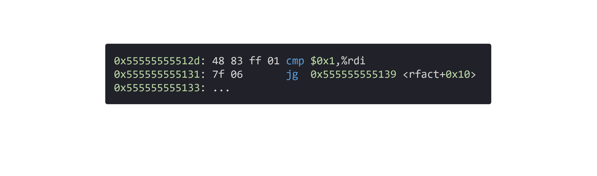

# 条件控制

这个系列是我学习《深入理解计算机系统》的笔记。

本篇文章是学习第三章的第十二篇笔记，对应书本 3.6.3 - 3.6.6 节的内容。

前面的笔记中我们介绍了[条件码寄存器](./11条件码寄存器.md)，在笔记的最后介绍了 `if` 语句所生成的指令。

这次我们介绍 `if` 所代表的条件分支语句所对应的指令细节。笔记分为 4 个部分：

* 跳转指令 JMP
* 跳转指令的编码细节
* 条件控制来实现条件分支
* 条件传送来实现条件分支


## 1. 跳转指令 jmp

在[条件码寄存器](./11条件码寄存器.md)的最后我们介绍了一个简单的条件分支判断语句 `if` ：

```c
if(n <= 1)
....
```

它转换成指令：

```arm
    0x55555555512d:       48 83 ff 01         cmp    $0x1,%rdi
    0x555555555131:       7f 06               jg     0x555555555139 <rfact+0x10>
    0x555555555133:       ...
```

`cmp` 指令的具体含义已经在[条件码寄存器](./11条件码寄存器.md)介绍过了，这次我们俩看一下第二行的跳转指令。

代码正常情况下会一句接着一句的顺序往下运行，但是如果遇到条件判断等情况，就需要根据条件的情况直接跳转到下一句需要运行的语句。

在高级语言中，我们可以使用 `if` 等判断语句进行跳转，对应的指令集中我们可以使用的是跳转指令 jmp（Jump）。

### 1.1 直接跳转和间接跳转

`jmp` 是直接跳转指令，意思是直接跳转到后面操作数所对应的地址。

<figure>
    
</figure>

另外， `jmp` 还可以作为间接跳转，写法是 `*`后面跟操作数：

```arm
jmp *%rax       //用 %rax 中的值作为跳转目标

jmp *(%rax)     //以 %rax 中的值为地址，从内存中读取该地址中的值，并以该值为跳转目标。

```

### 1.2 条件跳转

`jmp` 指令直接进行跳转，并不读取[条件码寄存器](./11条件码寄存器.md)中的值。

在开头 `if` 的示例语句中我们看到了 `jg` （jump greater）指令，该指令需要读取条件码寄存器中的值进行判断，如果之前算术或逻辑指令的状态值是大于，就进行跳转，否则就不跳转。

`cmp` 指令的结果就成了跳转的条件。

类似 `jg` （jump greater ，大于时跳转）这类的指令有很多，具体的条件和[条件码寄存器](./11条件码寄存器.md)中介绍的 `set` 指令一样。只不过 `set` 指令是直接获取条件码寄存器中的判断结果，而 `j**` 则是根据判断结果进行指令跳转操作。

|指令|跳转条件|描述|
|:--|:--|:--|
|je Label|ZF|相等/零|
|jne Label|~ZF|不等/非零|
|js Label|SF|负数|
|jns Label|~SF|非负数|
|jg Label|~(SF^OF) & ~ZF|大于（有符号`>`）|
|jge Label|~(SF^OF)|大于等于（有符号`>=`）|
|jl Label|SF^OF |小于（有符号`<`）|
|jle Label|(SF^OF) &#124;  ZF|小于等于（有符号`<=`）|
|ja Label|~CF & ~ZF |大于（无符号`>`）|
|jae Label|~CF |大于等于（无符号`>=`）|
|jb Label|CF|小于（无符号`<`）|
|jbe Label|CF &#124;  ZF|小于等于（无符号`<=`）|

现在我们基本可以明白，之前 `if` 语句生成指令的含义。

```c
if(n <= 1)
....
```

如果 %rdi > 1，就跳转到指令 0x555555555139。

```arm
cmp    $0x1,%rdi
jg     0x555555555139 <rfact+0x10>
```

## 2. 跳转指令的编码细节

在前面的文章中，我们只关注了指令，并没有注意指令的编码的细节。

```arm
    0x55555555512d:       48 83 ff 01         cmp    $0x1,%rdi
    0x555555555131:       7f 06               jg     0x555555555139 <rfact+0x10>
    0x555555555133:       ...
```

比如在上面的示例中，`jg     0x555555555139 <rfact+0x10>`指令的编码为 `7f 06`。

指令编码的细节，在第四章会有介绍，这里简单了解一下。`7f` 代表的是 `jg` 指令，那么 `06` 是如何代表跳转地址 `0x555555555139` 的呢？

`06` 编码只有一个字节，当然无法保存完整的跳转地址，它其实就是一个偏移量。

具体的做法是：执行跳转指令的时候，程序计数器（PC）的值先变成了下一条指令的地址 `0x555555555133`, 最终的跳转地址是由程序计数器的值加上编码中的偏移量。这个例子中就是，`0x555555555133 + 0x06` 等于 `0x555555555139`。

<figure>
    
</figure>

例子中是向下面的指令跳转，如果需要向上面的指令跳转，偏移量就需要给个负数。比如需要向上跳转 8 行，偏移量可以设置为 `f8`，补码形式的`0xf8` 就是十进制的 `-8`，`0x555555555133` 减 `8` 等于 `0x55555555512B` 。

例子中的偏移量用一个字节的补码就可以表示，如果偏移量过大，也可以用 2 或者 4 个字节来表示。

这种方式叫做 PC 相对寻址，只记录偏移量可以保证指令编码的简洁。在介绍链接的内容时这部分知识非常重要。

## 3. 条件控制来实现条件分支

知道了跳转指令，我们来看一个具体的 `if` 条件分支的使用示例，计算两数只差的绝对值：

```c
long lt_cnt = 0;
long ge_cnt = 0;

long absdiff(long x, long y){
    long result;

    if(x < y){
        lt_cnt++;
        result = y - x;
    }
    else{
        ge_cnt++;
        result = x - y；
    }

    return result；
}
```

这段代码添加了两个全局变量，`lt_cnt` 和 `ge_cnt`，主要的目的是为了是生成的指令更接近于 c 语言代码中的控制流。

**去掉这两个全局变量后的代码，将在下一节详细说明。*

代码对应的指令如下：

```arm
//x in %rdi, y in %rsi
absdiff:
    cmpq    %rsi,%rdi
    jge     .L2                 //if x>=y ,goto .L2
    addq    $1, lt_cnt(%rip)    //lt_cnt++
    movq    %rsi,%rax           
    subq    %rdi,%rax           //return = y - x
    ret
.L2:
    addq    $1, ge_cnt(%rip)    //ge_cnt++
    movq    %rdi,%rax           
    subq    %rsi,%rax           //return = x -y
    ret
```

整个指令的控制流和原始的 c 语言代码略有不同，可以用 c 语言的 `goto` 语句表示指令集的控制流:

```c
long lt_cnt = 0;
long ge_cnt = 0;

long goto_absdiff(long x, long y){
    long result;

    if(x >= y)
        goto x_ge_y;

    lt_cnt++;
    result = y - x;
    return result;

x_ge_y:
    ge_cnt++;
    result = x -y;
    return result;
}
```


从上面的指令我们可以看到正常的 `if` 条件分支：

```c
if(t)
    then-statement;
else
    else-statement;
```

在指令集中将会转换成如下的控制流：

```c
    if(!t)
        goto: false;
    then-statement;
    goto:done;
false:
    else-statement;
done:
```


可以看到指令将 c 语言中的 `if(t)` 转变成了 `if(!t)`。为什么要做这个反转呢？

如果条件分支只有一个 `if` 而没有 `else` 时，就可以看出优势了：

```c
if(t){
    then-statement;
}
```

反转判断的控制流：
```c
    if(!t)
        goto: done;
    then_statement
done:
```

不反转判断的控制流：
```c
    if(t)
        goto: true;
true:
    then_statement
    goto: done;
done:
```

可以看到，反转判断后的控制流更简洁。

## 4. 条件传送来实现条件分支

上面的示例代码中加了两个没有用的全局变量，如果将这两个全局变量去掉：

```c
long absdiff(long x, long y){
    long result;

    if(x < y){
        result = y - x;
    }
    else{
        result = x - y；
    }

    return result；
}
```
这段代码生成的指令将会是这样的：

```arm
//x in %rdi, y in %rsi
absdiff:
    movq    %rsi,%rax
    subq    %rdi,%rax   //rval = y-x
    movq    %rdi,%rax   
    subq    %rsi,%rdx   //eval = x-y
    cmpq    %rsi,%rdi   //
    cmovge  %rdx,%rax   //if x>=y, rval = eval
    ret
```

我们可以看到指令中将 `if` 和 `else` 中的值都计算出来了，最后再判断返回哪个值。

指令集中对应的控制流可以用 c 语言表示：

```c
long cmovabsdiff(long x, long y){
    
    long rval = y-x；
    long eval = x-y;

    long ntest = x>=y;

    if(ntest) 
        rval = eval;
    
    return rval;
}
```

if 和 else 中的语句都执行，在有些情况下是不符合需求的，比如上面一个例子中在 if 和 else 中添加了全局变量，就不能同时执行这两部分代码。

所以只有在特定条件下才会选择这种控制流来执行条件分支语句，之所以会选择这种方式，是因为这种方式的指令在 CPU 中的执行效率更高（因为 CPU 在执行这些指令是无需预测）。

同时计算 if 和 else 语句的方式称为数据的条件转移；而之前的那种满足条件在计算的方式，称为控制的条件转移。

## 总结

这篇笔记我们通过对跳转指令的介绍，让大家了解的 `if` 条件分支是如何实现的。

而跳转指令不仅可以实现  `if` 分支跳转，更重要的是它可以实现循环，我们将在下一篇笔记中详细讲解。

今天就到这里了，我们下一个笔记再见！

---

笔记列表：
 1. [前言 - 学习笔记](./00前言.md)
 2. [从程序的角度看，内存是什么？](./01内存.md)
 3. [内存的布局](./02内存的布局.md)
 4. [寄存器](./03寄存器.md)
 5. [MOV 指令](./04指令1MOV.md)
 6. [LEA 指令](./05指令2LEA.md)
 7. [算术和逻辑指令](./06指令算术和逻辑.md)
 8. [PUSH 和 POP 指令](./07指令push和pop.md)
 9. [CALL 和 RET 指令](./08指令call和ret.md)
 10. [程序运行时的栈](./09运行时栈.md)
 11. [栈帧的布局](./10栈帧的布局.md)
 12. [条件码寄存器](./11条件码寄存器.md)

如果你对这份笔记有兴趣，可以关注这个公众号“dingtingli-pub”，我会每周更新笔记。

<figure>
    
</figure>