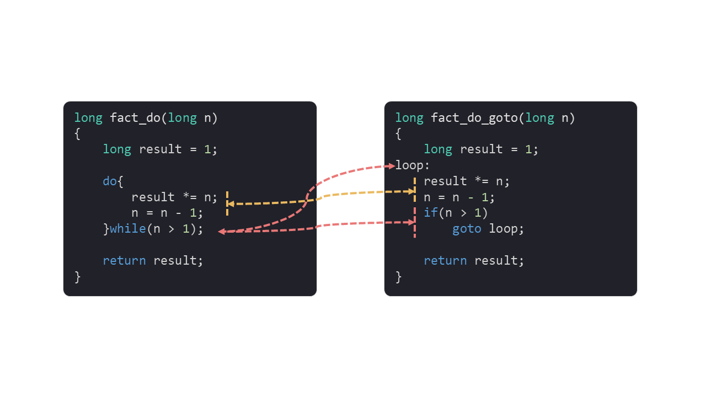
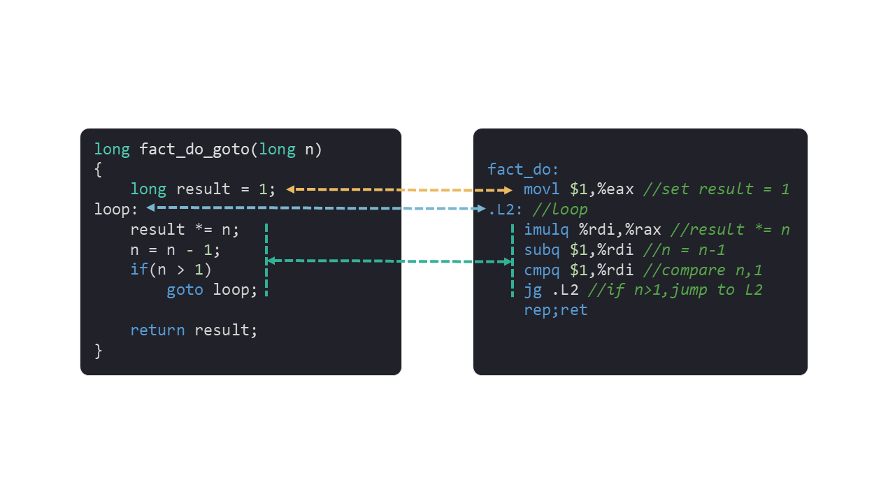
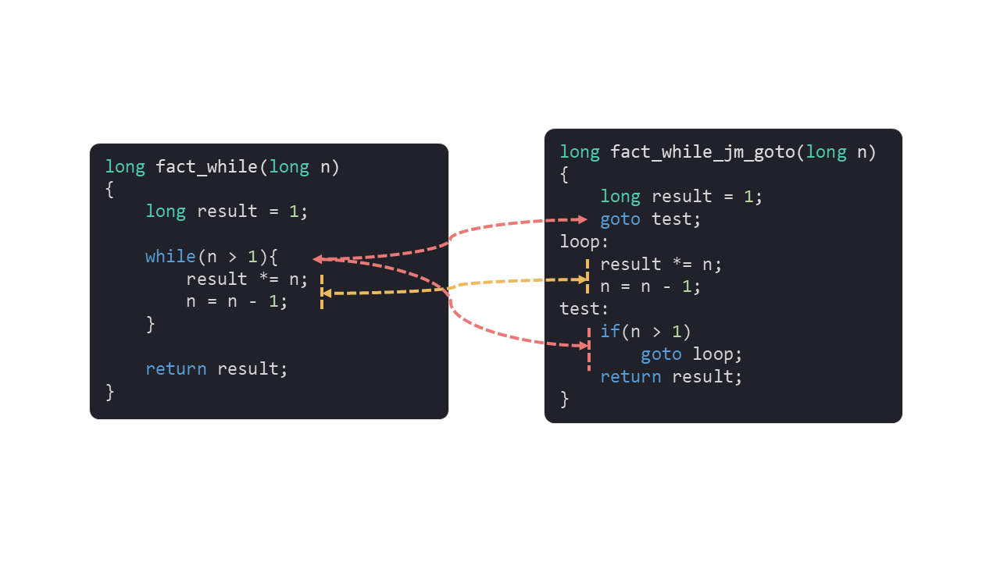
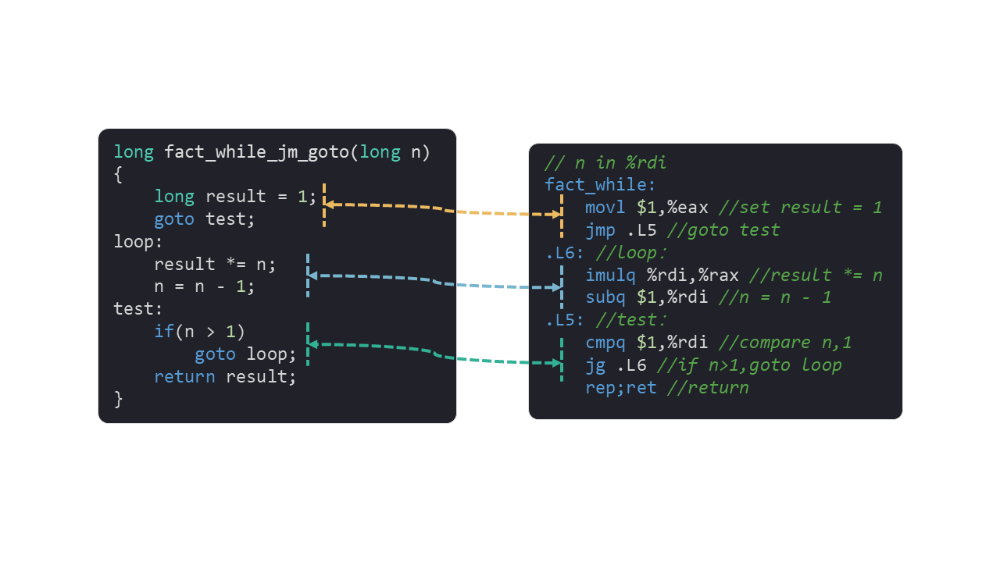
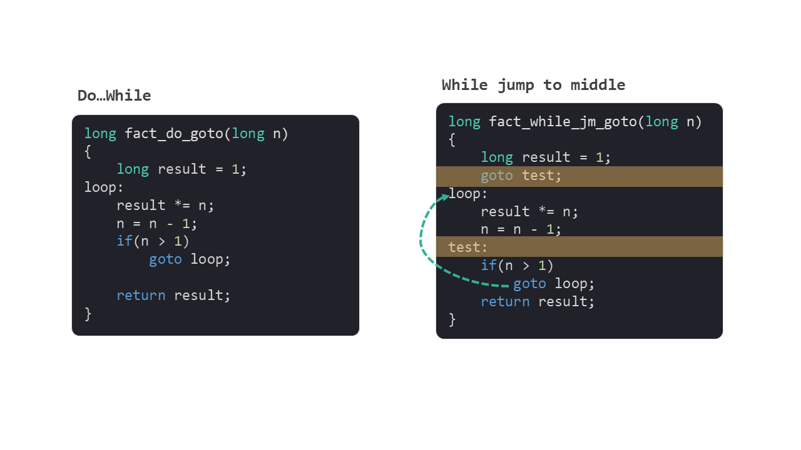
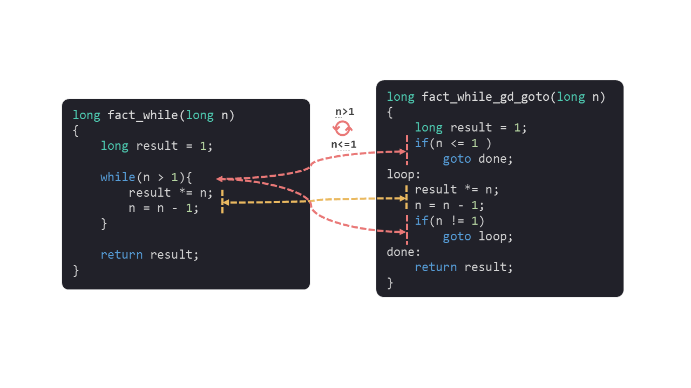
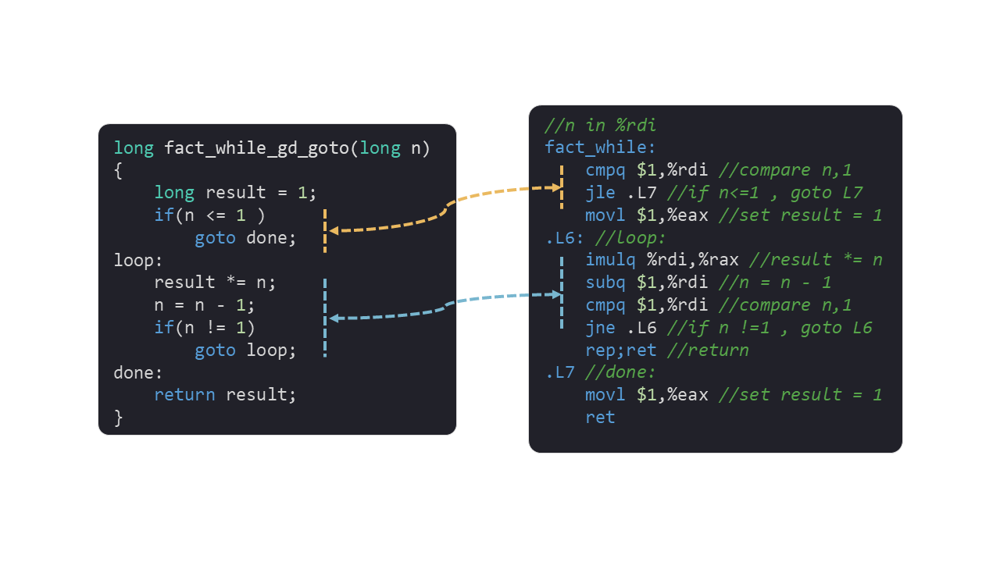
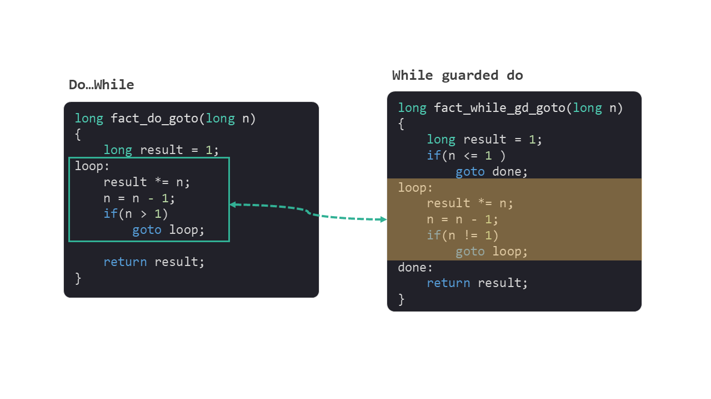

# 循环

这个系列是我学习《深入理解计算机系统》的笔记。

本篇文章是学习第三章的第十三篇笔记，对应书本 3.6.7 节的内容。

[上一篇笔记](./12条件分支.md)中我们介绍了跳转指令，并且详细讲解了如何使用跳转指令实现编程语言中的 `if` 语句。

我们知道计算机之所以比人力计算厉害，有一个很重要的原因是它可以不知疲倦地一直计算，而让计算机在有限的指令上不停地执行的关键就是循环。

今天我们就来看看，跳转指令是如何实现循环语句的。

笔记分为 3 个部分：

* `do…while` 语句
* `while` 语句
* `for` 语句

## 1. `do…while` 语句

我们使用书上的一个求解阶乘的示例，来说明循环的实现。

阶乘写作 n!，含义为 n!=1×2×3×...×(n-1)×n。

使用 do……while 语句来求解阶乘，可以用如下 c 语言代码：

```c
long fact_do(long n)
{
    long result = 1;

    do{
        result *= n;
        n = n - 1;
    }while(n > 1);

    return result;
}
```

编译后生成的指令所使用的控制流，跟 c 语言的源代码有些不同。为了方便描述，我们用 c 语言来解释一下指令所使用的控制流。

左侧是源代码，右侧的代码跟指令使用的​控制流一致。

<figure>
    
</figure>

​最终的指令可以和右侧的​代码一一对应。

<figure>
    
</figure>


可以看到循环和 `if` 条件分支在指令的表现形式上是差不多的，都是通过 `cmp` 和 `jump` 指令组合来实现。

但上面这段代码有一个问题，在阶乘的定义中 0！=1，而上面代码中 0!=0。

## 2. `while` 语句

我们使用 `while` 语句来修复一下上面阶乘的问题。

```c
long fact_while(long n)
{
    long result = 1;

    while(n > 1){
        result *=n;
        n = n - 1;
    }

    return result;
}
```

这段代码很好地解决了 `0!` 的问题。我们来看看这段代码生成的指令是什么样子的。

### 2.1 第一种指令形式

​编译器不同的优化方案，产生的指令也不同。 使用 GCC 编译器 的 `-Og` 优化选项进行编译，生成第一种指令的翻译形式，称之为 jump to middle。

这种形式将 `while` 的执行内容放到中间。执行顺序是：首先无条件跳转到结尾，然后在结尾处再进行条件判断，确认是否要跳转到中间。

具体的控制流可以用一段 c 语言表示：

<figure>
    
</figure>

同样，我们也可以观察一下对应的指令：

<figure>
    
</figure>

将这个 `while` 指令的形式与 `do…while` 进行对比，我们发现整体结构很类似，只是在开始是添加了一个无条件跳转，然后跳转处进行条件判断，并再次跳转到中间，这和它的名字 jump to middle 很契合。

<figure>
    
</figure>

### 2.2 第二种指令形式

使用 GCC 编译器的 `-O1` 优化选项进行编译时，生成了第二种指令翻译形式，称之为 guarded-do。

这种形式首先是进行条件分支判断，然后进行一段 `do…while` 循环。

<figure>
    
</figure>

有没有发现，这时候将源代码中 `while` 的判断进行了反转，从 `n>1` 变成了 `n<=1`，这样的变化我们在[上一篇笔记](./12条件控制.md) `if` 生成的指令中也曾经看到过。通常这会带来更简洁高效的指令。

另外我们发现最后在判断 `n>1` 时，指令使用了 `n!=1`，因为编辑器知道在做完 `n<=1`的判断后，只要保证 `n!=1` 就能满足 `n>1` 这个条件。因为 `n!=1` 执行效率更高。

生成的指令也同样可以和代码对应起来：

<figure>
    
</figure>

将这个 `while` 语句生成的指令与 `do…while` 进行对比，我们不难发现这次指令中完整地保留了 `do…while` 的指令，所以这种指令形式称为 guarded-do。

<figure>
    
</figure>

## 3. `for` 语句

我们再使用 `for` 语句实现一下阶乘的算法：

```c
long fact_for(long n)
{
    long result = 1;
    
    long i;
    for(i = 2; i<=n; i++)
        result *= i；
    
    return result；
}
```

上面的代码完全可以使用 `while` 语句来替代 `for` 语句。

```c
long fact_for_while(long n)
{
    long result = 1;

    long i = 2;         //replace 'for'
    while(i <= n){
        result *= i;
        i++；
    }

    return result；
}
```

所以 `for` 语句最终的指令形式，就是其对应 `while` 语句的指令形式。

从这个角度来看，`for` 语句就是一个语法糖，是为了让编程更方便而产生的。

## 总结

这篇笔记我们学习了常用的循环语句 `do…while`，`while` 和 `for` 的指令形式。

我们可以看到 `cmp` 和 `jump` 的指令组合，可以实现编程语言中所有跟条件判断和循环相关的语句。

下一篇文章中我们将介绍编程语言中另外一种循环，函数的自我循环——递归。

今天就到这里了，我们下一个笔记再见！

---

笔记列表：
 1. [前言 - 学习笔记](./00前言.md)
 2. [从程序的角度看，内存是什么？](./01内存.md)
 3. [内存的布局](./02内存的布局.md)
 4. [寄存器](./03寄存器.md)
 5. [MOV 指令](./04指令1MOV.md)
 6. [LEA 指令](./05指令2LEA.md)
 7. [算术和逻辑指令](./06指令算术和逻辑.md)
 8. [PUSH 和 POP 指令](./07指令push和pop.md)
 9. [CALL 和 RET 指令](./08指令call和ret.md)
 10. [程序运行时的栈](./09运行时栈.md)
 11. [栈帧的布局](./10栈帧的布局.md)
 12. [条件码寄存器](./11条件码寄存器.md)
 13. [条件控制](./12条件控制.md)

如果你对这份笔记有兴趣，可以关注这个公众号“dingtingli-pub”，我会每周更新笔记。

<figure>
    
</figure>