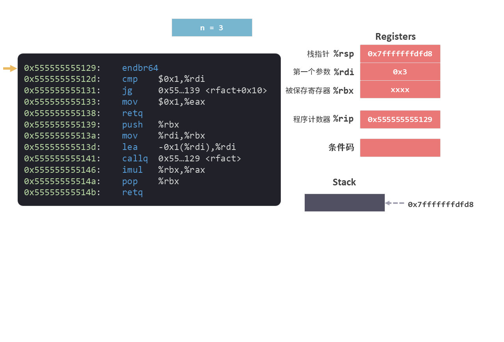
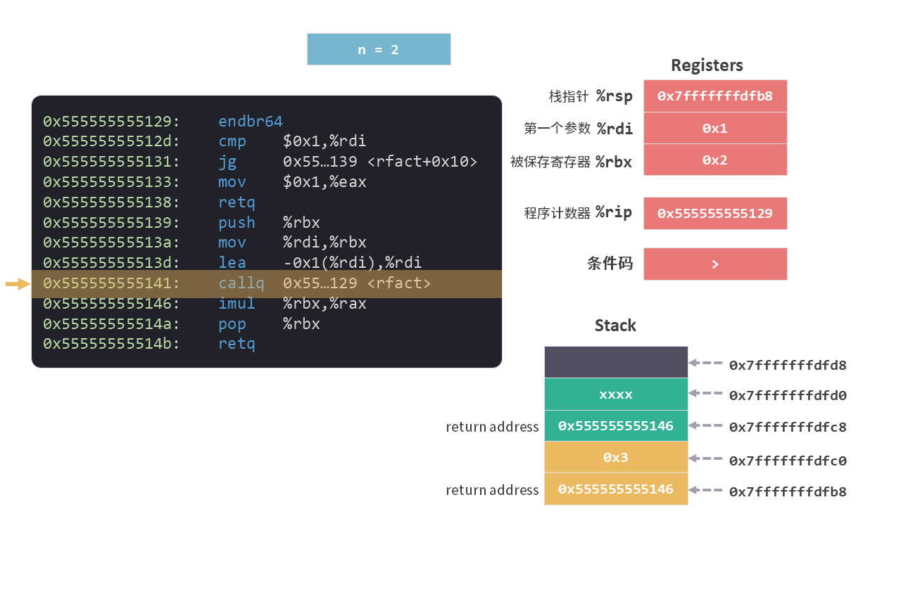
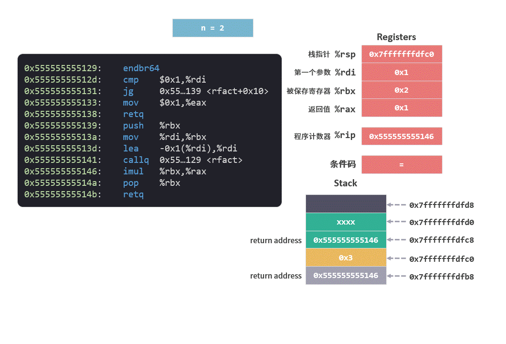

# 递归

这个系列是我学习《深入理解计算机系统》的笔记。

本篇文章是学习第三章的第十四篇笔记，对应书本 3.7.6 节的内容。

[上一篇笔记](./13循环.md)中我们介绍了循环语句对应的指令形式，今天我们来看一个更有意思的循环，函数自身的循环——递归。

在看这篇文章之前，最好能回顾一下之前讲解的几个知识点，[栈帧](./09运行时栈.md) 和 [条件分支](./12条件控制.md)。

笔记分为 4 个部分：

* 什么是递归
* 递归的运行
* 状态机
* 编程思维

## 1. 什么是递归（recursion）

[上一篇笔记](./13循环.md)中我们使用 while 循环实现了阶乘的求解。这次我们试着用递归的方式再来实现一下阶乘的求解。

阶乘写作 n!，含义为 n!=1×2×3×...×(n-1)×n。

用递归的方式来思考，n! = n * (n-1)！。意思是我们只要知道了 (n-1)！就可以求出 n! 。

打个比方，3！= 3 * 2！，而 2！ = 2 * 1！，最终只要知道 1！阶乘就可以返回去推导出 3！……

用 c 语言代码来实现阶乘的递归算法：
```c
long rfact(long n)
{
    long result;

    if(n <= 1)
        result = 1;
    else
        result = n * rfact(n-1);
    
    return result;
}

int main()
{
    long i = rfact(3);
    return 0;
}
```

代码中 `rfact` 函数就实现了 `n！` 的求解。

其中 `result = n * rfact(n-1);` 的意思就是 `n! = n * (n-1)！`。这句代码中我们可以看到 `rfact` 函数内部调用了自己，这就是**递归**——函数可以调用自身。

那这段代码是如何运行的呢？我们接下来通过观察 Stack（栈）和寄存器的变化来详细了解一下。

## 2. 递归的运行

首先查看一下 `rfact` 函数的指令形式：

```arm
0x555555555129 <rfact>:
    0x555555555129:       f3 0f 1e fa         endbr64 
    0x55555555512d:       48 83 ff 01         cmp    $0x1,%rdi
    0x555555555131:       7f 06               jg     0x555555555139 <rfact+0x10>
    0x555555555133:       b8 01 00 00 00      mov    $0x1,%eax
    0x555555555138:       c3                  retq   
    0x555555555139:       53                  push   %rbx
    0x55555555513a:       48 89 fb            mov    %rdi,%rbx
    0x55555555513d:       48 8d 7f ff         lea    -0x1(%rdi),%rdi
    0x555555555141:       e8 e3 ff ff ff      callq  1129 <rfact>
    0x555555555146:       48 0f af c3         imul   %rbx,%rax
    0x55555555514a:       5b                  pop    %rbx
    0x55555555514b:       c3                  retq   
```

### 2.1 条件分支

```arm
cmp    $0x1,%rdi
jg     0x555555555139 <rfact+0x10>
```

前两句指令是由 `cmp` 和 `jg` 组成的[条件分支](./12条件控制.md)，对应的是 c 语言中的 `if(n <= 1)` 语句。

指令的意思是：

```c
if (n > 1) 
    jump to `0x555555555139` instruction
else 
    next instruction.   // mov    $0x1,%eax
                        //calculate 1!
```

### 2.2 第一次调用函数 (n=3)

`main` 函数传递给 `rfact` 的参数是数值 `3`，所以第一次调用 `rfact` 函数时 `n=3`。 

指令开始执行之前，我们先来看看寄存器的情况：参数保存在 %rdi 中，程序计数器指向第一条指令。

<figure>
    
</figure>

接下来的指令执行过程中，会通过 `cmp` 和 `jg` 指令的判断，跳过第 4 和 5 行指令，从第 6 行指令开始执行。

```arm
1 endbr64 
2 cmp    $0x1,%rdi
3 jg     0x555555555139 <rfact+0x10>
4 mov    $0x1,%eax
5 retq   
6 push   %rbx
7 mov    %rdi,%rbx
8 lea    -0x1(%rdi),%rdi
9 callq  0x555555555129 <rfact>
...
```

我们通过动图来看看一步一步执行指令的过程。

<figure>
    
</figure>

当 `callq` 指令执行完成之后，Stack（栈）和寄存器的情况如下。

<figure>
    
</figure>

我们可以看到参数 `%rdi` 等于 `2` ，程序计数器 %rip 以及栈中的返回地址都已经准备再次调用 `rfact` 函数自身。

另外，被保存寄存器 %rbx 中保存了变量 `n` 的值 `3`。从[栈帧的布局](./10栈帧的布局.md)中我们知道所谓**被保存寄存器**，就是在函数返回时，该值还会被恢复到相应寄存器中。

### 2.3 第二次调用函数 (n=2)

`n = 2` 时调用了函数自身，这时候还会为函数再生成一个栈桢。

栈帧中首先保存了**被保存寄存器** %rbx 的值，确保了返回 `n = 3` 函数调用时，被保存寄存器 %rbx 中的值和调用 `n = 2` 函数之前是一样的。

而在 `n = 2` 函数调用期间，变量 `n` 的值也一直保存在 %rbx 中。

我们可以看到在每个栈帧运行时，寄存器 %rdi 保存着当前函数调用的参数 n ，而上一个函数调用时的参数就会通过**被保存寄存器**和栈一起，来保证在当前栈帧运行时该值始终一致。

<figure>
    
</figure>

当 `callq` 指令执行完成之后，Stack（栈）和寄存器的情况如下。

<figure>
    
</figure>

可以看到参数 `%rdi` 等于 `1` ，程序计数器 %rip 以及栈中的返回地址都已经准备第三次调用 `rfact` 函数自身。

### 2.4 第三次调用函数 (n=1)

当 `n = 1` 时，会通过 `cmp` 和 `jg` 指令的判断直接执行第 4 和 5 行指令。

```arm
1 endbr64 
2 cmp    $0x1,%rdi
3 jg     0x555555555139 <rfact+0x10>
4 mov    $0x1,%eax
5 retq   
```

<figure>
    
</figure>

这一段指令完成了 `1!` 的计算，并将结果 `1` 返回给 `n=2` 的函数。

### 2.5 返回返回

返回 `n=2` 的函数后，会执行剩下的指令：

```arm
imul   %rbx,%rax
pop    %rbx
retq   
```

上述指令的意思是：

1. 将从 `n=1` 函数返回的值 `1` ，与 `n=2` 函数中的变量 `n`(值为 `2`)相乘，相乘的结果 `2` 设置为 `n=2` 函数的返回值。

2. 在返回 `n=3` 的函数之前，我们会将 %rbx 恢复为 `3`。

<figure>
    
</figure>

之后会返回 `n=3` 的函数，执行的指令与上面相同。

将从 `n=2` 函数返回的值 `2` ，与 `n=3` 函数中的变量 `n`(值为 `3`)相乘，乘积 `6` 设置为 `n=3` 函数的返回值。

<figure>
    
</figure>

至此，整个递归过程运行结束。

## 3. 状态机

从上面递归运行的详细步骤中，可以看到每次调用函数自身都会为其生成一个栈帧（Stack Frame）。

我们也可以从一个更宏观的角度来理解递归，把程序理解成状态机。
​
所谓状态，就是程序运行时保存在内存（堆和栈）以及寄存器中的值。程序每运行一条指令，状态机都从一个状态转变到另一个状态。

在状态机中，为了实现函数的调用，还有一种特别的模型叫栈帧列表。每次调用函数都会在栈帧列表中压入一个栈帧，返回一个函数时就会从栈帧列表中弹出一个栈帧。

栈帧中保存着这个函数所需要使用的局部变量，以及这个函数当前的PC。这样，我们就可以把状态看作是栈帧列表 + 全局变量。

从这个角度，我们再来看看上面的递归程序状态机的变化过程：

<figure>
    
</figure>

**图中我们把 PC 简化成 c 语言的行号，并且只提供几个关键的执行步骤。*

换一个角度再理解一遍这个程序，是不是就更容易看懂递归了。

## 4. 编程思维

递归之所以让人不太容易理解，是因为它跟人类的正常思维不太一样，人类的正向思维是从小到大，由易到难，从局部到整体。

比如求 5 的阶乘（`5!`），人们习惯从小到大一个一个乘起来，即 `5！= 1 * 2 * 3 * 4 * 5`。

在递归中会将过程倒过来，要算 `5!` 先假定 `4!` 是已知的，然后再乘以 5 就可以了。那么 `4! `阶乘怎么算？同样，假定 `3!` 已知……以此类推，直到 `1! `时，我们知道它等于 1 ，从这就不再往下扩展，而是倒回去推出所有的结果，从 `1!` ,` 2!` 直到推回 `5！`.

递归就是很不直观的逆向思维，它从大到小，从整体到局部，是属于计算机特有的思维方式。

递归必须具备两个条件：
1. 首先需要确定好结束条件。
2. 在每个问题的形式上都相同，只要解决当前问题就能解决整个问题。

有些问题上，递归这种逆向思维会让问题变得非常简单。比如八皇后问题，汉诺塔问题。如果从小到大，一步一步推导问题复杂的为呈现指数级别的上升，但是递归只需要知道如何拆解问题即可，计算机可以帮忙快速的处理出现的无数种情况。

但是也需要注意递归的深度，从上面的运行情况来看，每一次递归都需要消耗 Stack 的空间，如果超过了 Stack 的大小 8 M， 就会出现栈溢出的情况。

总的来说，递归是一个程序员必须掌握的计算机思维。

## 总结

之前我们已经学习了[栈帧](./09运行时栈.md)和 [条件分支](./12条件控制.md)相应的指令。有了这些指令的支持，我们已经可以看明白递归算法所生成的指令了。

然而，我们更应该思考[栈帧](./09运行时栈.md)这种模式给计算机提供一种解决问题的模式。这种模式是有别于人类的思维模式的。

只有明白了计算机是如何解决问题的，我们才能写出更高效的代码。

今天就到这里了，我们下一个笔记再见！

推荐阅读：

操作系统上的程序（蒋岩炎）：

https://www.bilibili.com/video/BV12L4y1379V?vd_source=d8bfce14ec9cc246465157088bd8dc3a

---

笔记列表：
 1. [前言 - 学习笔记](./00前言.md)
 2. [从程序的角度看，内存是什么？](./01内存.md)
 3. [内存的布局](./02内存的布局.md)
 4. [寄存器](./03寄存器.md)
 5. [MOV 指令](./04指令1MOV.md)
 6. [LEA 指令](./05指令2LEA.md)
 7. [算术和逻辑指令](./06指令算术和逻辑.md)
 8. [PUSH 和 POP 指令](./07指令push和pop.md)
 9. [CALL 和 RET 指令](./08指令call和ret.md)
 10. [程序运行时的栈](./09运行时栈.md)
 11. [栈帧的布局](./10栈帧的布局.md)
 12. [条件码寄存器](./11条件码寄存器.md)
 13. [条件控制](./12条件控制.md)
 14. [循环](./13循环.md)

如果你对这份笔记有兴趣，可以关注这个公众号“dingtingli-pub”，我会每周更新笔记。

<figure>
    
</figure>