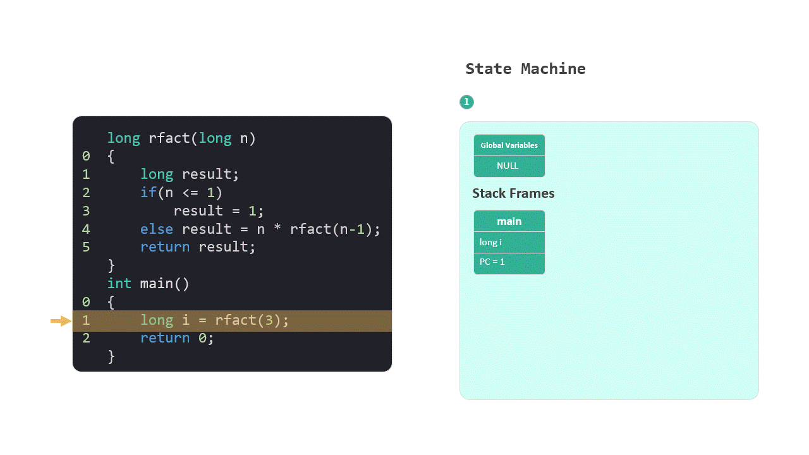

# 为什么要了解计算机的底层原理？


终于完成了《深入理解计算机系统》第三章的笔记整理，这个过程耗费了我将近半年的时间。

在这个系列笔记完成之际，我回想起了一位网友提出的问题：“现在学习 CSAPP 对我的工作有帮助吗？”

我也曾困惑于此。经过深入阅读和笔记整理，我对这个问题有了更深的见解。

## 1 理解抽象泄漏

以第三章的标题“Machine-Level Representation of Programs”为例，翻译过来就是“程序的机器级别表示”。

我们通常在工作中使用如 Java、C#、Python、JavaScript 这样的高级编程语言。

看似，这些高级语言已经足够远离底层的汇编语言。那么，我们为什么还需要了解“程序的机器级别表示”呢？

我在阅读 Stack Overflow 创始人 Joel Spolsky 的一篇文章后，对此豁然开朗。

他在文章中提出了“抽象泄漏法则”，深刻指出：所有非琐碎的抽象，在某种程度上，都无法完全封装底层的复杂性。

编程语言的演进过程中，从机器语言到汇编，再到如 Java 和 Python 的高级语言，每一步抽象都旨在简化开发者的工作。尽管如此，这些抽象层并不总是完美无瑕。


例如，当我们在高级语言中使用加号（`+`）连接字符串，如 `"foo" + "bar"` 时，其背后的实现复杂度和性能开销却常常被隐藏。

资深程序员可能会建议使用 `StringBuilder` 类来优化此类操作。这些建议的背后正反映了抽象泄漏的现象。

在低级别语言中，并没有字符串这一类型，只有 `char *`，即字符数组。当我们了解到 `StringBuilder` 类的底层原理实际上是操作字符数组时，就能更全面地理解其优势。


深入理解这些抽象背后的机制不仅能提高我们解决问题的效率，还能拓宽我们的技术视野。

正如 Joel Spolsky 所强调的：“抽象可以节省我们的工作时间，但不能节省我们的学习时间。”

因此，学习底层原理，尤其是那些我们日常看似不必深入了解的部分，实际上是提升我们编程技能的关键。

## 2 栈帧和闭包

从底层开始学习，我们不仅能够更好地把握编程的基础知识，还可以深入理解一些看似晦涩的概念，例如闭包和递归。

让我们从一个常见的前端编程挑战开始探索：闭包。

想象一下，你在使用 JavaScript 写一个循环，代码如下：

```javascript
for (var i = 0; i < greetings.length; i++) {
    ...
}
```

运行这段代码，你可能会遇到一些问题，比如循环内部的变量 `i` 不按预期工作。这时候，如果你将 `var` 替换为 `let`，问题似乎就解决了。这背后的原因是什么呢？

这个现象揭示了闭包的实际应用。

在 JavaScript 中，使用 `var` 声明变量会导致变量提升，这意味着变量在整个函数中都是可见的，即使它是在循环内部声明的。

而 `let` 提供了块级作用域，每次迭代都会创建一个新的变量实例，这解决了由于变量共享引起的问题。

通过理解 JavaScript 的函数栈帧和堆内存管理，你就能从根本上理解闭包的运作机制。


参考：[JavaScript 闭包在 Heap 中的表示](https://zhuanlan.zhihu.com/p/468527405)

## 3 递归和迭代

现在，让我们来谈谈递归。我记得第一次尝试通过递归来解决汉诺塔问题时，整个过程让我困惑不已。

递归的复杂性主要来源于它的自引用性质，每个函数调用都在等待它自己的一个更小版本完成。

但当我们理解了函数栈帧的工作机制，递归的原理就变得清晰多了：每次函数调用都会创建一个新的栈帧，其中保存着函数的局部变量和返回地址。

计算机使用栈帧来追踪每一层递归调用的过程，形成了一个层次分明的推导过程。



递归是计算机处理问题的独特方式，这种方式有别于人类的正常思维。作为程序员，我们需要理解并按照这种方式编写自己的代码。

理解递归，意味着你能够更深入地理解计算机如何使用其本身的运算特性来优雅地解决问题。

## 4 如何从底层开始学习

如何从底层开始学习计算机系统？首先，我们需要了解“程序的机器级别表示”，这通常意味着学习汇编语言。

在了解汇编之前，我们首先应从程序的视角理解一些核心硬件概念：内存、寄存器和程序计数器是如何工作的，以及它们在编程中的角色。


我们并不需要深入到编写复杂的汇编代码，但至少应该理解其基本结构和指令。

这种理解有助于任何程序员更好地掌握计算机的工作原理。以下内容将帮助你快速掌握这些基础概念：

[从内存的视角出发：什么是内存？](./01内存.md) — 探索内存的基本作用。

[深入内存布局](./02内存的布局.md) — 了解程序运行时内存时如何布局的。

[寄存器的重要性](./03寄存器.md) — 理解寄存器在执行程序时的功能。


接下来，我们会详细探讨汇编语言的基本组成部分。这一过程类似于学习任何新语言的基本语法：

[基础指令学习：了解MOV指令](./mpweixin/04指令1MOV.md) — 介绍MOV指令如何在程序中转移数据。

[内存访问与LEA指令详解](./mpweixin/05指令2LEA.md) — 解释LEA指令如何有效地处理地址计算。

[算术与逻辑操作简介](./mpweixin/06指令算术和逻辑.md) — 看看如何执行基本的计算和逻辑判断。

[栈操作入门：PUSH 和 POP](./mpweixin/07指令push和pop.md) — 学习如何使用栈来保存和恢复数据。

[函数调用的核心：CALL 和 RET](./mpweixin/08指令call和ret.md) — 理解函数如何被调用和返回。


在理解了这些基本指令之后，我们将深入学习函数的实现细节，特别是栈和栈帧的概念：

[掌握程序运行时栈的管理](./mpweixin/09运行时栈.md) — 揭示运行时栈如何支持程序执行。

[详解栈帧布局](./mpweixin/10栈帧的布局.md) — 透视函数调用中栈帧的具体结构。


最后，我们会学习如何通过汇编实现条件分支，这对理解编程语言中的 `if` 语句和循环控制极为重要：

[条件码寄存器的作用和重要性](./mpweixin/11条件码寄存器.md) — 探索条件码寄存器如何影响程序流。

[实现条件分支：if语句的底层逻辑](./mpweixin/12条件控制.md) — 理解如何在汇编中处理条件判断。

[深入循环的底层逻辑](./mpweixin/13循环.md) — 学习循环控制在汇编中的实现方式。

[递归的底层原理](./mpweixin/14递归.md) — 揭示递归在底层的具体执行过程。


通过这些学习，你不仅能够读懂汇编代码，还能深刻理解那些通常由高级编程语言自动处理的底层细节，从而让你在技术上看得更远、走得更稳。

## 5 结语

最后说一件最近工作中遇到的问题。在前端开发中，我使用了 ajax 来请求数据，接下来的操作必须等待这些数据被成功加载。

这引发了我对一些问题的思考：既然 JavaScript 是单线程的，它是如何处理像 ajax 这样的异步调用的？这些操作与多线程有关系吗？如何确保这些异步调用的执行顺序？

回过头来细想，能提出这些问题，都是因为我当时看过了操作系统是如何处理并发的，如何处理线程的。这些问题自然地出现在我的思考过程中。

这些疑问的产生，源于我对操作系统如何处理并发和线程的基本了解，这些问题自然地出现在我的思考过程中。

顺着这个思路，让我能够链接到 JavaScript 中的异步编程技术，比如 promises 和 async/await。


参考：[可视化的 JavaScript Promises & Async/Await](https://zhuanlan.zhihu.com/p/467601693)

异步编程不仅限于 JavaScript。其他高级编程语言，如 C# 也提供了类似的异步编程工具，比如 async、await 和 Task。JavaScript 使用的是 Event Loop，而 C# 使用的是多线程。

通过了解底层原理，我们不仅可以更好地理解和应用这些高级特性，还能通过底层的视角看待问题，从而找到更有效的解决方案。

所以，深入学习计算机系统的底层不仅是为了满足我们对知识的好奇，更是为了在实际编程中能够运用这些知识解决问题。

理解了底层，我们才能真正精通编程，不仅是在使用高级语言时，更是在面对各种技术挑战时能够迎刃而解。

让我们在这条道路上一起努力吧，Happy Coding！😊