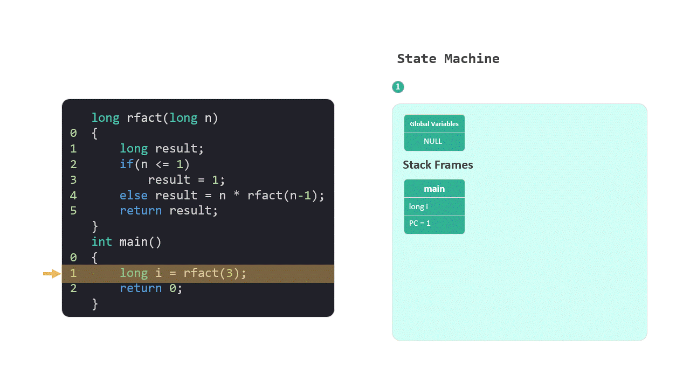
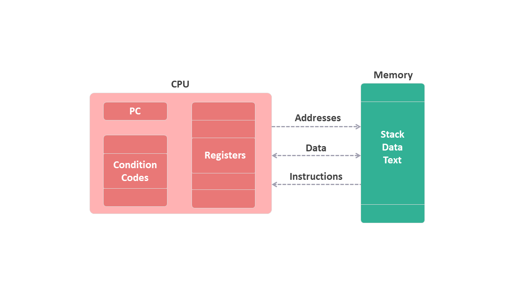

# 从底层逻辑开始

终于把第三章的笔记整理好了，前前后后大概用了大半年时间，中间还经历了一次上海疫情。在这个系列笔记完成之际，突然想起了一位网友的问题“现在学习 CSAPP 对我的工作有帮助吗？”

在学习之前，我其实也有同样的疑问。现在已经大致看了一遍书，还做了一份笔记，对这个问题也有了一些自己的感受。

思考这个问题的过程，让我想起了刘润老师的一本书《底层逻辑》。是的，这个问题最好的回答就是“从底层逻辑开始”。

接下来我将从 Why / What / How 三个角度来聊聊我的理解和学习收获。

* Why
* What
* How

## 1. Why

就拿书本的第三章为例，这个章节的英文叫做 Machine-Level Representation of Programs，翻译过来就是“程序的机器级别表示”。

大家平时工作中使用的都是 Java，C#，JavaScript 等这类高级编程语言。而且我们在工作中也是不需要使用汇编这类的低级语言的。

那么，我们现在为什么要去学习“程序的机器级别表示”呢？

这个问题我在看到码农翻身的[一篇文章](https://mp.weixin.qq.com/s/HNcIgOD81UkQjbO2pG0dWA)时恍然大悟。文章中提到 Stack Overflow 的创始人 Joel Spolsky 一个理论：抽象泄漏法则。

### 1.1 抽象泄漏法则

以编程语言为例，这就是一个不断向上抽象的产物。

从机器语言开始到汇编语言，然后到 c/c++ 高级语言，再到 Java，C#，JavaScript 等高级编程语言，总是在不断地抽象。

（图）

Joel Spolsky 说：

>All non-trivial abstractions, to some degree, are leaky.

>所有非琐碎的抽象，在某种程度上，都是泄露的。

比如在高级语言中，都将 string 抽象成向 int 一样使用。我们可以使用加号将两个字符串串联，就像这样： `"foo" + "bar"`。

当我们这么使用的时候，可能会有高级别的程序员告诉我们，串联字符串时最好使用 StringBuilder 类。我们会记住这个用法，但是不一定能理解为什么。

这其实就是抽象的泄露。在低级别语言中并没有字符串这个类型，只有`char *`，字符串就是一个 char 的数组。

理解到这一层，再回头看看 StringBuilder 类，就会知道底层的原因。

（图）

所以 Joel Spolsky 说 “the abstractions save us time working, but they don’t save us time learning. （抽象可以节省我们的工作时间，但不能节省我们的学习时间）”。

**Joel Spolsky 原文  [The Law of Leaky Abstractions](https://www.joelonsoftware.com/2002/11/11/the-law-of-leaky-abstractions/)*

### 1.2 理解基础知识

从底层开始学习，还能够更好的理解编程的基础知识，这是我在学习过程中感触最深的地方。举两个例子：闭包和递归。

#### a. 闭包

前端开发的朋友第一次遇到闭包问题，可能都是从一段 `for` 循环不能正常执行开始。

```javascript
for (var i = 0; i < greetings.length; i++) {
    ...
}
```

我们会发现将 `var` 写成 `let` 就可以正常工作了。

闭包到底是什么原因导致的？

当我们知道了函数栈帧和堆的概念之后，再去找找相应的专业文章，就能够从原理上理解闭包这个概念。

（图）

这里推荐一下我翻译的一篇文章：[JavaScript 闭包在 Heap 中的表示](https://zhuanlan.zhihu.com/p/468527405)


#### b. 递归

记得我第一次跟踪递归实现汉诺塔的算法时，完全是一团浆糊，弄清楚是怎么回事。

这个问题同样也可以从底层逻辑来搞明白。

当我们知道了函数栈帧的概念，知道了每次函数调用都有自己的栈帧，知道了栈帧里面保存了局部变量。

这时候再回过头来理解递归，其实就是基于栈帧这个概念，生成一条栈帧链，实现的从大到小，从整体到局部一个推导过程。

递归也可以理解为计算机基于自己的运算特性（栈帧），形成了自己独特地处理问题的方式。作为程序员，我们需要理解并按照这种方式编写自己的代码。

<figure>
    
</figure>

**阶乘的递归实现*

## 2. What

什么是 “程序的机器级别表示” ？在第三章中，我们可以理解为汇编语言。

在了解汇编语言之前，我们还需要从程序的视角对一些硬件有大致的认识。什么是内存？什么是寄存器？什么是程序计数器？……

产生这些疑问，其实也是因为汇编也是一种抽象，是机器语言的抽象。

我们当然可以跳过这部分知识。但是如果能了解这些知识，的确可以帮助我们学习。

从书中的内容，我整理出下面这几部分内容，可以帮助大家快速理解这些概念。

 1. [从程序的角度看，内存是什么？](./01内存.md)

 2. [内存的布局](./02内存的布局.md)

 3. [寄存器](./03寄存器.md)

<figure>
    
</figure>

但是，这里我想推荐一本书——《编码》。顺便也介绍一种选择书籍的好办法，概括起来就三个字：白，浅，透。

对新手来说，一听就明白。对专业人士来说，讲解的方式浅显易懂。对高手来说，道理讲得很透彻。

《编码》这本书的确是难得的“白，浅，透”三方面都做得特别好的入门书籍。

我们在这本书中可以看到，如何从一个简单的逻辑门开始一步一步地演变出指令的过程。看完之后，大家对计算机，对汇编语言一定会有深刻的理解。

（编码封面）

## 3. How

如何学习汇编语言呢？

我们学习的目的不是为了能够编写汇编代码，而是能够看懂。所以学习起来相对简单。

我将第三章的内容分成了三部分。

首先，第一部分我们需要学习基本的指令形式，就像学习语言是我们需要先学基本语法一样。

1. [指令 1 - MOV](./mpweixin/04指令1MOV.md)

2. [指令 2 - LEA](./mpweixin/05指令2LEA.md)

3. [指令 3 - 算术和逻辑](./mpweixin/06指令算术和逻辑.md)

4. [指令 4 - PUSH 和 POP](./mpweixin/07指令push和pop.md)

5. [指令 5 - CALL 和 RET](./mpweixin/08指令call和ret.md)

然后，第二部分在学习函数相关的知识，这一部分我们可以学到栈和栈帧的概念。

1. [程序运行时的栈](./mpweixin/09运行时栈.md)

2. [栈帧的布局](./mpweixin/10栈帧的布局.md)

最后，掌握一下条件分支的知识，看看条件分支是如何实现编程语言中 `if` 和 循环语句的，也看看递归到底是怎么回事。

1. [条件码寄存器](./mpweixin/11条件码寄存器.md)

2. [条件分支](./mpweixin/12条件控制.md)

3. [循环](./mpweixin/13循环.md)

4. [递归](./mpweixin/14递归.md)

汇编语言作为一门低级语言，相比其他高级语言来说语法非常简洁，如果只要做到能够看懂，并不用花费太长时间。

## 4. One More Thing

“程序的机器级别表示”，看上去我们一直在研究汇编语言。然而这仅仅是个开始。

从这里起步，在接下来的章节中我们可以看到操作系统的其他特性，比如虚拟、并发、持久化等等知识。

最后说一件最近工作中遇到的问题。我在前端使用 ajax 请求数据，接下去的事情需要等待这些数据到达后才能继续。

当时心中出现了好多问题：JavaScript 作为一个单线程语言，是如何实现 ajax 的异步调用的？这些跟线程有关系吗？有没有方法保证异步调用的顺序执行？

回过头来细想，能提出这些问题，都是因为我当时看过了操作系统是如何处理并发的，如何处理线程的。这些问题自然地出现在我的思考过程中。

顺着这个思路，很顺利地找到了 JavaScript 中异步编程的方法 promise，async、await。

这里推荐一下我翻译的一篇文章：[可视化的 JavaScript Promises & Async/Await](https://zhuanlan.zhihu.com/p/467601693)

其实，在很多高级的编程语言中看到异步编程。比如 JavaScript 中的 promise，async、await；C# 中的 async、await、Task 等等。

我个人的体验是，如果只是为了掌握语言特性，学习异步编程很有可能会学得雨里雾里。然而，当我们知道了操作系统是如何处理并发的，如何处理线程的，这些都将会帮助我们更加深刻地理解编程语言中的异步问题。

最后，还是回到文章开头那句话 —— 一切都从底层逻辑开始。