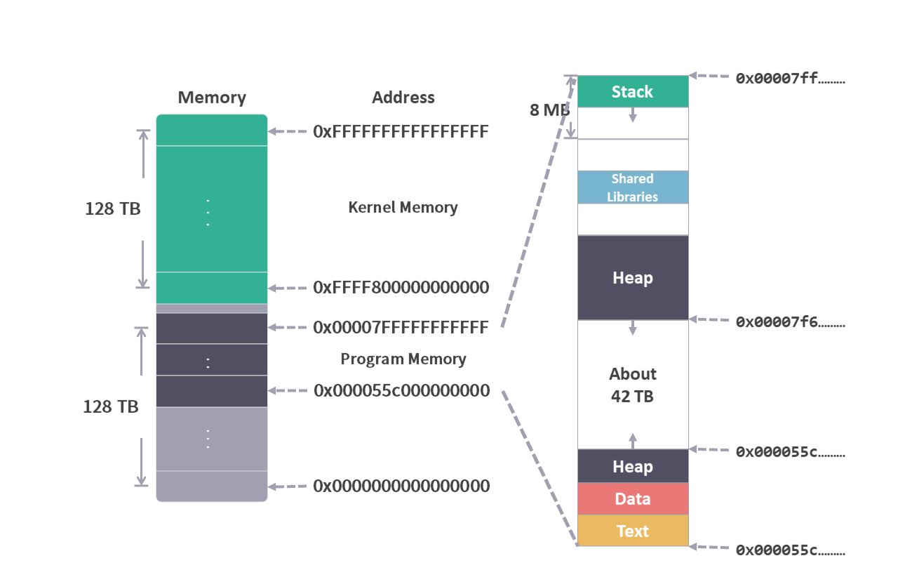
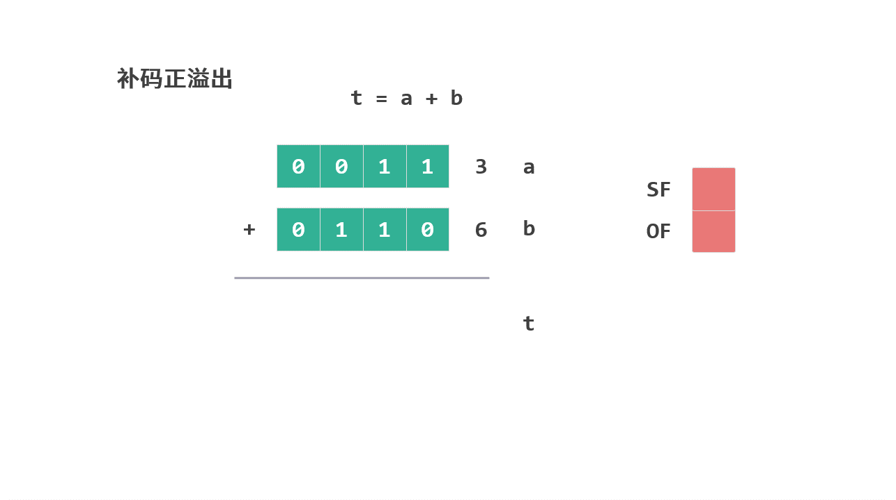

# 前言 - 学习笔记

2021 年，我在学习 JavaScript 时看到了一篇关于 V8 引擎的文章。当在这篇文章中看到 “栈” 和 “寄存器” 这些概念的时候，就有点读不下去了。我想大家可能都有过这种感觉，对计算机基础知识的欠缺导致深入理解技术原理的时候步履维艰。

于是接下去几个月我决定从头开始认真学习一遍《深入理解计算机系统》。

在学习的过程中走过不少弯路，有些内容需要重复看几遍才明白，有些内容则需要再找其他资料对比来看。

一开始我是边学习边在纸上记笔记，做"第三章 程序的计算机级表示"笔记的时候，我发现电子版会更方便理解，于是便有了这份学习笔记。

选择把这份笔记公开出来，也是希望这份笔记也可以帮助到更多正在学习这本书的朋友。

相对于直接看书，结合笔记来学习，我觉得有这么三点好处：

## 1. 可视化的演示

在学习的过程中，经常会遇到操作内存和寄存器相关的指令，比如 Push 和 Pop。

书本上会用多张图来演示这些指令的执行过程。

<figure>
    
</figure>

这种情况下，通过动图可以更加直观地了解整个过程。

<figure>
    
      
</figure>

整个笔记中，我在每篇文章中都配有相应的图片来帮助理解，目前已经完成了100多张动态图片。

## 2. 新的视角

书本上的讲解，是按照概念从小到大的顺序来进行的。这符合人们认识事物的心理预期。

但我在学习的过程中我发现有时候这反而容易让我失去学习的耐心。因为内容实在太多了，一章的内容不是一两天就能看完的，很容易就钻进一个小的细节中，而忘了整个结构。

我需要一张导航图，知道我今天学习的内容在这张图的那个部分。

于是我的笔记中重新整理了顺序，首先介绍内存的布局。

<figure>
    
     
</figure>

然后在介绍完简单指令后，就直接通过一个完整的例子介绍过程（函数），最后再回过头来介绍条件码等其他内容。

当然，我也会在每篇文章中标注出这是书本中的哪个章节。按照书本的顺序来学习的时候，可以将笔记作为对照。

<figure>
    
</figure>

## 3. 查漏补缺

学习的过程中，我也会去查找其他学习资料。有些内容是书本中没有讲到的。比如，程序使用的虚拟内存最高位为什么是 '0x00007FFFFFFFFFFF'？这其实跟 AMD64 架构的规定有关，“虚拟内存地址只用48位地址”。

<figure>
    
      
</figure>

另外，有些书中没有细讲，但我在学习的时候不是很清楚的部分，笔记中也会详细介绍。比如，在介绍条件码寄存器的溢出标志 OF 时，提到补码的正溢出和负溢出，笔记中会有详细的示例来解释。

<figure>
    
</figure>

## 总结

这是一份个人的学习笔记。在笔记中，我尽可能地用一种可视化的方式将书本中的概念展现出来。这些内容虽然无法替代你亲自去阅读《深入理解计算机系统》这本书，但是肯定可以帮助你更好地理解书本中的内容。

如果你对这份笔记有兴趣，可以直接关注这个公众号“dingtingli-pub”。我会每周更新三篇笔记。

<figure>
    
</figure>