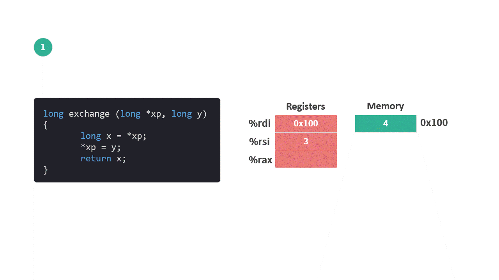

# 寄存器

之前的文章，我们已经介绍了关于内存的相关内容。对于程序而言，我们还会接触到 CPU 内部的存储单元——寄存器（Register）。

寄存器可以用来暂存程序指令，数据和内存地址。因为是在 CPU 内部，所有寄存器的读写速度比内存快很多。

*寄存器和内存之间，还有一层存储介质叫缓存（Cache）也在 CPU 内部，访问速度也在两者之间，但 Cache 对程序而言是透明的。*

有三类寄存器与程序的运行有关：

1. PC（Program Counter）程序计数器：存放程序将要执行的下一条指令在内存中的地址（用 %rip 表示）。

2. 整数寄存器文件：有 16 个寄存器，每个寄存器 64 位，可以存放内存地址和整数数据。

3. 条件码寄存器（condition code register）：主要有 4 个寄存器，每个寄存器为 1 位，用于存储最近执行的算术或逻辑指令的状态信息。主要是用来实现编程语言中的条件语句，比如 if，while。

*除了上面提到的寄存器，还有其他寄存器，比如多个处理浮点运算的128位寄存器等。*

16 个整数寄存器，都有自己的名称。因为可以用来存储 X64 系统中的内存地址，所以每个寄存器都是 64 位。

为了兼容之前的系统，同样位置的寄存器使用的位数不同，名称也会有差别，64 位是一个名字，32 位，16 位，8 位都有自己的名字，具体形式如下图。

<figure>
    
    <figcaption><em>整数寄存器</em></figcaption>
   <br><br>
</figure>

寄存器和内存之间的关系如下：

<figure>
    
    <figcaption><em>寄存器和内存</em></figcaption>
   <br><br>
</figure>

程序编译后的代码保存到内存中，机器一条一条地读取代码里面的指令并执行。执行期间根据指令的内容使用内存和寄存器。

我们用一个简单的例子来演示一下程序运行期间，寄存器和内存是如何工作的。

```c
long exchange (long *xp, long y){
    long x = *xp;
    *xp = y;
    return x;
}

int main(){
    long a = 4;
    long b = exchange(&a, 3);
}
```
上面代码的主要功能是，将变量 a 的地址 和 数值 3 传递给 exchange 函数，最终变量 a 的值变成了3，变量 b 赋值为 4 （即调用函数之前变量 a 的值）。

1. 函数初始化状态：
    * 假设数值 4 保存在内存开始地址为 0x100 的地方（long 类型需要 8 个字节，占用 8 个内存地址）。
    * 参数 xp 是数值 4 的内存地址，这个地址存放在寄存器 %rdi 中。
    * 参数 y 的数值是 3，该值保存在寄存器 %rsi 中。

<figure>
    
    <figcaption><em>初始化</em></figcaption>
     <br><br>
</figure>

*注：图中 Memory 一格为 8 个连续的字节，右侧的地址为这 8 个字节的开始地址。

2. 设置变量 x 的值：
    * 变量 x 保存在寄存器 %rax 中。
    * 从 xp （即 %rid）所指向的内存中读取数值 4。    
    * 将上一步取到的数值 4 保存到寄存器 %rax 中。

<figure>
    
    <figcaption><em>设置 x 的值</em></figcaption>
   <br><br>
</figure>

3. 将参数 y 的值赋给 xp 所指向的内存。
    * 从 %rsi 中取出数值3，将其保存到 %rid 所只向的内存中。

寄存器 %rax 是保存函数返回值的地方，变量 x 被赋值之后没有变化，所以最后一句 `return x;` 在这里不需要额外的指令。

<figure>
    
    <figcaption><em>将参数 y 的值赋给 xp 所指向的内存</em></figcaption>
   <br><br>
</figure>

完整的过程如下面这张图：
<figure>
    
    <figcaption><em>整体流程</em></figcaption>
    <br><br>
</figure>

函数 exchange 最终转换成指令集（汇编代码）如下：

```amd
movq (%rdi),%rax
movq %rsi,(%rdi)
```

* 这些指令什么意思？
* 如何将编写的代码转换成机器指令？

这些问题一定让你很困惑，不要着急，我们会在之后的文章中详细介绍这些内容。


