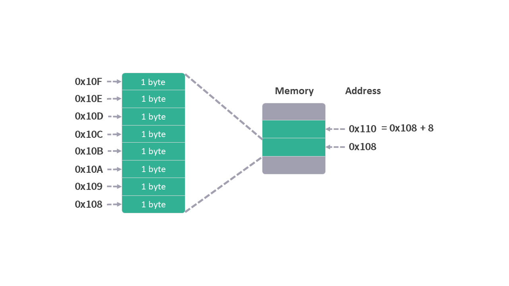
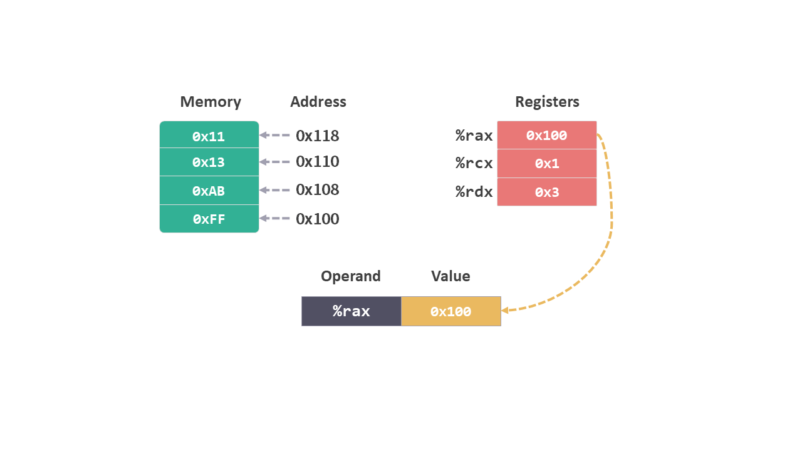
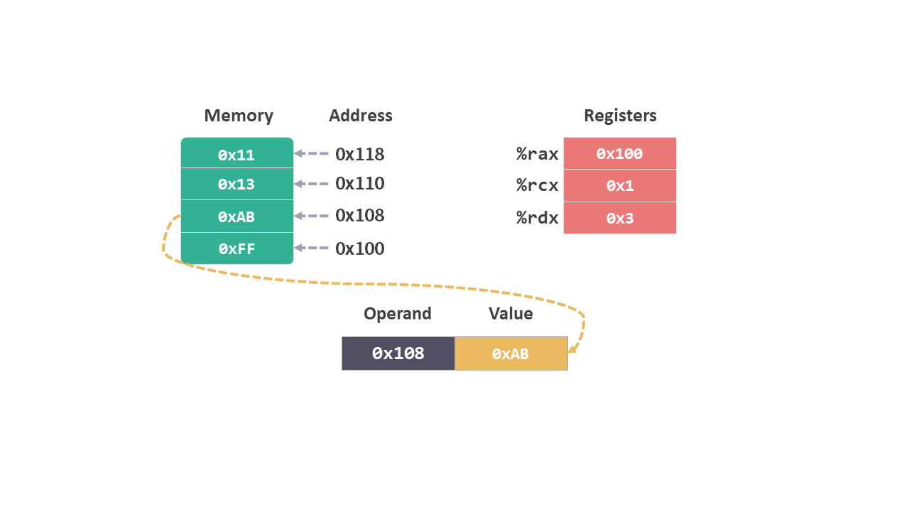
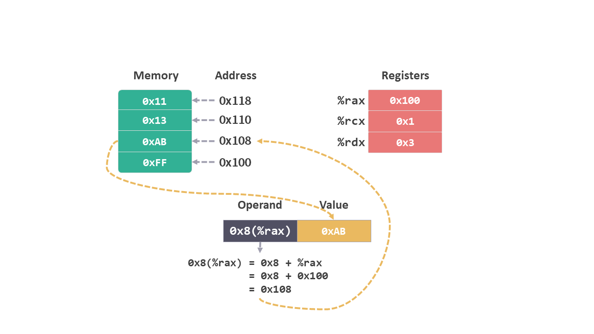
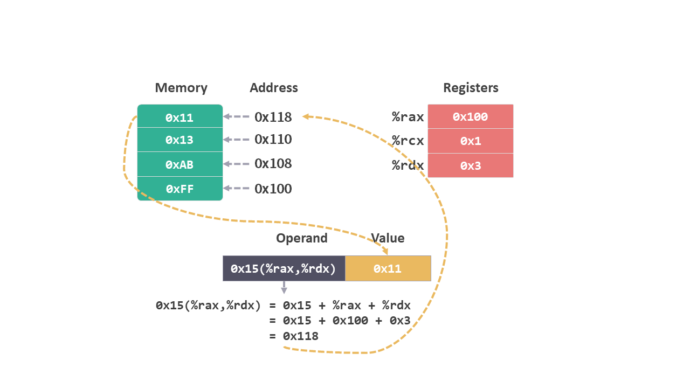
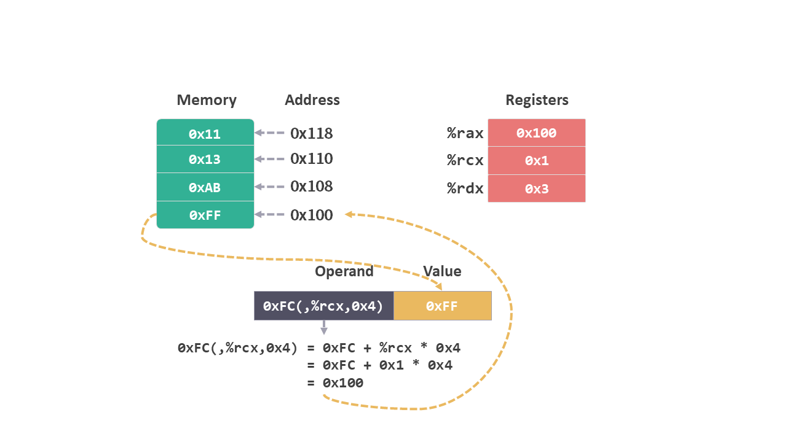

# 指令集 01 - 操作数格式

[上一篇文章](/寄存器.md)我们谈到了指令，从这篇文章开始我们就来了解一下指令相关的内容。

## 指令集介绍

我们用高级语言来编写代码，而计算机却不能直接解读这些代码，因为 CPU 有一套自己理解的格式和行为，被称为指令集架构（ISA Instruction Set Architecture），它定义了**处理器状态，指令的格式以及每条指令对状态的影响**。

编译器将我们的代码转换成相应的指令，之后 CPU 会一条一条地执行这些指令，这就是代码执行的大致流程。

我们首先来学习一下有哪些指令，它们是如何执行的；之后会结合具体的 c 语言代码，看看指令和代码的对应关系；最后再结合之前学习的内存相关的知识，了解程序运行时是如何使用内存的。

## 指令

指令的结构大概是这样的，一条命令后面接着一个或者多个这个命令需要的操作数。

比如上一篇文章最后提到的指令：

```amd
movq (%rdi),%rax
```

`movq` 就是一条指令，`(%rdi)` 和 `%rax` 就是这条指令需要的两个操作数。

## 操作数格式

我们首先来了解一下操作数的格式。

在介绍操作数之前，我们首先统一一下图示中内存的表示。

之前介绍内存的时候说过一个内存地址所代表的内存空间大小为 1 个字节，所以图示中一格内存的大小也是 1 个字节。之后为了表示方便，图示中一格内存的大小为 8 个字节，这样正好可以完整保存一个整数寄存器中的内容。

<figure>
    
    <figcaption><em>内存示意图</em></figcaption>
    <br><br>
</figure>

操作数的格式有下面几种形式：

### 1. 寄存器

操作数接是寄存器，对应的值就是该寄存器中的值。

比如 `%rax`，在图中对应该寄存器中的 `0x100`。
<figure>
    
    <figcaption><em>%rax</em></figcaption>
    <br><br>
</figure>

### 2. 绝对地址

操作数是内存地址，对应该地址指向的内存空间中保存的值。

比如 `0x108`，在图中对应内存中保存的值 `0xAB`。
<figure>
    
    <figcaption><em>0x108</em></figcaption>
    <br><br>
</figure>

### 3. 立即数

操作数的前面加上 `$` 符号，表示该操作数是一个立即数，对应的值就是该操作数。

比如 `$0x101`，在图中对应的值是 `0x101`。
<figure>
    
    <figcaption><em>$0x101</em></figcaption>
    <br><br>
</figure>

### 4. 间接地址

操作数是用 `()` 将寄存器包起来，那么就会从寄存器的值所对应的内存地址中读取相应内存空间中的值。

比如 `(%rax)`，在图中先会找到 `%rax` 的值 `0x100`，然后查找内存地址为 `0x100` 所对应内存空间保存的值 `0xFF`。

<figure>
    
    <figcaption><em>(%rax)</em></figcaption>
    <br><br>
</figure>

### 5. 变换地址

从间接地址的格式中还演变出几种需要计算的地址。

比如 `0x8(%rax)`，在图中需要先将 `%rax` 中的值 `+ 0x8`，得到 `0x100 + 0x8 = 0x108`，然后再从内存地址 `0x108` 中找到所对应的值 `0xAB`。

<figure>
    
    <figcaption><em>0x8(%rax)</em></figcaption>
    <br><br>
</figure>


这类需要计算的格式还有如下几种：

 `0x15(%rax,%rdx) = 0x15 + %rax + %rdx` 

<figure>
    
    <figcaption><em>0x15(%rax,%rdx)</em></figcaption>
    <br><br>
</figure>

`(%rax,%rdx,0x8) = %rax + %rdx * 0x8`

<figure>
    
    <figcaption><em>(%rax,%rdx,0x8)</em></figcaption>
    <br><br>
</figure>

`0xFC(,%rcx,0x4) = 0xFC + %rcx * 0x4`
<figure>
    
    <figcaption><em>0xFC(,%rcx,0x4)</em></figcaption>
    <br><br>
</figure>


最后，让我们再来看看开头的那条指令:

```amd
movq (%rdi),%rax
```

试着来理解后面的两个操作数：

* %rdi 中的值应该是一个内存地址，`(%rdi)` 的意思是从该地址中取出相应内存的值。
* %rax 就是指寄存器。

从指令名称字面上来看，是不是将第一步从内存中取出的值移动到 %rax 中呢？

这就需要来理解指令 `movq` 的具体含义了。下次再聊。
