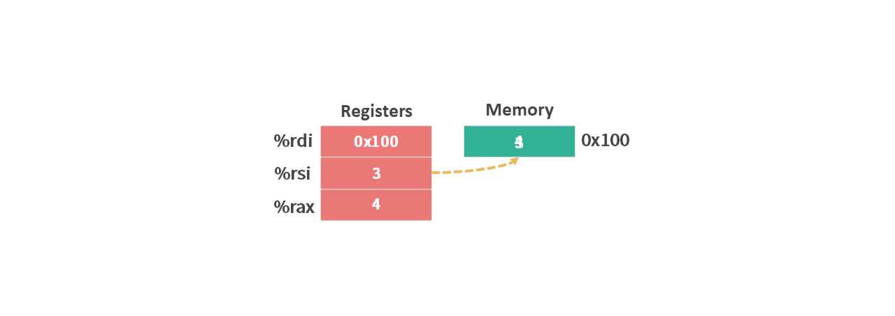

# 指令集 02 - MOV

[上一篇文章](./指令集1操作数.md)介绍了指令操作数的格式，这次让我们来看看一条具体的指令 mov。

```arm
mov S, D
```

mov 指令是将数据从一个位置（S）复制到另一个位置（D）。

我们以一段之前使用过 c 语言为例。
[详情可点击这里](./寄存器.md)
```c
long x = *xp;
*xp = y;
return x;
```

这段代码转换成指令如下：

```arm
movq (%rdi),%rax
movq %rsi,(%rdi)
```

运行指令前假设：
1. %rdi 中存放的是内存地址 0x100
2. %rax 中没有有值
3. %rsi 中存放的是数值 3
4. 地址 0x100 对应的内存空间中的值为 4

<figure>
    
    <figcaption><em>初始状态</em></figcaption>
    <br><br>
</figure>

```arm
movq (%rdi),%rax
```

我们先忽略 `mov` 后面的 `q`，按照上面对 mov 指令的定义，这句指令的意思是：将 (%rdi) 代表的数据复制到 %rax 中。

（%rdi）操作数的意思：%rdi 中的数据 0x100 是内存地址，从该地址中读取内存空间的值 4。

<figure>
    
    <figcaption><em>movq (%rdi),%rax</em></figcaption>
    <br><br>
</figure>

```arm
movq %rsi,(%rdi)
```
这句指令的意思是：将 %rsi 中的数据复制到 (%rdi) 中。

<figure>
    
    <figcaption><em>movq %rsi,(%rdi)</em></figcaption>
    <br><br>
</figure>

现在我们来看一下 `q` 是什么意思。

q 代表操作数所对应的位数是 64 位（8 字节）。除了 q 之外还有 b，w, l 它们分别对应着：

|缩写|位数|字节|全称|
|:--|:--|:--|:--|
|b|8 位|1 字节| byte|
|w|16 位|2 字节| word|
|l|32 位|4 字节| double words|
|q|64 位|8 字节| quad words|

比如：`movl $0x4050, %eax`，就是将立即数 `0x4050` 复制到 32 位寄存器 %eax 中。

注意两点：
1. mov 指令不可以将数据从内存直接复制到内存，这个操作需要经过寄存器。

2. 32 位 movl 指令会将寄存器中的高位 4 个字节设置成 0。
`movl $0x4050, %eax`，除了设置 32 位的 %eax，同时还会将 %rax 的高位 4 个字节设置成 0。

## 参考

```c
long exchange (long *xp, long y){
    long x = *xp;
    *xp = y;
    return x;
}

int main(){
    long a = 4;
    long b = exchange(&a, 3);
}
```
上面代码的主要功能是将变量 a 的地址 和 数值 3 传递给 exchange 函数，最终变量 a 的值变成了3，变量 b 赋值为 4 （即调用函数之前变量 a 的值）。

