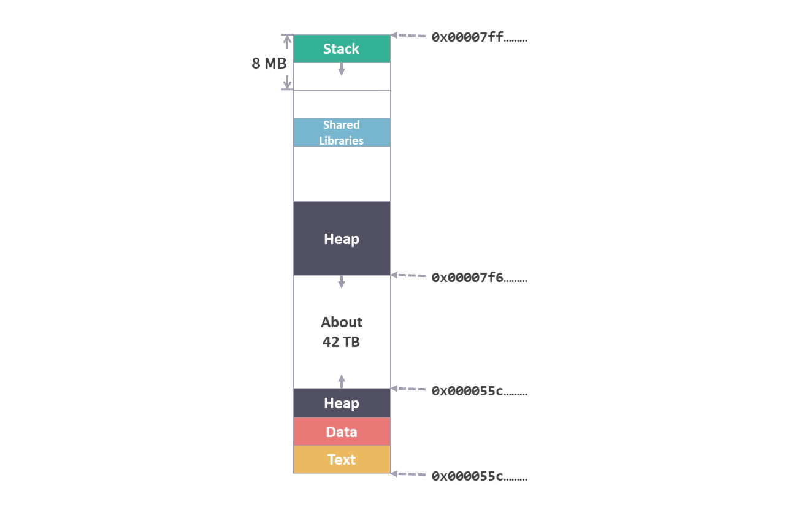
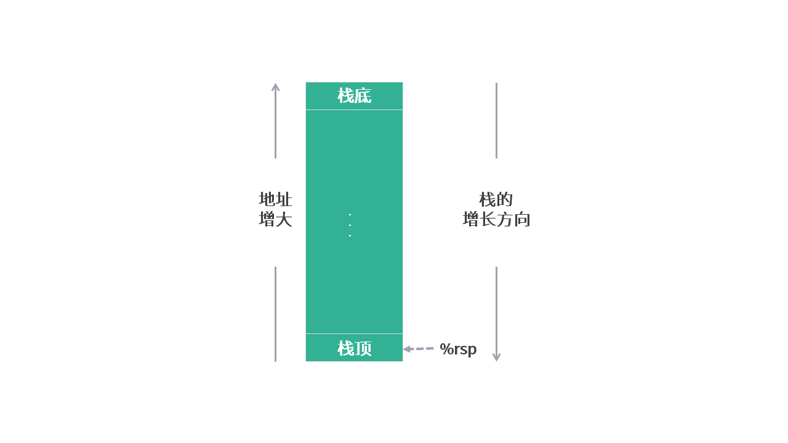
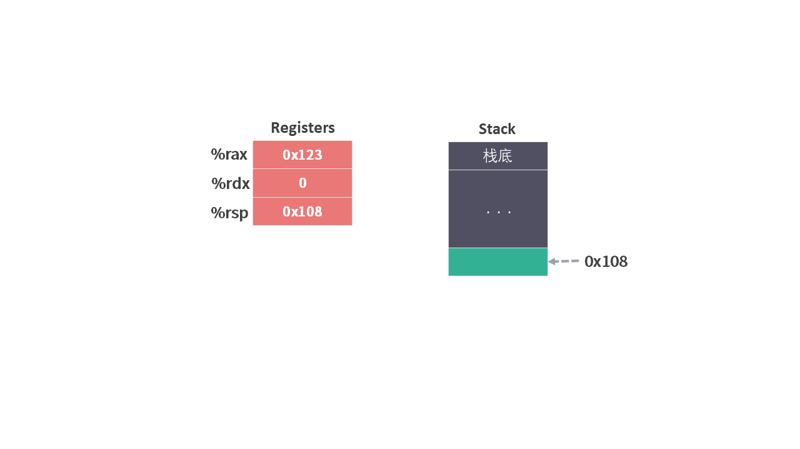
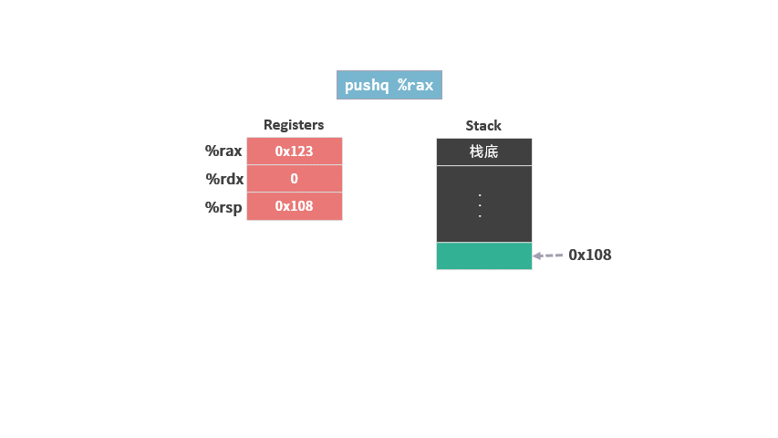
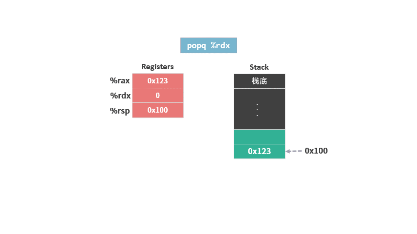

# 指令集 03 - 压入和弹出栈

[上一篇文章](./指令集2mov.md)我们介绍了 `mov` 指令，用于将数据从一个地方复制到另一个地方。

在[内存布局](./程序角度的内存布局.md)中，最上面一部分叫做 Stack（堆），这次我们就来看看两个关于 Stack 的指令，Push 和 Pop。
<figure>
    
    <figcaption><em>内存布局</em></figcaption>
   <br><br>
</figure>

## Stack 的结构

首先，我们先来了解一下 Stack 的结构。

这一个内存区域之所以称之为 Stack（堆），是因为：
1. 这是一块地址连续的内存区域
2. 以 Stack（堆）这种数据结构来管理这块内存区域。

Stack（堆）可以添加和删除数据，不过要遵循“后进先出”的原则。根据这个原则，这段内存需要有一端被封住，称之为“栈底”，所有数据从从另外一端进出，称为“栈顶”。

通常，“栈底”在高位内存地址，栈顶在低位内存地址。所以，栈顶元素的内存地址是栈中所有元素中最低的。

由于我们画内存示意图的时候，习惯将低位内存地址放在下面，高位内存地址放在上面，所以栈的内存示意图像一个倒扣过来的桶，底上。

另外，**栈顶元素的内存地址保存在寄存器 %rsp 中（register stack point）。**

<figure>
    
    <figcaption><em>stack 示意图</em></figcaption>
    <br><br>
</figure>


## 压入和弹出栈的指令

向栈中添加数据的动作称为“Push（压）”，从栈中删除数据的动作称为“Pop（弹）”。

压栈指令

```arm
pushq S
```

该操作会执行两个步骤：

1. 修改栈指针 %rsp，因为压入的是 q（8 个字节），所以栈指针需要 `-8`。
2. 将值 S 写到新的栈顶地址。

c 语言中没有直接操作栈的语句，所有我们直接使用指令语句做演示，以后我们会详细讲解什么样的 c 语言代码会导致栈操作。

假设指令开始之前，内存和寄存器的状态是这样的。

<figure>
    
    <figcaption><em>初始状态</em></figcaption>
    <br><br>
</figure>


```arm
pushq %rax
```

具体操作如下：
1. 修改栈指针，将栈指针 `-8`，以扩展栈的空间。
2. 将 %rax 的内容写到新的栈顶地址。

<figure>
    
    <figcaption><em>push</em></figcaption>
    <br><br>
</figure>

弹出指令：

```arm
popq D
```

pop 与 push 正好相反：

1. 从栈顶读取数据，写到 D
1. 修改栈指针 %rsp，因为弹出的是 q（8 个字节），所以栈指针需要 `+8`。

沿用上面图示的状态，使用如下指令：

```arm
popq %rdx
```
具体操作如下：
1. 将栈顶数据写到 %rdx 中，
2. 修改栈指针，将栈指针 `+8`，以减小栈的空间。

<figure>
    
    <figcaption><em>push</em></figcaption>
    <br><br>
</figure>

需要注意的是，我们只是修改了栈顶指针，原来栈顶的地址的数据并没有删除。
