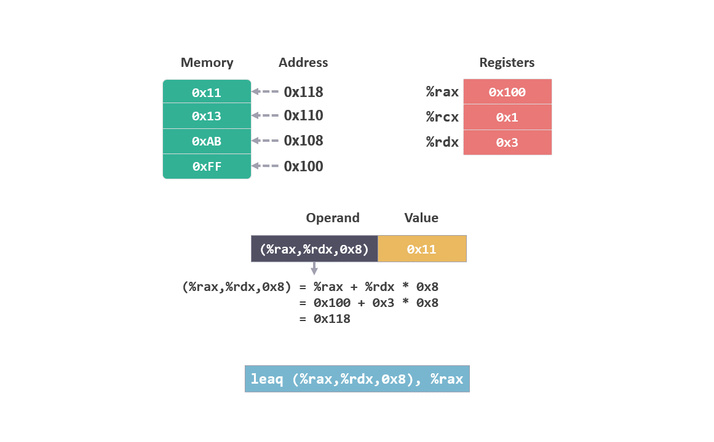
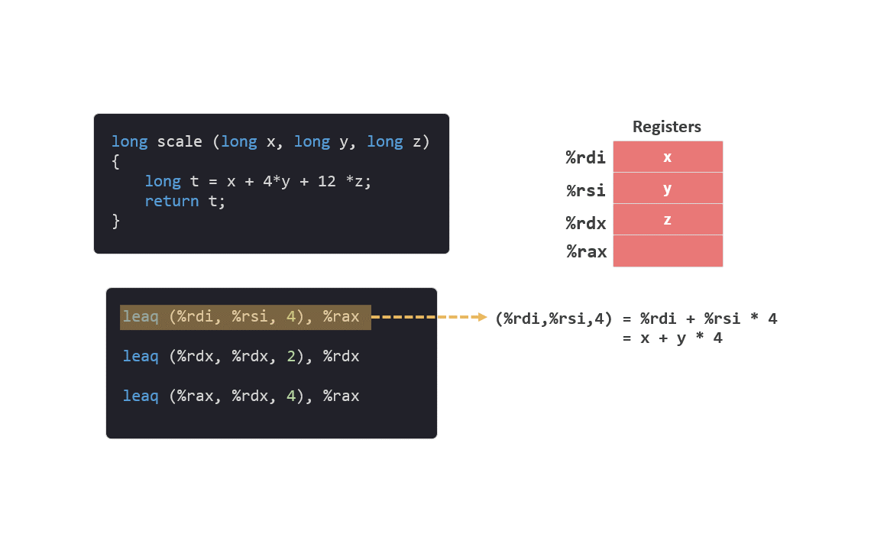
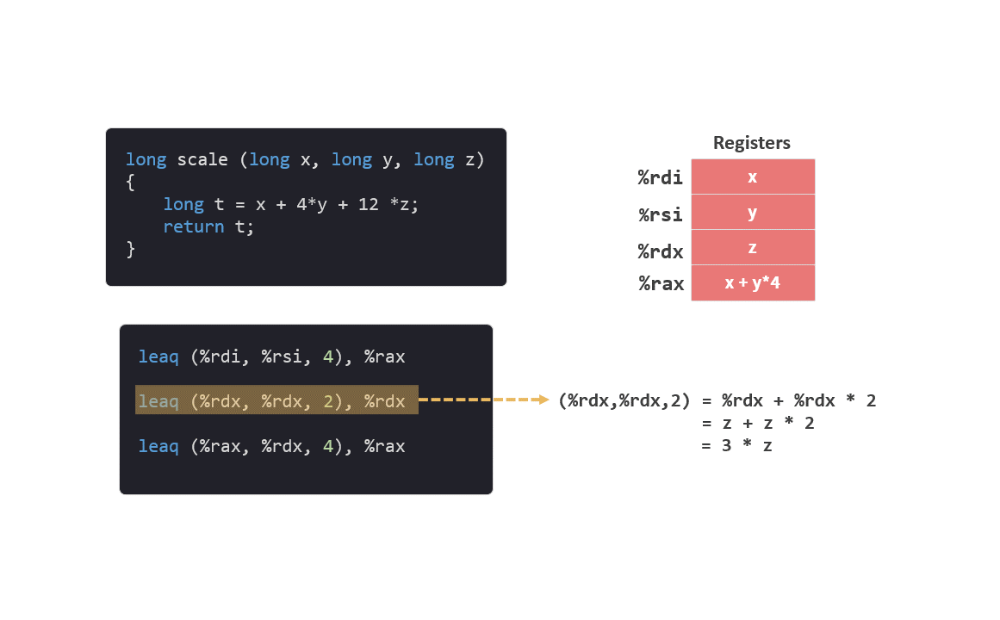
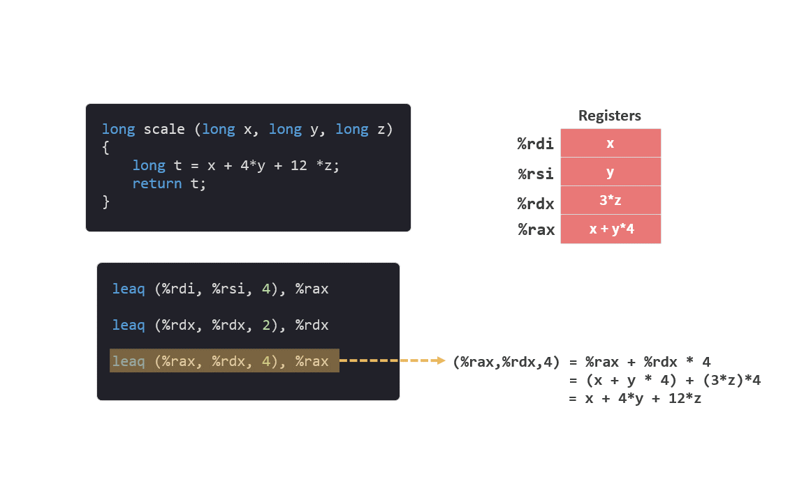

# 指令集 04 - leaq

## movq 回顾

在[操作数格式](./指令集1操作数.md)中，我们介绍了各种操作数的使用格式

```arm
(%rax,%rdx,0x8)
```

相当于计算出 `%rax + %rdx * 0x8` 所对应的地址，然后从该地址对于的内存中读取相应的值。

<figure>
    
    <figcaption><em>(%rax,%rdx,0x8)</em></figcaption>
    <br><br>
</figure>

如果在 `movq` 中使用这个操作数，比如：

```arm
movq (%rax,%rdx,0x8)，%rax
```

该指令会将从内存中读出的值 `0x11`，写入 %rax 中。

<figure>
    
    <figcaption align="center"><em>movq</em></figcaption>
   <br><br>
</figure>

## leaq 指令

这次介绍一个 `movq` 的指令变形，叫做 `leaq` （load effective address：加载有效地址）。

跟 `movq` 类似，`leaq` 也有两个操作数，但不一样的是，第二个操作数必须是寄存器。所以，该指令只有 `leaq` 一种形式，没有 `b`，`w`, `l` 等其他新手。

```
leaq S, register
```

还有一点不同的是，`leaq` 会将计算出的地址直接写入寄存器中，并不读取地址所在内存中的值。

比如跟上面那条指令对应的 `leaq`：

```arm
leaq (%rax,%rdx,0x8)，%rax
```

该指令会将 `%rax + %rdx * 0x8` 计算出来的值 `0x118`，直接写入 %rax 中。

<figure>
    
    <figcaption align="center"><em>leaq</em></figcaption>
   <br><br>
</figure>

## C 语言示例

我们来看一段 c 程序，

```c
long scale(long x, long y, long z)
{
    long t = x + 4 * y + 12 * z;
    return t;
}
```

这段代码会转换成如下指令：

```arm
leaq (%rdi, %rsi, 4), %rax
leaq (%rdx, %rdx, 2), %rdx
leaq (%rax, %rdx, 4), %rax
```

在进入函数之前，初始状态：x 保存在 %rdi 中, y 保存在 %rsi 中，z 保存在 %rdx 中。

注意：函数参数的传递方式，我们会在之后详细介绍。

另外，函数的返回值会保存在 %rax 中。

<figure>
    
    <figcaption align="center"><em>leaq 01</em></figcaption>
   <br><br>
</figure>

```arm
leaq (%rdi, %rsi, 4), %rax
```

该指令将计算 `%rdi + %rsi * 4 = x + y * 4`，并将值直接写入 %rax。

<figure>
    
    <figcaption align="center"><em>leaq 02</em></figcaption>
   <br><br>
</figure>

```arm
leaq (%rdx, %rdx, 2), %rdx
```

该指令将计算 `%rdx + %rdx * 2 = z + z * 2 = 3 * z`，并将值直接写入 %rdx。

<figure>
    
    <figcaption align="center"><em>leaq 03</em></figcaption>
   <br><br>
</figure>

```arm
leaq (%rax, %rdx, 4), %rax
```
该指令将计算 `%rax + %rdx * 4 = x + y * 4 + （3z） * 4 = x + 4 * y + 12 * z`，并将值直接写入 %rdx。

（图）

## 作用

`leaq` 虽然是 load effective address（加载有效地址）的简称，但它根本就没有引用内存。

在转换的过程中，`leaq` 更多的是被用来描述复杂的计算。