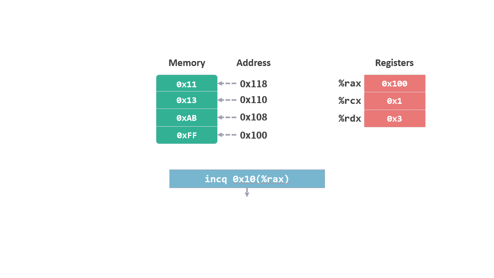
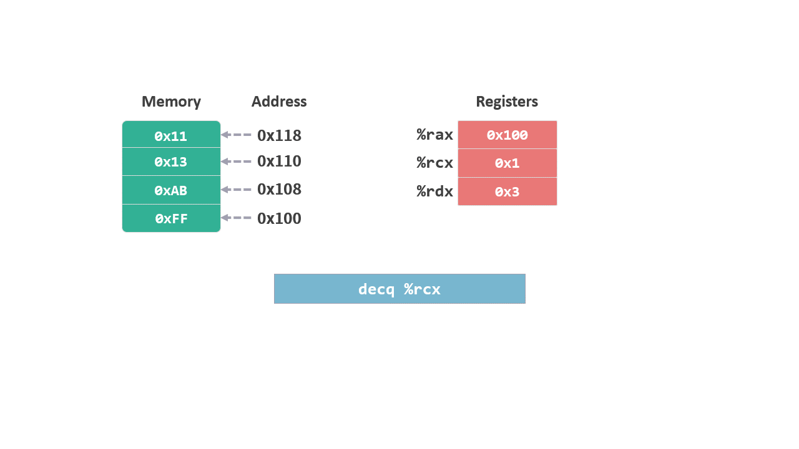

# 指令集 05 - 一元操作

我们之前看到的指令大多都有两个操作数，有些指令只需要一个操作数，被称为一元操作。

## inc 指令

inc（Increment，自增），将操作数加 `1`, 相当于 c 语言中的 `++`。

```
inc D
```

<figure>
    
   <br><br>
</figure>

## dec 指令

dec（decrement，自减），将操作数减 `1`, 相当于 c 语言中的 `--`。

```
dec D
```

<figure>
    
   <br><br>
</figure>

## 其他一元操作指令

|指令|作用||
|:--|:--|:--|
|NEG D|取负|-D|
|NOT D|取补|~D|


