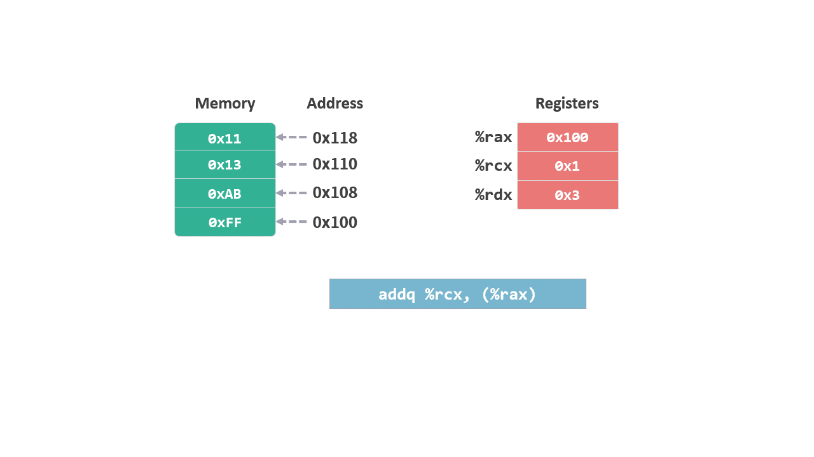

# 指令集 06 - 二元操作

[上一篇文章](./指令集5一元操作.md)介绍了只需要一个操作数的一元操作指令，这次介绍几组需要两个操作数的二元操作指令。

## 算术运算

### 加法和减法

add，对两个操作数进程加法运算，并将结果写入第二个操作数。

```arm
add S, D
```
<figure>
    
   <br><br>
</figure>

sub, 对两个操作数进程减法运算，并将结果写入第二个操作数。

```arm
sub S, D
```
**需要注意的是，减法操作是 `D-S`，也就是用第二个操作数减去第一个操作数。**

<figure>
    
   <br><br>
</figure>

### 乘法和除法

另外还有乘法指令 `imul S, D`，使用方式和 `add`，`sub` 类似。

但是需要注意，该指令是的运算结果必须是 64 位的数值。如果超过超过 64 位，就需要使用 `imulq S` 指令，该指令只有一个操作数。

`imulq S`， 将 S 与 %rax 相乘，运算结果保存在两个寄存器中，低位的 64 位保存在 %rax, 高位的 64 位 保存在 %rdx。

`idiv` 除法指令没有二元操作的形式，只有一元操作。

`idivq S` 将计算 `%rax / S`，计算结果：商保存到 %rax，余数保存到 %rdx。

`imulq S`，`idivq S` 是对有符号数进行的运算，无符号数对应的指令是`mulq S`，`divq S`。 

## 逻辑运算

逻辑运算有 `AND` ，`OR` 和 `XOR`。使用方式和 `SUB` 指令一样，都是用第二个操作数与第一个操作数进行逻辑运算，并将结果保存到第二个操作数中。

在生成的指令中，经常会遇到对同一个操作数进行 `xor` 的操作：

```
xor %eax, %eax
```

`xor` 异或操作原理是，相同为 `0`，不同为`1`。

| ^| 0| 1|
|:--|:--|:--|
|**0**|0|1|
|**1**|1|0|

因此两个相同的操作数进行 `xor`（所有位数都相同），结果就是将该操作数设置为 `0`。

该操作的效率高于 `mov $0, %eax`。

另外，对 32 位寄存器 %eax 进行操作有一个额外的好处，它会默认将寄存器的高 32 位也设置为 `0`，即可将 %rax 设置为 `0`。 

## 位移运算

在二进制中将数字左移一位，相当于将该数字乘以 $ 2^1 $，左移 2 位，相当于将该数字乘以  $ 2^2 $。

```arm
SAL k, D
```

该指令对操作数 D，左移 k 位。类似于 c 语言中的 `D << k`。

同样，`SAR` 会对操作数进行右移操作。

```arm
SAR k, D
```

位移时需要考虑有符号和无符号数，上面两个指令都是针对有符号数的位移，被称之为算术位移。

无符号数的位移，称之为逻辑位移，对应的指令是 `SHL` 和 `SHR`。

* 左位移都是向低位填 `0`，所以算术和逻辑左移指令 `SAL` 和 `SHL` 的作用是一样的。

* 右移是向高位填值，算术位移 `SAR` 向高位填入符号位，逻辑位移`SHR` 向高位填入 `0`。

注意：寄存器 %cl 与位移指令相关，如果操作数 k 保存在寄存器中，一个字节就足以表示 64 位操作系统的位移量了，而这个字节会被保存到寄存器 %cl 中。