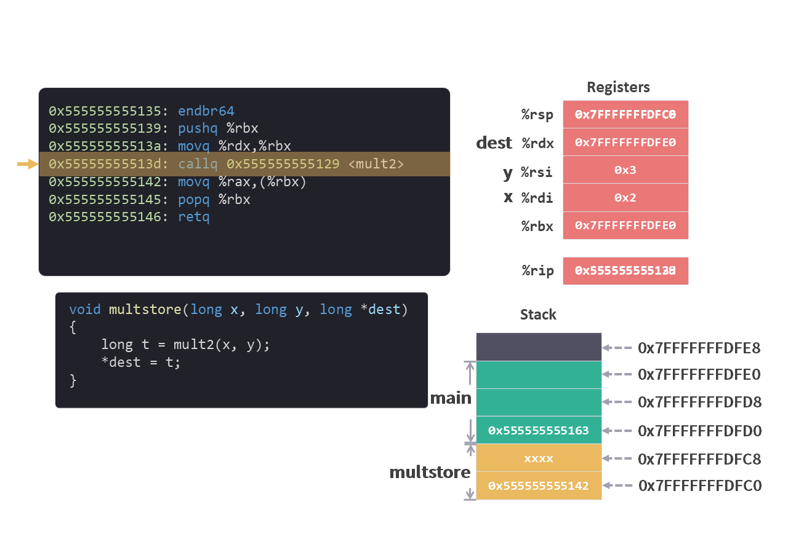
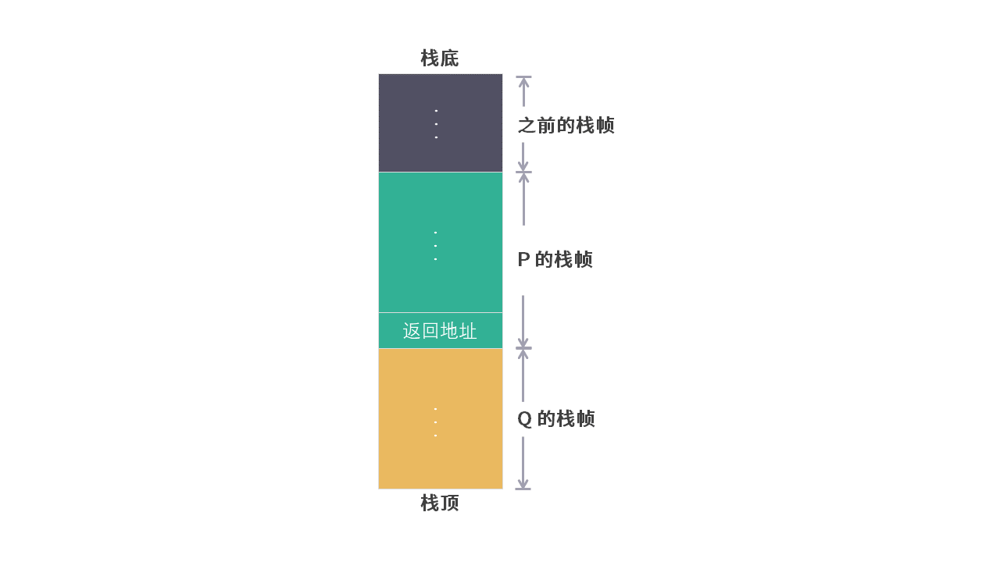
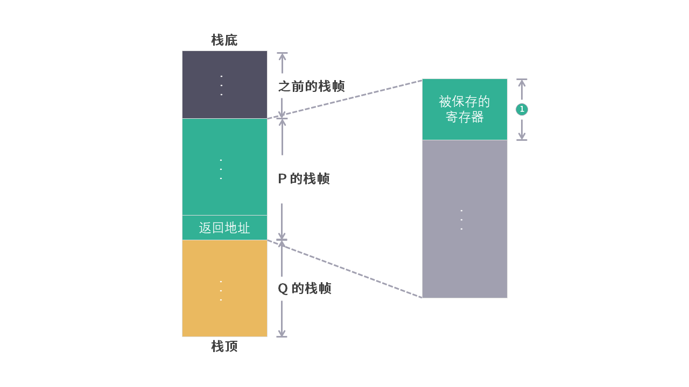
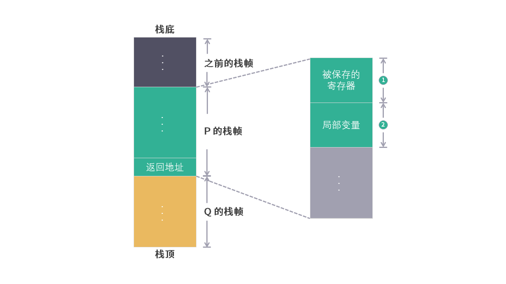
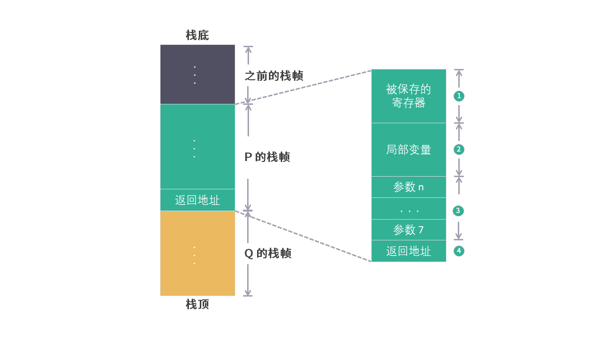

# 栈帧的布局

从[程序的内存布局](./程序角度的内存布局.md)这篇文章中，我们可以知道 Stack（栈）在内存的位置，以及大小（8M）。

在运行时栈的系列文章中，我们又看到程序在运行时，如果需要在内存中存储数据，就会在 Stack（栈）（或者 Heap ）上申请空间。

## 栈帧（Stack frame）

当一个函数中的所有的局部变量都可以保存在寄存器中，并且该函数不调用其他函数时，这个函数就不需要在 Stack 分配空间。就像[运行时栈 5 - 返回值和 ret](./运行时栈5返回值.md)中介绍的 `mult2` 函数一样。

而 `main` 函数和 `multstore` 函数在执行时都在 Stack 中申请了内存空间。

每个函数在 Stack 中申请的内存空间，被称为该函数的**栈帧（Stack frame）**。

在图中，我们用绿色标注了 `main` 函数的栈帧，用黄色标注了 `multstore` 函数的栈帧。

<figure>
    
</figure>

介绍 [push / pop 指令](./指令集3pushpop.md) 时，我们提到过 Stack 中数据保存的顺序是“后进先出”（LIFO：Last In First Out）。栈帧也同样有这个顺序。

```c
function P(){
    function Q();
}
```
P 函数调用 Q 函数，假设每个函数都需要在 Stack 上申请内存空间。那么 P 函数的栈帧和 Q 函数的栈帧就会像下面图中一样，Q 在栈顶，P 在 Q 的后面。

<figure>
    
</figure>

## 栈帧的布局

我们现在知道了栈帧的概念，接下来就来探索一下栈帧中会存储哪些数据，它们的布局是什么样的。

### 1. 被调用者保存的寄存器

[运行时栈 4 - 被保存的寄存器](/运行时栈4被保存的寄存器.md) 一文中我们介绍了**被调用者保存的寄存器**。

我们还以上面的 P 函数和 Q 函数的关系为例，来解释一下什么是被调用者保存的寄存器。 

当 Q 函数执行时需要使用这类寄存器时，需要先将 该寄存器中的值压入 Stack 中，然后再使用，然后在返回 P 函数之前，又要从 Stack 中将原来的值从 Stack 中弹出，将寄存器恢复。

从 P 函数的角度来看，这类寄存器在 P 运行时都是一致的，因为不管内部调用了多少其他的函数，这些函数返回时都会主动保证这类寄存器中的值恢复原样。

**被调用者保存的寄存器** 有以下几个：

<figure>
    
</figure>

除了被调用者保存的寄存器，是否会有**调用者保存的寄存器**？答案是有的。所有其他寄存器，除了栈指针 %rsp 都是调用者保存的寄存器。

同样从 P 函数的角度来看，如果 P 函数希望**调用者保存的寄存器** 在 Q 函数 返回之后能恢复原样， P 函数自己就需要先压栈，然后在 Q 返回之后再弹出，因为 Q 函数可以任意修改这类寄存器。

**从这两个概念中，我们也可以知道，寄存器的值在不同的函数（或者说栈帧）中是共享的。**

<figure>
    
</figure>

### 2. 局部变量

栈帧的主要作用是用来保存局部变量。

从 [`mult2` 函数](./运行时栈5返回值.md) 运行中我们可以知道，局部变量的存储首选是寄存器，那么什么样的局部变量会保存在 Stack 上呢？

1. 当寄存器不足以保存所有数据时，剩余数据会保存到 Stack 上。

2. 对局部变量使用地址运算符"&"，必须给该变量生成一个地址，所以该变量要保存到 Stack 上。

    [`main` 函数](./运行时栈2分配内存.md) 中的变量 `d` 就是这种情况。

3. 局部变量为数组（Array）或者结构（Struct）时，数组或者结构的引用必须能够访问到，所以也需要保存到 Stack 上。

*注：c 语言不会主动使用 Heap（堆）。而在 Java 或者 C# 这类语言中，引用类型会在 Stack（栈）上保存一个地址，该地址指向 Heap（堆），数据都保存在 Heap（堆）上。比如 New 一个对象，数组等等。

<figure>
    
</figure>

### 3. 参数 7-n

[运行时栈 2 - 分配内存和参数传递](/运行时栈2分配内存.md) 我们的参数都是通过寄存器来传递的。

从寄存器的定义中我们可以看到，如果被调用函数的参数在 6 个（<=6）以内，都可以通过寄存器来传递。

要是参数多于 6 个（>6）该怎么办呢？我们来看个例子

```c
int add(int arg1, int arg2, 
        int arg3, int arg4, 
        int arg5, int arg6, 
        int arg7, int arg8)
{
    return  arg1 + arg2
            + arg3 + arg4
            + arg5 + arg6
            + arg7 + arg8;
}

int main(){
    int i = add(1, 2, 3, 4, 5, 6, 7, 8);
    return i;
}
```

```arm
0000000000001129 <add>:
    1129:       f3 0f 1e fa             endbr64 
    112d:       01 f7                   add    %esi,%edi
    112f:       01 d7                   add    %edx,%edi
    1131:       01 cf                   add    %ecx,%edi
    1133:       44 01 c7                add    %r8d,%edi
    1136:       44 01 cf                add    %r9d,%edi
    1139:       89 f8                   mov    %edi,%eax
    113b:       03 44 24 08             add    0x8(%rsp),%eax
    113f:       03 44 24 10             add    0x10(%rsp),%eax
    1143:       c3                      retq   

0000000000001144 <main>:
    1144:       f3 0f 1e fa             endbr64 
    1148:       6a 08                   pushq  $0x8
    114a:       6a 07                   pushq  $0x7
    114c:       41 b9 06 00 00 00       mov    $0x6,%r9d
    1152:       41 b8 05 00 00 00       mov    $0x5,%r8d
    1158:       b9 04 00 00 00          mov    $0x4,%ecx
    115d:       ba 03 00 00 00          mov    $0x3,%edx
    1162:       be 02 00 00 00          mov    $0x2,%esi
    1167:       bf 01 00 00 00          mov    $0x1,%edi
    116c:       e8 b8 ff ff ff          callq  1129 <add>
    1171:       48 83 c4 10             add    $0x10,%rsp
    1175:       c3                      retq   
    1176:       66 2e 0f 1f 84 00 00    nopw   %cs:0x0(%rax,%rax,1)
    117d:       00 00 00 


```

从 `main` 函数的指令集中我们可以看到，arg1 ~ arg6 前 6 个参数保存在寄存器中。

`main` 函数申请了 16 个字节的 Stack（栈）空间，用于存放 arg7 和 arg8 第 7 个和第 8 个参数。

从中我们可以得到结论：

* Stack（栈）中将会保存第 7 个到第 n 个参数。

* 存储顺序是第 7 个参数在栈顶，第 8 个到第 n 个参数依次排在后面。

<figure>
    
</figure>

另外，还有一点需要注意。例子中 `int` 类型的数据只需要 4 个字节的空间，但是 Stack 中却为 `int` 类型的数据申请了 8 个字节的空间。这是因为通过 Stack（栈）传递参数的时候，参数的存储空间必须是 8 个字节的倍数。

<figure>
    
</figure>

*注：在新的语言，比如 Go 中，参数将会全部使用 Stack（栈）来传递。

### 4. 返回地址

所有参数准备好之后，就该执行 `call` 指令将返回地址压入栈中。

 `call` 指令的具体详情可以查看[运行时栈 3 - 转移控制 call](/运行时栈3转移控制.md)。

 如果 P 函数调用 Q 函数，在 P 的栈帧中准备好参数后，就会将返回地址压入栈中，此时我们将返回地址算作 P 的栈帧中的一部分，因为它存放着与 P 相关的状态。

<figure>
    
</figure>

*注：在 被调用者保存的寄存器 和 局部变量 之间还可能分配出一段空间用于栈的保护，这部分内容以后再介绍。

## 总结

我们从程序内存布局中知道了 Stack（栈）的位置和大小。程序执行的调用又在 Stack（栈）上产生了栈帧（Stack Frame）的概念。

栈帧中的布局是由多个部分组成，这些信息不仅保存了当前函数运行所需的内容，而且当函数返回时之前的函数仍然可以继续正常的运行。

栈帧使得每次函数调用都有了他们自己的私有信息存储空间，接下来我们可以基于这个知识重新认识一下编程中的重要概念——递归（recursion）。

## 问题


