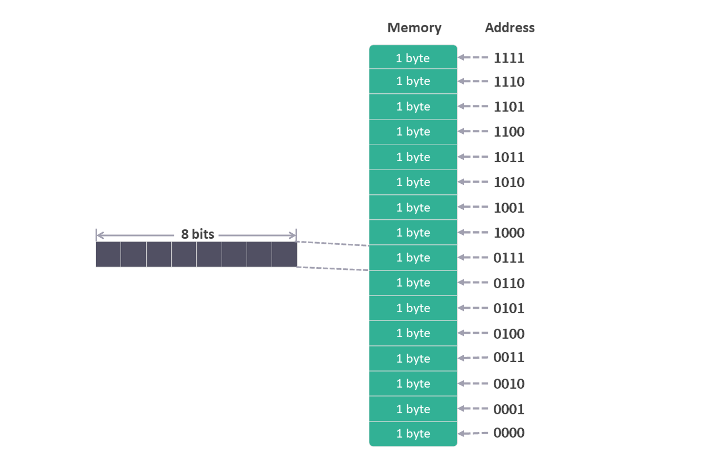
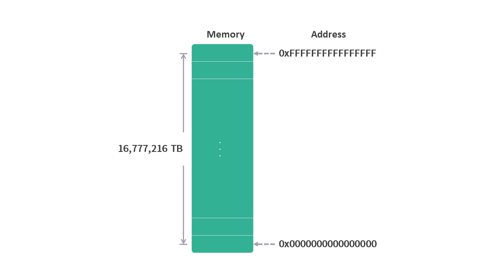
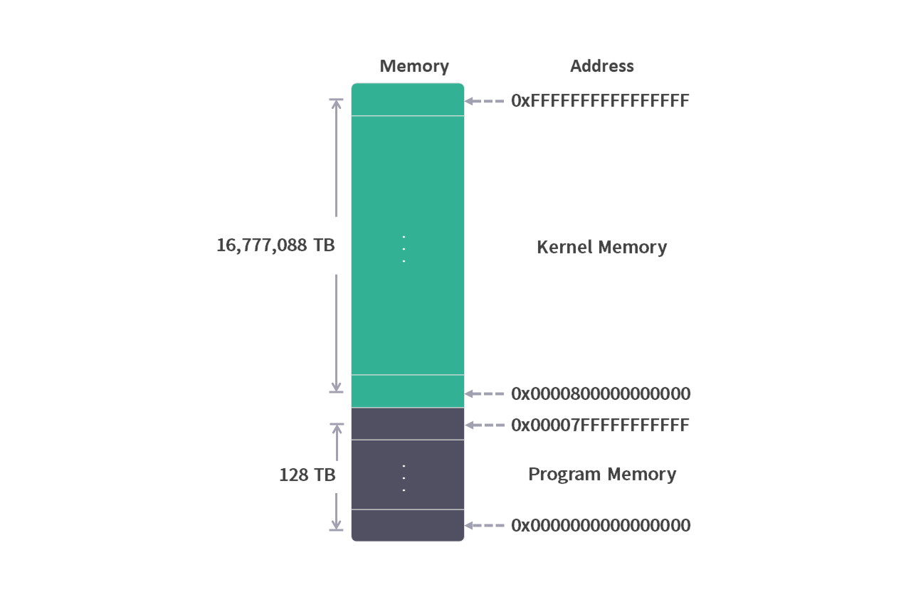

# 从程序的角度看，内存是什么？

## 内存的基本概念

我们可以把内存想象成一个数组，其中每个数组元素的大小是 1 字节（byte）。

在数组中访问一个元素可以使用索引。同样，为了能访问内存中的元素，每个元素也有自己的地址。

从上面的类比中，可以看出内存对于程序来说有这么几个特性：
1. 内存的最小空间是1个字节（byte），也就是 8 位（bit）。
2. 内存是由许多这样的空间组合在一起的。
3. 每个空间都有一个地址。

我们以一个 4 位寻址空间的内存为例，用图形的形式来模拟一下内存的样子（只是模拟，真实的内存不是这样的）。

什么是 4 位 寻址空间？这是指内存地址的范围是用 4 位（bit）的**二进制**表示，从 0000 到 1111，换算成十进制就是 0 ~ 15。

因为每个地址可以保存 1 个字节（byte）的数据，所以这个内存的容量就是 16 个字节( $ 2^4 =16 $)。

<figure>
    
    <figcaption><em>4 位寻址空间内存</em></figcaption>
      
</figure>

Q: 为什么内存最小空间是 1 个字节（byte）？ 
## 64 位操作系统内存空间

现在的操作系统都是 64 位，也就是说支持 64 位寻址空间的内存：

0000000000000000000000000000000000000000000000000000000000000000（64个0）

~

1111111111111111111111111111111111111111111111111111111111111111（64个1）

二进制的显示太长，换算成十六进制（每 4 位二进制数转换成 1 位十六进制数）：

0x0000000000000000（16个0） ~ 0xFFFFFFFFFFFFFFFF（16个F）

这么大的寻址空间如果都填满，内存最多可以存储多少数据呢？

$ 2^{64} $ = 18,446,744,073,709,551,616 字节（byte），大概是16,777,216 TB。

TB 这个容量单位一般都用来描述硬盘，而内存的容量通常是 GB，我们的个人电脑内存通常是 8/16/32 GB。

上面计算出的这个数字只是说明，我们现在使用的操作系统理论上最多支持 16,777,216 TB 的内存大小。

<figure>
    
    <figcaption><em>64 位寻址空间内存</em></figcaption>
</figure>

虽然现实中我们看不到这么大的内存，但是从程序的角度来看，了解这个寻址空间还是有意义的。

Q: 32 位操作系统的内存寻址空间是多少？

## 程序角度的内存

我们可以想象一个场景，一台有 32 G 内存的计算机，正在运行着浏览器，Word 等程序。这时候内存的使用情况大概是什么样子呢？

如果操作系统是 Windows，打开任务管理器就能看到，每个程序都占用着一定数量的内存空间。

我们可能会认为，程序可以直接操作分配给它的内存空间。

然而真实情况是，程序本身是无法直接操作物理内存，程序所能操作的是**虚拟内存**。

这个虚拟内存有这么几个特点：

1. 每个程序都感觉自己单独拥有系统的整个内存。

2. 每个程序可以看到的内存寻址空间是 0x0000000000000000 ~ 0xFFFFFFFFFFFFFFFF，而不是计算机真实的物理内存寻址空间。

3. 0x0000800000000000 ~ 0xFFFFFFFFFFFFFFFF 这段寻址空间的内存属于操作系统内核虚拟内存。

4. 每个程序实际可以使用的内存寻址空间是 0x0000000000000000 ~ 0x00007FFFFFFFFFFF 。

<figure>
    
    <figcaption><em>64 位寻址空间内存</em></figcaption>
</figure>

也就是说每个程序都感觉自己拥有了完整的64位寻址空间的内存。

看到这里我们肯定会有一堆疑问：

    * 虚拟内存是什么技术？
    * 虚拟内存如何映射到物理内存？
    * 虚拟内存这么大，如果程序使用范围了超出物理内存的空间，会发生什么情况？
    ...

这些问题都需要理解虚拟内存这项技术之后才能解答。

现阶段我们只需知道，每个程序看到的内存都是操作系统所能提供的完整寻址空间的内存，并且有一个叫虚拟内存的技术，可以将程序在这里使用的内存映射到物理内存上。
