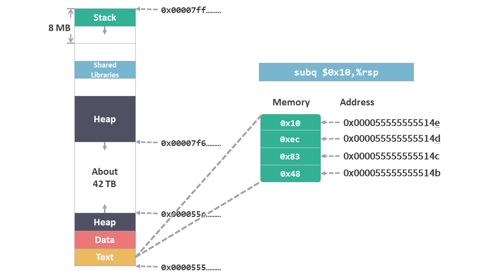

# 运行时栈 01 - 准备

前面的文章中，我们介绍了[内存的布局](./程序角度的内存布局)，同时还讲解了许多指令，尤其是可以操作 Stack（堆）的指令 [push 和 pop](./指令集3pushpop.md)。

其实大多数指令可操作的内存空间就是 Stack（栈）和 Heap（堆），其中 Stack（栈）尤其重要。

这次我们通过一个完整的 C 语言代码来仔细跟踪一下代码运行时 Stack（栈）的具体情况。

## 准备 c 语言代码

先准备一个 c 文件 msstore.c，文件内容如下：

```c
long mult2(long a, long b)
{
    long s = a * b;
    return s;
}

void multstore(long x, long y, long *dest)
{
    long t = mult2(x, y);
    *dest = t;
}

int main()
{
    long d;
    multstore(2, 3, &d);
    return 0;
}
```

文件中有 3 个函数，`main`，`multstore` 和 `mult2`。

### main

`main` 函数是 c 语言程序的入口，代码会从这里开始执行。

函数中定义了一个 `long` 类型的变量 `d`，然后调用 `multstore` 函数。

传递给 `multstore` 函数的有 3 个参数: 数值 `2`, `3` 和变量 `d` 的内存地址 `&d`。

### multstore

函数 `multstore` 首先调用函数 `mult2`，并且将 `main` 函数传来的参数 `2` 和 `3` 作为参数传给了函数 `mult2`。

函数 `mult2` 的返回值被赋值给变量 `t`。

最终 `t` 会被写入 `main` 函数传来的地址所对应的内存中，也就是变量 `d` 中。

### mult2

`mult2` 将传来的两个参数相乘，并返回相应结果。

**所有函数最终实现的结果，就是将 `2` 和 `3` 的乘积赋值给变量 `d`。**

## 转换成指令

上述函数会被转换成指令并保存到内存 Text 区域。

```arm
0x0000555555555129 <mult2>:
    0x0000555555555129:       f3 0f 1e fa             endbr64 
    0x000055555555512d:       48 89 f8                movq    %rdi,%rax
    0x0000555555555130:       48 0f af c6             imulq   %rsi,%rax
    0x0000555555555134:       c3                      retq   

0x0000555555555135 <multstore>:
    0x0000555555555135:       f3 0f 1e fa             endbr64 
    0x0000555555555139:       53                      pushq   %rbx
    0x000055555555513a:       48 89 d3                movq    %rdx,%rbx
    0x000055555555513d:       e8 e7 ff ff ff          callq   0x555555555129 <mult2>
    0x0000555555555142:       48 89 03                movq    %rax,(%rbx)
    0x0000555555555145:       5b                      popq    %rbx
    0x0000555555555146:       c3                      retq   

0x0000555555555147 <main>:
    0x0000555555555147:       f3 0f 1e fa             endbr64 
    0x000055555555514b:       48 83 ec 10             subq    $0x10,%rsp
    0x000055555555514f:       48 8d 54 24 08          leaq    0x8(%rsp),%rdx
    0x0000555555555154:       be 03 00 00 00          movl    $0x3,%esi
    0x0000555555555159:       bf 02 00 00 00          movl    $0x2,%edi
    0x000055555555515e:       e8 d2 ff ff ff          callq   0x555555555135 <multstore>
    0x0000555555555163:       b8 00 00 00 00          movl    $0x0,%eax
    0x0000555555555168:       48 83 c4 10             addq    $0x10,%rsp
    0x000055555555516c:       c3                      retq   
```

每一行指令的含义如下：

`0x000055555555514b:       48 83 ec 10             subq    $0x10,%rsp`

* `0x000055555555514b` 表示该指令的起始内存地址
* `48 83 ec 10` 表示该指令保存到内存中的机器码
* `subq    $0x10,%rsp` 表示该指令的可读形式，相当于注释

该指令在内存中的示意图如下，图中每个格子代表一个字节的内存空间：

<figure>
    
</figure>

大部分指令我们已经在前面介绍过了，具体作用我们可以通过下面的列表来查看。

*`endbr64` 指令不影响内存使用，这里可以忽略。*

|指令|参考|
|:--|:--|
|mov|[指令集 2 - mov](/指令集2mov.md)|
|leaq|[指令集 3 - leaq](/指令集4leaq.md)|
|addq|[指令集 5 - 二元操作](/指令集6二元操作.md)|
|subq|[指令集 5 - 二元操作](/指令集6二元操作.md)|
|pushq|[指令集 6 - push / pop](/指令集3pushpop.md)|
|popq|[指令集 6 - push / pop](/指令集3pushpop.md)|
|imulq|[指令集 5 - 二元操作](/指令集6二元操作.md)|
|callq|[运行时栈 3 - 转移控制 call](/运行时栈3转移控制.md)|
|retq|稍后介绍|

接下来我们将会按步骤执行这段指令，并且跟踪内存中的变化。

*这段 c 语言生成的指令不止我们现在看到的这些，完整的指令可以参考资料部分，我们节选了需要的内容，其他内容现阶段可以不用考虑。*

## 资料

[1] 通过如下命令可以看到完整的指令集

```cmd
gcc -Og -o  msstore msstore.c -fno-stack-protector
objdump -d msstore
```

指令集中看到的内存地址跟上面看到的地址不太一样，具体原因可以参考：

https://stackoverflow.com/questions/51791746/why-is-gdb-filling-the-0s-of-a-memory-address-with-5s-during-a-register-info


```arm
msstore:     file format elf64-x86-64


Disassembly of section .init:

0000000000001000 <_init>:
    1000:       f3 0f 1e fa             endbr64 
    1004:       48 83 ec 08             sub    $0x8,%rsp
    1008:       48 8b 05 d9 2f 00 00    mov    0x2fd9(%rip),%rax        # 3fe8 <__gmon_start__>
    100f:       48 85 c0                test   %rax,%rax
    1012:       74 02                   je     1016 <_init+0x16>
    1014:       ff d0                   callq  *%rax
    1016:       48 83 c4 08             add    $0x8,%rsp
    101a:       c3                      retq   

Disassembly of section .plt:

0000000000001020 <.plt>:
    1020:       ff 35 a2 2f 00 00       pushq  0x2fa2(%rip)        # 3fc8 <_GLOBAL_OFFSET_TABLE_+0x8>
    1026:       f2 ff 25 a3 2f 00 00    bnd jmpq *0x2fa3(%rip)        # 3fd0 <_GLOBAL_OFFSET_TABLE_+0x10>
    102d:       0f 1f 00                nopl   (%rax)

Disassembly of section .plt.got:

0000000000001030 <__cxa_finalize@plt>:
    1030:       f3 0f 1e fa             endbr64 
    1034:       f2 ff 25 bd 2f 00 00    bnd jmpq *0x2fbd(%rip)        # 3ff8 <__cxa_finalize@GLIBC_2.2.5>
    103b:       0f 1f 44 00 00          nopl   0x0(%rax,%rax,1)

Disassembly of section .text:

0000000000001040 <_start>:
    1040:       f3 0f 1e fa             endbr64 
    1044:       31 ed                   xor    %ebp,%ebp
    1046:       49 89 d1                mov    %rdx,%r9
    1049:       5e                      pop    %rsi
    104a:       48 89 e2                mov    %rsp,%rdx
    104d:       48 83 e4 f0             and    $0xfffffffffffffff0,%rsp
    1051:       50                      push   %rax
    1052:       54                      push   %rsp
    1053:       4c 8d 05 86 01 00 00    lea    0x186(%rip),%r8        # 11e0 <__libc_csu_fini>
    105a:       48 8d 0d 0f 01 00 00    lea    0x10f(%rip),%rcx        # 1170 <__libc_csu_init>
    1061:       48 8d 3d df 00 00 00    lea    0xdf(%rip),%rdi        # 1147 <main>
    1068:       ff 15 72 2f 00 00       callq  *0x2f72(%rip)        # 3fe0 <__libc_start_main@GLIBC_2.2.5>
    106e:       f4                      hlt    
    106f:       90                      nop

0000000000001070 <deregister_tm_clones>:
    1070:       48 8d 3d 99 2f 00 00    lea    0x2f99(%rip),%rdi        # 4010 <__TMC_END__>
    1077:       48 8d 05 92 2f 00 00    lea    0x2f92(%rip),%rax        # 4010 <__TMC_END__>
    107e:       48 39 f8                cmp    %rdi,%rax
    1081:       74 15                   je     1098 <deregister_tm_clones+0x28>
    1083:       48 8b 05 4e 2f 00 00    mov    0x2f4e(%rip),%rax        # 3fd8 <_ITM_deregisterTMCloneTable>
    108a:       48 85 c0                test   %rax,%rax
    108d:       74 09                   je     1098 <deregister_tm_clones+0x28>
    108f:       ff e0                   jmpq   *%rax
    1091:       0f 1f 80 00 00 00 00    nopl   0x0(%rax)
    1098:       c3                      retq   
    1099:       0f 1f 80 00 00 00 00    nopl   0x0(%rax)

00000000000010a0 <register_tm_clones>:
    10a0:       48 8d 3d 69 2f 00 00    lea    0x2f69(%rip),%rdi        # 4010 <__TMC_END__>
    10a7:       48 8d 35 62 2f 00 00    lea    0x2f62(%rip),%rsi        # 4010 <__TMC_END__>
    10ae:       48 29 fe                sub    %rdi,%rsi
    10b1:       48 89 f0                mov    %rsi,%rax
    10b4:       48 c1 ee 3f             shr    $0x3f,%rsi
    10b8:       48 c1 f8 03             sar    $0x3,%rax
    10bc:       48 01 c6                add    %rax,%rsi
    10bf:       48 d1 fe                sar    %rsi
    10c2:       74 14                   je     10d8 <register_tm_clones+0x38>
    10c4:       48 8b 05 25 2f 00 00    mov    0x2f25(%rip),%rax        # 3ff0 <_ITM_registerTMCloneTable>
    10cb:       48 85 c0                test   %rax,%rax
    10ce:       74 08                   je     10d8 <register_tm_clones+0x38>
    10d0:       ff e0                   jmpq   *%rax
    10d2:       66 0f 1f 44 00 00       nopw   0x0(%rax,%rax,1)
    10d8:       c3                      retq   
    10d9:       0f 1f 80 00 00 00 00    nopl   0x0(%rax)

00000000000010e0 <__do_global_dtors_aux>:
    10e0:       f3 0f 1e fa             endbr64 
    10e4:       80 3d 25 2f 00 00 00    cmpb   $0x0,0x2f25(%rip)        # 4010 <__TMC_END__>
    10eb:       75 2b                   jne    1118 <__do_global_dtors_aux+0x38>
    10ed:       55                      push   %rbp
    10ee:       48 83 3d 02 2f 00 00    cmpq   $0x0,0x2f02(%rip)        # 3ff8 <__cxa_finalize@GLIBC_2.2.5>
    10f5:       00 
    10f6:       48 89 e5                mov    %rsp,%rbp
    10f9:       74 0c                   je     1107 <__do_global_dtors_aux+0x27>
    10fb:       48 8b 3d 06 2f 00 00    mov    0x2f06(%rip),%rdi        # 4008 <__dso_handle>
    1102:       e8 29 ff ff ff          callq  1030 <__cxa_finalize@plt>
    1107:       e8 64 ff ff ff          callq  1070 <deregister_tm_clones>
    110c:       c6 05 fd 2e 00 00 01    movb   $0x1,0x2efd(%rip)        # 4010 <__TMC_END__>
    1113:       5d                      pop    %rbp
    1114:       c3                      retq   
    1115:       0f 1f 00                nopl   (%rax)
    1118:       c3                      retq   
    1119:       0f 1f 80 00 00 00 00    nopl   0x0(%rax)

0000000000001120 <frame_dummy>:
    1120:       f3 0f 1e fa             endbr64 
    1124:       e9 77 ff ff ff          jmpq   10a0 <register_tm_clones>

0000000000001129 <mult2>:
    1129:       f3 0f 1e fa             endbr64 
    112d:       48 89 f8                mov    %rdi,%rax
    1130:       48 0f af c6             imul   %rsi,%rax
    1134:       c3                      retq   

0000000000001135 <multstore>:
    1135:       f3 0f 1e fa             endbr64 
    1139:       53                      push   %rbx
    113a:       48 89 d3                mov    %rdx,%rbx
    113d:       e8 e7 ff ff ff          callq  1129 <mult2>
    1142:       48 89 03                mov    %rax,(%rbx)
    1145:       5b                      pop    %rbx
    1146:       c3                      retq   

0000000000001147 <main>:
    1147:       f3 0f 1e fa             endbr64 
    114b:       48 83 ec 10             sub    $0x10,%rsp
    114f:       48 8d 54 24 08          lea    0x8(%rsp),%rdx
    1154:       be 03 00 00 00          mov    $0x3,%esi
    1159:       bf 02 00 00 00          mov    $0x2,%edi
    115e:       e8 d2 ff ff ff          callq  1135 <multstore>
    1163:       b8 00 00 00 00          mov    $0x0,%eax
    1168:       48 83 c4 10             add    $0x10,%rsp
    116c:       c3                      retq   
    116d:       0f 1f 00                nopl   (%rax)

0000000000001170 <__libc_csu_init>:
    1170:       f3 0f 1e fa             endbr64 
    1174:       41 57                   push   %r15
    1176:       4c 8d 3d 73 2c 00 00    lea    0x2c73(%rip),%r15        # 3df0 <__frame_dummy_init_array_entry>
    117d:       41 56                   push   %r14
    117f:       49 89 d6                mov    %rdx,%r14
    1182:       41 55                   push   %r13
    1184:       49 89 f5                mov    %rsi,%r13
    1187:       41 54                   push   %r12
    1189:       41 89 fc                mov    %edi,%r12d
    118c:       55                      push   %rbp
    118d:       48 8d 2d 64 2c 00 00    lea    0x2c64(%rip),%rbp        # 3df8 <__do_global_dtors_aux_fini_array_entry>
    1194:       53                      push   %rbx
    1195:       4c 29 fd                sub    %r15,%rbp
    1198:       48 83 ec 08             sub    $0x8,%rsp
    119c:       e8 5f fe ff ff          callq  1000 <_init>
    11a1:       48 c1 fd 03             sar    $0x3,%rbp
    11a5:       74 1f                   je     11c6 <__libc_csu_init+0x56>
    11a7:       31 db                   xor    %ebx,%ebx
    11a9:       0f 1f 80 00 00 00 00    nopl   0x0(%rax)
    11b0:       4c 89 f2                mov    %r14,%rdx
    11b3:       4c 89 ee                mov    %r13,%rsi
    11b6:       44 89 e7                mov    %r12d,%edi
    11b9:       41 ff 14 df             callq  *(%r15,%rbx,8)
    11bd:       48 83 c3 01             add    $0x1,%rbx
    11c1:       48 39 dd                cmp    %rbx,%rbp
    11c4:       75 ea                   jne    11b0 <__libc_csu_init+0x40>
    11c6:       48 83 c4 08             add    $0x8,%rsp
    11ca:       5b                      pop    %rbx
    11cb:       5d                      pop    %rbp
    11cc:       41 5c                   pop    %r12
    11ce:       41 5d                   pop    %r13
    11d0:       41 5e                   pop    %r14
    11d2:       41 5f                   pop    %r15
    11d4:       c3                      retq   
    11d5:       66 66 2e 0f 1f 84 00    data16 nopw %cs:0x0(%rax,%rax,1)
    11dc:       00 00 00 00 

00000000000011e0 <__libc_csu_fini>:
    11e0:       f3 0f 1e fa             endbr64 
    11e4:       c3                      retq   

Disassembly of section .fini:

00000000000011e8 <_fini>:
    11e8:       f3 0f 1e fa             endbr64 
    11ec:       48 83 ec 08             sub    $0x8,%rsp
    11f0:       48 83 c4 08             add    $0x8,%rsp
    11f4:       c3                      retq 
```

----------

1. 控制传递 -- 指令 call /ret  PC（Program Counter）程序计数器 %rip

2. 参数和返回值传递 -- 寄存器/栈>6 传参数 %rax 传返回值

3. 管理局部数据 -- 栈帧

```c
long mult2(long a, long b)
{
    long s = a * b;
    return s;
}

void multstore(long x, long y, long *dest)
{
    long t = mult2(x, y);
    *dest = t;
}

int main()
{
    long d;
    multstore(2, 3, &d);
    return 0;
}
```

```arm
0000000000001129 <mult2>:
    1129:       f3 0f 1e fa             endbr64 
    112d:       48 89 f8                mov    %rdi,%rax
    1130:       48 0f af c6             imul   %rsi,%rax
    1134:       c3                      retq   

0000000000001135 <multstore>:
    1135:       f3 0f 1e fa             endbr64 
    1139:       53                      push   %rbx
    113a:       48 89 d3                mov    %rdx,%rbx
    113d:       e8 e7 ff ff ff          callq  1129 <mult2>
    1142:       48 89 03                mov    %rax,(%rbx)
    1145:       5b                      pop    %rbx
    1146:       c3                      retq   

0000000000001147 <main>:
    1147:       f3 0f 1e fa             endbr64 
    114b:       48 83 ec 10             sub    $0x10,%rsp
    114f:       48 8d 54 24 08          lea    0x8(%rsp),%rdx
    1154:       be 03 00 00 00          mov    $0x3,%esi
    1159:       bf 02 00 00 00          mov    $0x2,%edi
    115e:       e8 d2 ff ff ff          callq  1135 <multstore>
    1163:       b8 00 00 00 00          mov    $0x0,%eax
    1168:       48 83 c4 10             add    $0x10,%rsp
    116c:       c3                      retq   
    116d:       0f 1f 00                nopl   (%rax)
```

main: 0x0000555555555147

multstore: 0x0000555555555135

mult2： 0x0000555555555135

&d:    0x00007fffffffdfe0

```cmd
gcc -Og -o  msstore msstore.c -fno-stack-protector
objdump -d msstore
```


```cmd
gdb msstore
```

```cmd
break main
```

```cmd
run
```

```cmd
disas main
```

```cmd
disas multstore
```

```cmd
disas mult2
```

```cmd
print $rsp
```

```
$1 = (void *) 0x7fffffffdfe8
```

```arm
Dump of assembler code for function main:
=> 0x0000555555555147 <+0>:     endbr64 
   0x000055555555514b <+4>:     sub    $0x10,%rsp
   0x000055555555514f <+8>:     lea    0x8(%rsp),%rdx
   0x0000555555555154 <+13>:    mov    $0x3,%esi
   0x0000555555555159 <+18>:    mov    $0x2,%edi
   0x000055555555515e <+23>:    callq  0x555555555135 <multstore>
   0x0000555555555163 <+28>:    mov    $0x0,%eax
   0x0000555555555168 <+33>:    add    $0x10,%rsp
   0x000055555555516c <+37>:    retq   
End of assembler dump.  
```

```arm
Dump of assembler code for function multstore:
   0x0000555555555135 <+0>:     endbr64 
   0x0000555555555139 <+4>:     push   %rbx
   0x000055555555513a <+5>:     mov    %rdx,%rbx
   0x000055555555513d <+8>:     callq  0x555555555129 <mult2>
   0x0000555555555142 <+13>:    mov    %rax,(%rbx)
   0x0000555555555145 <+16>:    pop    %rbx
   0x0000555555555146 <+17>:    retq   
End of assembler dump.
```

```arm
Dump of assembler code for function mult2:
   0x0000555555555129 <+0>:     endbr64 
   0x000055555555512d <+4>:     mov    %rdi,%rax
   0x0000555555555130 <+7>:     imul   %rsi,%rax
   0x0000555555555134 <+11>:    retq   
End of assembler dump.
```

```cmd
gcc -Og -S malloc.c -fno-stack-protector
```
```arm
	.file	"msstore.c"
	.text
	.globl	mult2
	.type	mult2, @function
mult2:
.LFB23:
	.cfi_startproc
	endbr64
	movq	%rdi, %rax
	imulq	%rsi, %rax
	ret
	.cfi_endproc
.LFE23:
	.size	mult2, .-mult2
	.globl	multstore
	.type	multstore, @function
multstore:
.LFB24:
	.cfi_startproc
	endbr64
	pushq	%rbx
	.cfi_def_cfa_offset 16
	.cfi_offset 3, -16
	movq	%rdi, %rax
	movq	%rsi, %rdi
	movq	%rdx, %rbx
	movq	%rax, %rsi
	call	mult2
	movq	%rax, (%rbx)
	popq	%rbx
	.cfi_def_cfa_offset 8
	ret
	.cfi_endproc
.LFE24:
	.size	multstore, .-multstore
	.globl	main
	.type	main, @function
main:
.LFB25:
	.cfi_startproc
	endbr64
	subq	$16, %rsp
	.cfi_def_cfa_offset 24
	leaq	8(%rsp), %rdx
	movl	$3, %esi
	movl	$2, %edi
	call	multstore
	movl	$0, %eax
	addq	$16, %rsp
	.cfi_def_cfa_offset 8
	ret
	.cfi_endproc
.LFE25:
	.size	main, .-main
	.ident	"GCC: (Ubuntu 9.3.0-17ubuntu1~20.04) 9.3.0"
	.section	.note.GNU-stack,"",@progbits
	.section	.note.gnu.property,"a"
	.align 8
	.long	 1f - 0f
	.long	 4f - 1f
	.long	 5
0:
	.string	 "GNU"
1:
	.align 8
	.long	 0xc0000002
	.long	 3f - 2f
2:
	.long	 0x3
3:
	.align 8
4:

```


## gdb debug

1. enter

```
gdb msstore
```

2. break

```
break main
```

3. run

```
run
```

4. disas

```
disas main
```

5. break %rsp

```
break * 0x000055555555514b
```

6. continue

```
continue
```

7. print %rsp
```
print $rsp
```

8. stepi

```
stepi
```

9. print %rsp
```
print $rsp
```

10. stepi
```
stepi
```

11. print %rdx
```
print $rdx
```

12. stepi 3
```
stepi 3
```

13. disass
```
disass
```

14. print %rsp
```
print $rsp
```

15. print %rdi
```
print $rdi
```

16. print %rsi
```
print $rsi
```

17. print %rdx
```
print $rdx
```