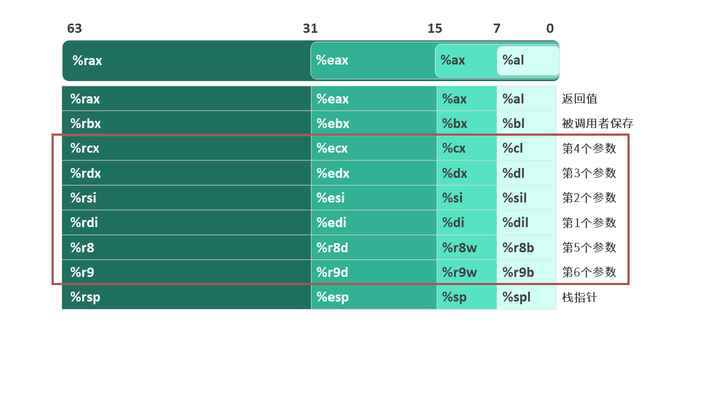
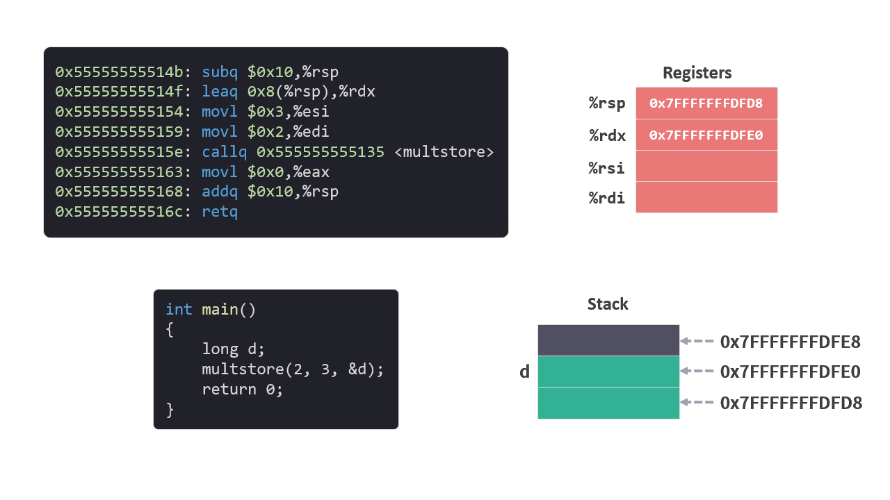

# 运行时栈 02 - 分配内存和参数准备

[上一篇文章](./运行时栈1准备.md)中指令已经存放在内存中准备执行了。

这次我们开始执行指令，并观察 Stack（堆） 的变化。

我们先从 `main` 函数开始。

```c
int main()
{
    long d;
    multstore(2, 3, &d);
    return 0;
}
```

该函数对应的指令如下：

```arm
0x0000555555555147 <main>:
    0x0000555555555147:       f3 0f 1e fa             endbr64 
    0x000055555555514b:       48 83 ec 10             subq    $0x10,%rsp
    0x000055555555514f:       48 8d 54 24 08          leaq    0x8(%rsp),%rdx
    0x0000555555555154:       be 03 00 00 00          movl    $0x3,%esi
    0x0000555555555159:       bf 02 00 00 00          movl    $0x2,%edi
    0x000055555555515e:       e8 d2 ff ff ff          callq   0x555555555135 <multstore>
    0x0000555555555163:       b8 00 00 00 00          movl    $0x0,%eax
    0x0000555555555168:       48 83 c4 10             addq    $0x10,%rsp
    0x000055555555516c:       c3                      retq   
```

前面已经提到过 `endbr64` 指令可以跳过，我们就从第二条指令开始。

### `subq    $0x10,%rsp`

执行 `subq    $0x10,%rsp` 之前，我通过 gdb 调试器确认栈指针 %rsp 具体的值为 `0x7fffffffdfe8`。

`subq    $0x10,%rsp` 指令为 main 函数在 Stack（栈）中分配了16 个字节的空间。

执行完成后，栈指针 %rsp 为 `0x7fffffffdfd8`。

<figure>
    
</figure>

### `leaq    0x8(%rsp),%rdx`

`leaq    0x8(%rsp),%rdx` 指令的意思是将 main 函数在 Stack 分配的内存中的前面 8 个字节的起始地址保存到 %rdx 中。

为什么是%rdx？%rdx 在[寄存器](./寄存器.md)中的含义是第三个参数。

<figure>
    
</figure>
    
我们可以看到，在 c 语言中，第三个参数是 `&d`, 即变量 `d` 的内存地址。

```c
    multstore(2, 3, &d);
```

因此，可以知道变量 `d` 的值就保存在 Stack 的前 8 个字节中，而 %rdx 中保存的是变量 `d` 的内存地址。

<figure>
    
</figure>

### `movl    $0x3,%esi`

`movl    $0x3,%esi` 指令是将立即数 `3` 保存到 %esi 中。

%rsi 在[寄存器](./寄存器.md)中的含义是第二个参数。

还是在这句 c 语言中，我们可以看到 `3` 是第二个参数。

```c
multstore(2, 3, &d);
```
<figure>
    
</figure>

### `movl    $0x2,%edi`

`movl    $0x2,%edi` 指令是将立即数 `2` 保存到 %esi 中。

%rdi 在[寄存器](./寄存器.md)中的含义是第一个参数。

就像在 c 语言中看到的那样，`2` 是第一个参数。

```c
multstore(2, 3, &d);
```

<figure>
    
</figure>

## 总结

前四条指令，做了3件事情：
1. 为 main 函数在 Stack（栈）中申请了 16 个字节的空间。

2. 确定了变量 `d` 在 Stack（栈）中的位置，并将地址保存到 %rdx。

3. 将 multstore 函数需要的参数，按顺序保存到相应寄存器中。

*注意：虽然申请了 16 个字节，但其实只用了前 8 个字节，多申请的 8 个字节并没有使用。

所有的这些事情都是为下一句指令准备的，看名称应该是调用 `mulstroe` 函数，接下来我们来仔细介绍一下 `callq` 指令。

```arm
callq   0x555555555135 <multstore>
```

参考：

[1] 如果想了解 `endbr64` 指令，可以访问：
https://stackoverflow.com/questions/56905811/what-does-the-endbr64-instruction-actually-do