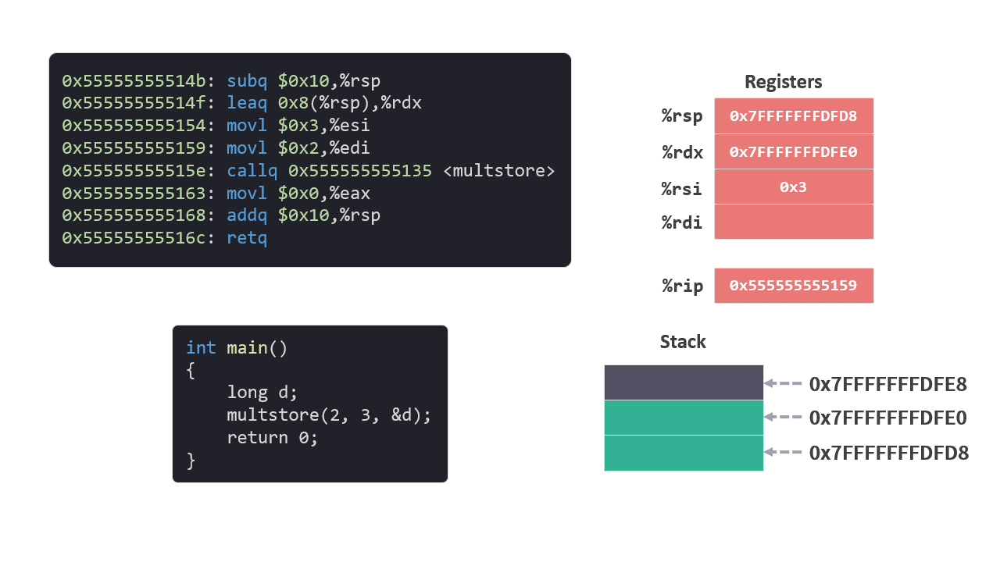

# 运行时栈 03 - 转移控制 call

[前面一篇文章](./运行时栈2分配内存.md)中，我们已经准备从 `main` 函数中调用 `multstore` 函数了。

`callq   0x555555555135 <multstore>` 执行这条指令，将会调用 `multstore` 函数。

这次我们就着重来了解一下 `call` 指令。

## 程序计数器

在开始之前，我们先来回忆一下在介绍[寄存器](./寄存器.md)的时候，我们说过一个叫**程序计数器(PC：Program Counter)**的寄存器，用 %rip 来表示。

程序计数器的作用是给出将要执行的下一条指令在内存中的地址。

比如，在执行 `0x0000555555555159` 内存地址表示的指令的时候，%rip 中地址会变成下一条指令的内存地址 `0x000055555555515e`。

<figure>
    
</figure>

## `call` 指令

`callq   0x555555555135 <multstore>` 的操作数是 `multstore` 函数指令的内存起始地址 `0x555555555135`。

同时我们还需注意，`callq   0x555555555135 <multstore>` 下面一条指令的内存地址是 `0x0000555555555163`。

```arm
0x0000555555555135 <multstore>:
    ...

0x0000555555555147 <main>:
    ...
    0x000055555555515e:       callq   0x555555555135 <multstore>
    0x0000555555555163:       movl    $0x0,%eax
    ...
```

`call` 指令会完成两步操作：
1. 在 Stack（栈）中扩展 8 个字节，用于存放 `call` 下面一条指令的内存地址，作为返回地址。

2. 将程序计数器 %rip 设置成操作数中的值。

在我们这个例子中:

1. 首先会扩展 Stack（栈），栈指针%rsp 变为 `0x7fffffffdfd0`，并在该地址保存 `call` 下面一条指令 `movl    $0x0,%eax` 的地址 `0x555555555163`。

2. 将操作数 `0x555555555135` 写入程序计数器 %rip。


<figure>
    
</figure>

这样下一步将会执行 `0x555555555135` 地址上的指令，也就是 `multstore` 函数。

`main` 函数会暂停，直到 `multstore` 函数返回。

参考：

[1] `main` 函数和 `multstore` 函数

```c
void multstore(long x, long y, long *dest)
{
    long t = mult2(x, y);
    *dest = t;
}

int main()
{
    long d;
    multstore(2, 3, &d);
    return 0;
}
```

该函数对于内存中的指令如下。

```arm
0x0000555555555135 <multstore>:
    0x0000555555555135:       f3 0f 1e fa             endbr64 
    0x0000555555555139:       53                      pushq   %rbx
    0x000055555555513a:       48 89 d3                movq    %rdx,%rbx
    0x000055555555513d:       e8 e7 ff ff ff          callq   0x555555555129 <mult2>
    0x0000555555555142:       48 89 03                movq    %rax,(%rbx)
    0x0000555555555145:       5b                      popq    %rbx
    0x0000555555555146:       c3                      retq   

0x0000555555555147 <main>:
    0x0000555555555147:       f3 0f 1e fa             endbr64 
    0x000055555555514b:       48 83 ec 10             subq    $0x10,%rsp
    0x000055555555514f:       48 8d 54 24 08          leaq    0x8(%rsp),%rdx
    0x0000555555555154:       be 03 00 00 00          movl    $0x3,%esi
    0x0000555555555159:       bf 02 00 00 00          movl    $0x2,%edi
    0x000055555555515e:       e8 d2 ff ff ff          callq   0x555555555135 <multstore>
    0x0000555555555163:       b8 00 00 00 00          movl    $0x0,%eax
    0x0000555555555168:       48 83 c4 10             addq    $0x10,%rsp
    0x000055555555516c:       c3                      retq   
```