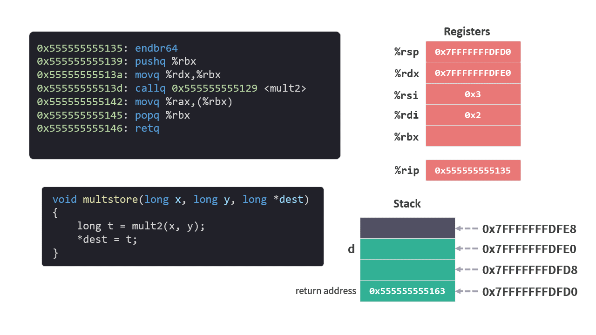

# 运行时栈 04 - 被保存的寄存器

[上一篇文章](./运行时栈3转移控制.md)中，执行完 `call` 指令后，程序计数器（PC：Program Counter）中下一条指令就是被调用函数 `multstore` 中的第一条指令。

并且，在 `call` 指令之前就已经在寄存器中准备好了 `multstore` 函数所需要的参数。

<figure>
    
</figure>

## 被保存的寄存器

```c
void multstore(long x, long y, long *dest)
{
    long t = mult2(x, y);
    *dest = t;
}
```

```arm
0x0000555555555135 <multstore>:
    0x0000555555555135:       f3 0f 1e fa             endbr64 
    0x0000555555555139:       53                      pushq   %rbx
    0x000055555555513a:       48 89 d3                movq    %rdx,%rbx
    0x000055555555513d:       e8 e7 ff ff ff          callq   0x555555555129 <mult2>
    0x0000555555555142:       48 89 03                movq    %rax,(%rbx)
    0x0000555555555145:       5b                      popq    %rbx
    0x0000555555555146:       c3                      retq   
```


`multstore` 中第一条有效的指令是 `pushq   %rbx`，其中操作数 %rbx 的作用是**被调用者保存**。意思就是说接下来的指令会用到 %rbx，所以要先将其中的值保存到 Stack（栈）上，用完之后再使用 `popq    %rbx`指令将其从 Stack（栈）中复制回 %rbx，从而恢复原样。

<figure>
    
</figure>

所以，这里 %rbx 中原来的是什么并不重要，我们只需要先将其复制到 Stack（栈）中即可。

<figure>
    
</figure>

我们知道 `%rdx` 中保存的是 `main` 函数中变量 `d` 的地址。`movq    %rdx,%rbx` 将 `%rdx` 复制到 `%rbx`，接下来的指令中就不需要直接使用 `%rdx`。

这样的好处是，不需要改变通过参数传过来的地址。如果传过来的地址是一个数组的起始地址，我们既可以在 `%rdx` 保持数组的起始地址不变，同时还可以通过直接修改 `%rbx` 来计算偏移地址。

当然，在我们这个简单的示例中这个操作看不出有什么优势。

<figure>
    
</figure>

## 准备参数 

接下去就要调用 `mult2` 函数了。在调用之前，需要在寄存器中准备好 `mult2` 函数所需要的参数。

```c
mult2(x, y);
```

因为参数 x 和 y 目前仍然保存在 %rdi 和 %rsi 中，所以不需要额外的指令来处理参数。

然而，如果我们将 x 和 y 的顺序换一下

```c
void multstore(long x, long y, long *dest)
{
    long t = mult2(y, x); //chang the position of x and y.
    *dest = t;
}
```

这时候我们就可以从指令中看到变化：

```arm
 1 pushq	%rbx
*2 movq	%rdi, %rax
*3 movq	%rsi, %rdi
 4 movq	%rdx, %rbx
*5 movq	%rax, %rsi
 6 call	mult2
 7 movq	%rax, (%rbx)
 8 popq	%rbx
```
第 2，3， 5 行指令将 `%rdi` 和 `%rsi` 中的值做了调换。

注意：使用了 %rax 作为调换的中转，因为 %rax 不是被调用者保存的寄存器，所以不需要先 Push。%rax 的作用是用来保存返回值，在执行 Call 之后，如果函数有返回值， %rax 会自动改变。

## 再次调用 call 指令

`callq   0x555555555129 <mult2>` 的执行方式跟[上一篇文章](./运行时栈3转移控制.md)介绍的一样。

首先是在 Stack（栈）上申请空间，将 `call` 下面一条指令`movq    %rax,(%rbx)` 的地址 `0x555555555142` 存入 Stack（栈）中，

然后将程序计数器中的值修改为 call 中的操作数 `0x555555555129`。

<figure>
    
</figure>

接下来我们就可以进入最后一个函数 `mult2` 了。

```c
long mult2(long a, long b)
{
    long s = a * b;
    return s;
}
```

## 总结

这篇文章，我们进入到了 `multstore` 函数，第一条指令就是先将 `%rbx` 中的值保存到 Stack （栈）上，其目的是为了在之后的指令中可以自由使用 `%rbx` 寄存器，在 `multstore` 函数结束时，再将 Stack （栈）上的值写入 `%rbx` 中使其恢复原样。这类的寄存器被称为**被调用者保存的寄存器**。

<figure>
    
</figure>
