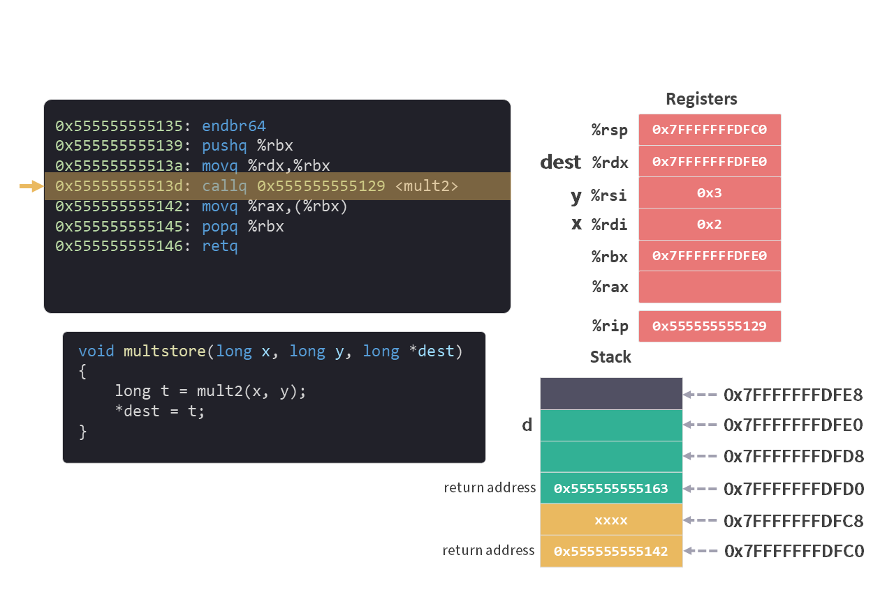
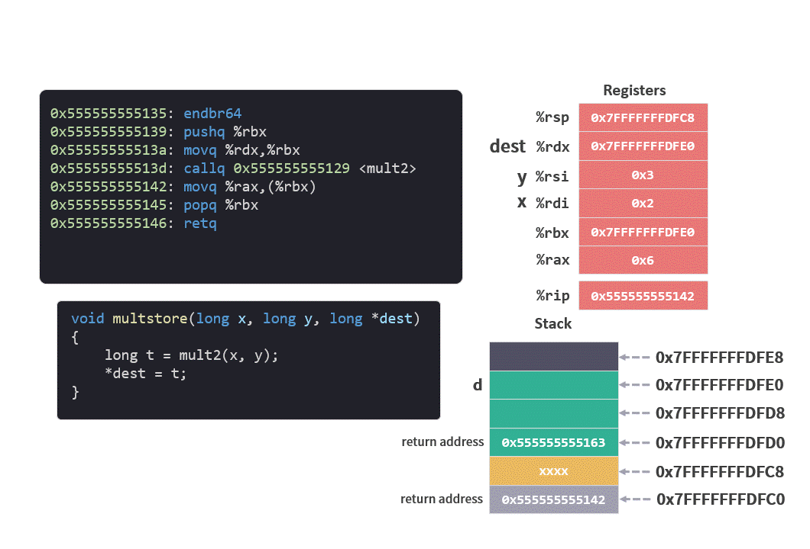

# 运行时栈 05 - 返回值 和 ret 指令

经过了两次 `call` 的转移，我们来到了最后一个函数 `mult2`。

```c
long mult2(long a, long b)
{
    long s = a * b;
    return s;
}
```

```arm
0x0000555555555129 <mult2>:
    0x0000555555555129:       endbr64 
    0x000055555555512d:       movq    %rdi,%rax
    0x0000555555555130:       imulq   %rsi,%rax
    0x0000555555555134:       retq  
```

## 计算返回值

`mult2` 函数的作用，是将两个参数相乘，并返回相乘的结果。

%rax 寄存器的作用就是保存返回值。

<figure>
    
</figure>

```arm
movq    %rdi,%rax
imulq   %rsi,%rax
```
我们看到，第一条指令 `movq    %rdi,%rax`，将第一个参数 `a` 复制到返回值 %rax 中。

第二条指令 `imulq   %rsi,%rax`，将第二个参数 `b` 与刚刚复制到 %rax 中的第一个参数 `a` 相乘，并将结果也保存 %rax 中。

*imulq 指令的具体内容可以参考[指令集6二元操作](./指令集6二元操作.md)。

<figure>
    
</figure>

## ret 指令

返回值在 %rax 中保存好之后，就可以执行最后一条指令 `retq` 。

`ret` 指令和 `call` 指令是一对。 `call` 指令的作用是调用函数，`ret` 指令的作用是返回之前的函数。

在[ `call` 指令](./运行时栈3转移控制.md)执行时，它会将一个返回地址压入栈顶。

`ret` 指令正好相反，它会做两个操作：

1. 从栈顶弹出返回地址。

2. 将返回地址写入程序计数器（PC %rip），保证下一条执行的指令是返回地址上的指令。

在我们这个例子中，因为涉及到两个函数，我们将 `mult2` 函数和 `multstore` 函数合在一起看一下。

```c
long mult2(long a, long b)
{
    long s = a * b;
    return s;
}
```

```arm
0x0000555555555129 <mult2>:
    0x0000555555555129:       endbr64 
    0x000055555555512d:       movq    %rdi,%rax
    0x0000555555555130:       imulq   %rsi,%rax
*   0x0000555555555134:       retq  

0x0000555555555135 <multstore>:
    0x0000555555555135:       endbr64 
    0x0000555555555139:       pushq   %rbx
    0x000055555555513a:       movq    %rdx,%rbx
    0x000055555555513d:       callq   0x555555555129 <mult2>
*   0x0000555555555142:       movq    %rax,(%rbx)
    0x0000555555555145:       popq    %rbx
    0x0000555555555146:       retq   
```

1. 首先从 Stack 中弹出栈顶的 8 个字节 `0x0000555555555142`。这个地址也是 `mult2` 函数要返回到 `multstore` 函数中的位置。即 `multstore` 函数中 `callq` 指令下面一条指令 `movq    %rax,(%rbx)` 的地址。

2. 将弹出的地址 `0x0000555555555142` 写入程序计数器（PC %rip）中。

<figure>
    
</figure>

## 返回 `multstore` 函数

`ret` 指令执行之后，将会返回 `multstore` 函数。

在 `multstore` 函数中的 `callq   0x555555555129 <mult2>` 指令执行之后，Stack 和 寄存器的情况如下：

<figure>
    
</figure>

在执行 `movq    %rax,(%rbx)` 之前，Stack 和 寄存器的情况如下：

<figure>
    
</figure>

从中可以看到 `mult2` 函数所有指令执行完成后所带来的变化：
1. 返回值 `0x6` 保存在 `%rax` 中。
2. 栈顶指针为 `0x7FFFFFFFDFC8`，返回地址已经从 Stack（栈）中弹出。
3. 程序计数器为 `0x555555555142`，即指令 `movq    %rax,(%rbx)` 的地址。

```c
void multstore(long x, long y, long *dest)
{
    long t = mult2(x, y);
    *dest = t;
}
```
```arm
0x0000555555555135 <multstore>:
    0x0000555555555135:       endbr64 
    0x0000555555555139:       pushq   %rbx
    0x000055555555513a:       movq    %rdx,%rbx
    0x000055555555513d:       callq   0x555555555129 <mult2>
*   0x0000555555555142:       movq    %rax,(%rbx)
    0x0000555555555145:       popq    %rbx
    0x0000555555555146:       retq   
```

## 继续执行 `multstore` 函数

接下来继续执行 `multstore` 函数剩余的指令：

```arm
movq    %rax,(%rbx)
popq    %rbx
...
```

其中 `movq    %rax,(%rbx)` 将返回值 `%rax` 复制到 `%rbx`所保存的地址指示的内存中。这一步操作其实是实现了 c 语言中的语句 `*dest = t;`。

`popq    %rbx` 用于恢复[被调用者保存的寄存器](./运行时栈4被保存的寄存器.md)，将 %rbx 中原来的值从 Stack 中弹出返回给 `%rbx`。

<figure>
    
</figure>

## 再次执行 `ret` 指令

`multstore` 函数最后条指令：

```arm
retq
```

跟之前的 `ret` 指令一样，首先从 Stack 中弹出栈顶的返回地址 `0x555555555163` ，将其写入程序计数器（PC %rip）中。

<figure>
    
</figure>

## 返回 `main` 函数

