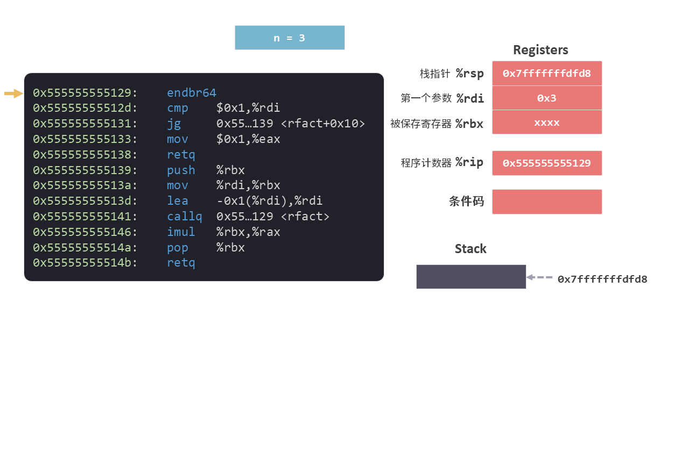
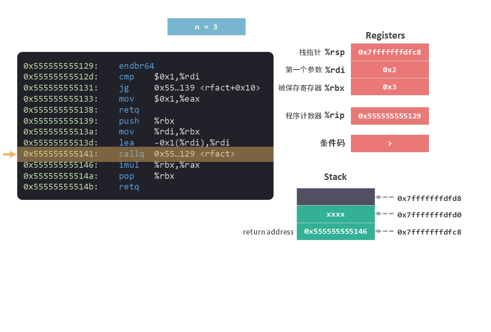
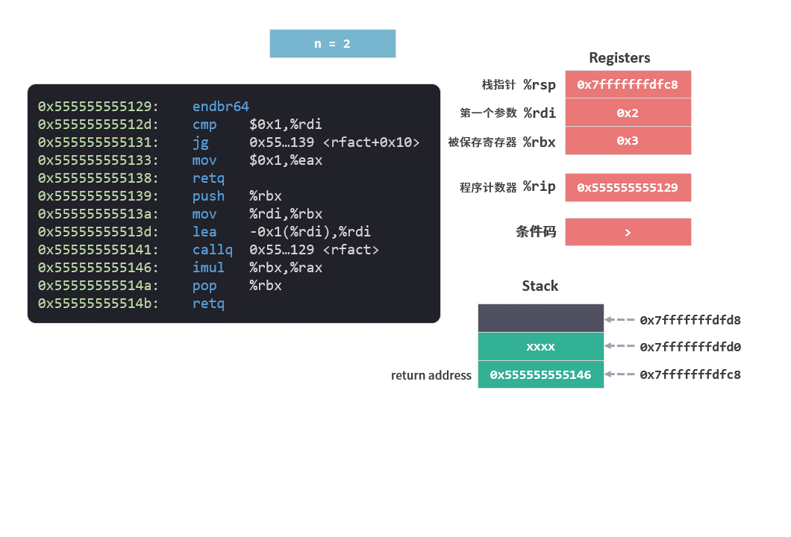
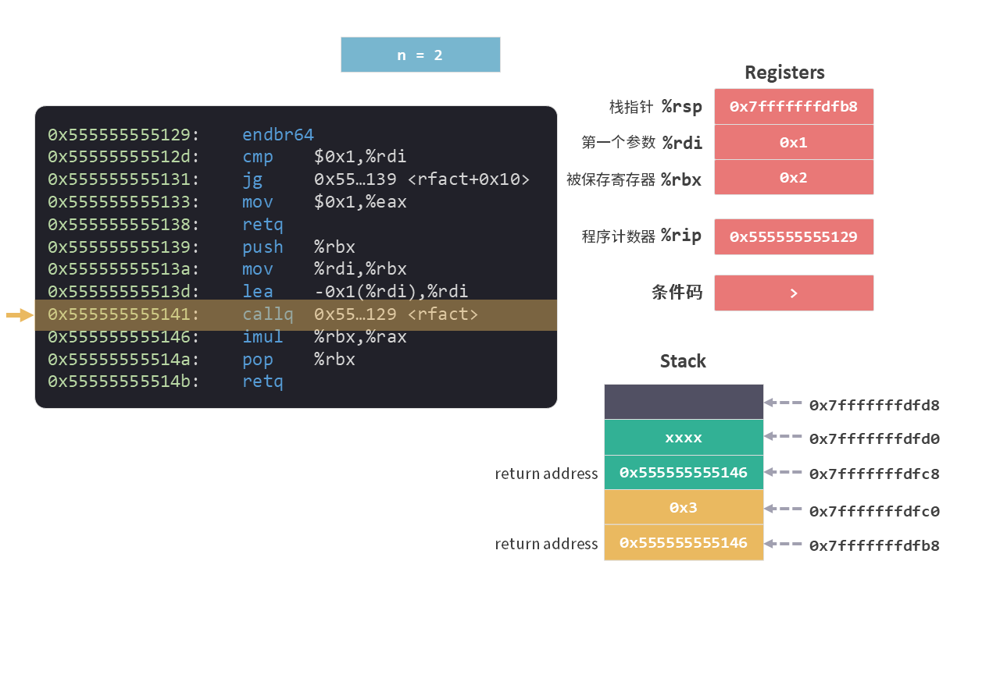
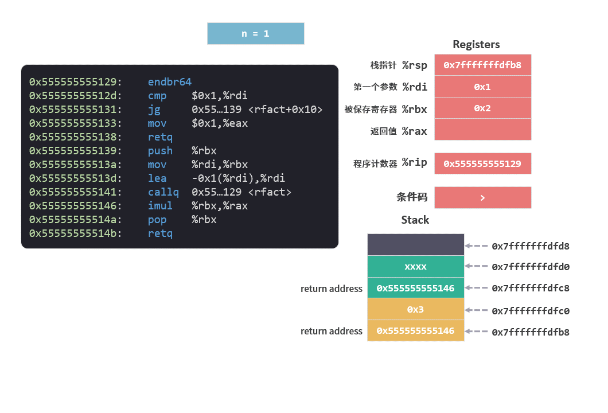
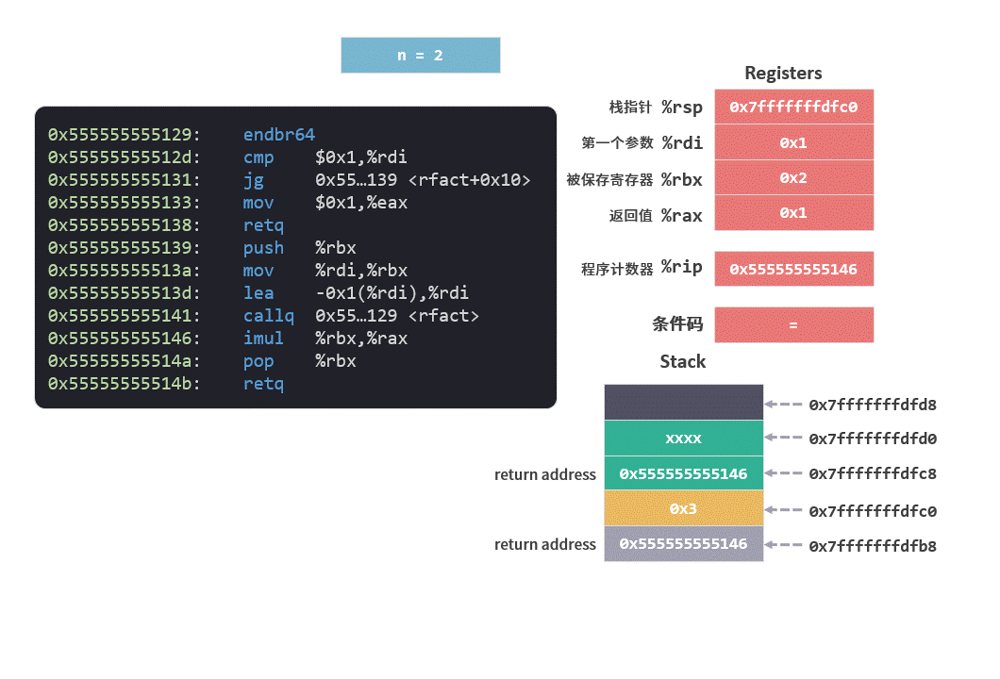

# 递归（recursion）

我们在之前的文章中详细介绍了[栈帧（Stack Frame）](./栈帧的布局.md)的概念，通过栈帧使得每次函数调用都有了他们自己的私有信息存储空间，而这一切都是递归（recursion）实现的基础。

## 什么是递归

首先通过一段示例来回忆一下递归的基本含义。

下面这段 c 语言代码，主要是用来求阶乘的。比如 `3！` 就等于 `3 * 2 * 1`，我们可看出来 `n! = n * (n-1)！`。

```c
long rfact(long n)
{
    long result;

    if(n <= 1)
        result = 1;
    else
        result = n * rfact(n-1);
    
    return result;
}

int main()
{
    long i = rfact(3);
    return 0;
}
```

代码中 `rfact` 就实现了 `n！` 的求解，其中 `result = n * rfact(n-1);` 的意思就是 `n! = n * (n-1)！`。这句代码中我们可以看到 `rfact` 函数内部调用了自己，这就是**递归**——函数可以调用自身。

那这段代码是如何运行的，我们通过观察 Stack（栈）和寄存器的变化来详细了解一下。

## 递归的运行

上面的 `rfact` 函数编译后的指令集如下：

```arm
0x555555555129 <rfact>:
    0x555555555129:       f3 0f 1e fa         endbr64 
    0x55555555512d:       48 83 ff 01         cmp    $0x1,%rdi
    0x555555555131:       7f 06               jg     0x555555555139 <rfact+0x10>
    0x555555555133:       b8 01 00 00 00      mov    $0x1,%eax
    0x555555555138:       c3                  retq   
    0x555555555139:       53                  push   %rbx
    0x55555555513a:       48 89 fb            mov    %rdi,%rbx
    0x55555555513d:       48 8d 7f ff         lea    -0x1(%rdi),%rdi
    0x555555555141:       e8 e3 ff ff ff      callq  1129 <rfact>
    0x555555555146:       48 0f af c3         imul   %rbx,%rax
    0x55555555514a:       5b                  pop    %rbx
    0x55555555514b:       c3                  retq   
```

### 1. `cmp` 和 `jp` 指令

其中有两句指令是我们之前没有介绍过的：

```arm
cmp    $0x1,%rdi
jg     0x555555555139 <rfact+0x10>
```

这两条指令我们后续会相信介绍，现在先来初略了解一下。

1. `cmp    $0x1,%rdi` 指令会将两个操作数进行比较 `%rdi - $0x1`，并将比较的结果保存到条件码中。

2. `jg     0x555555555139 <rfact+0x10>` 指令(jg：Jump Greater)的意思是如果条件码中的比较结果是 `大于 0（即 %rdi > $0x1）` 就跳转至 `0x555555555139`所指向的指令，否则就继续执行下面一条指令。

从含义上我们可以判断这两条指令对应的 c 语言代码是：

```c
if(n <= 1)
```

指令中的处理方式有些变化，c 语言的判断是 `n <= 1` ，而指令中的判断是 `n > 1`。虽然指令的判断相反，但整体的逻辑还是是一致的。

```
if (n > 1) 
    jump to `0x555555555139` instruction
else 
    next instruction. 
```

好了，简单了解这两句的指令之后，我们就可以从头到尾地看看这段指令是如何运行的。

### 2. 第一次调用 `n = 3`

`main` 函数传递给 `rfact` 的参数是数值 `3`，所以第一次调用 `rfact` 函数时 `n=3`。 

指令开始执行之前，我们先来看看寄存器的情况：参数保存在 %rdi 中，程序计数器指向第一条指令。

<figure>
    
</figure>

```arm
1 endbr64 
2 cmp    $0x1,%rdi
3 jg     0x555555555139 <rfact+0x10>
4 mov    $0x1,%eax
5 retq   
6 push   %rbx
7 mov    %rdi,%rbx
8 lea    -0x1(%rdi),%rdi
9 callq  0x555555555129 <rfact>
...
```

接下来的指令执行过程中，会通过 `cmp` 和 `jg` 指令的判断跳过第 4 和 5 行指令。

我们来看看一步一步执行指令的过程。

<figure>
    
</figure>

当 `callq` 指令执行完成之后，Stack（栈）和寄存器的情况如下。
我们可以看到参数 %rdi ，程序计数器 %rip 以及栈中的返回地址都已经准备再次调用 `rfact` 函数自身。

<figure>
    
</figure>

另外，被保存寄存器 %rbx 中保存了变量 `n` 的值。从[运行时栈4被保存的寄存器](./运行时栈4被保存的寄存器.md)中的被保存寄存器的解释中我们可以知道，在 `n=3` 这个函数调用过程中，因为变量 `n` 的值保存 %rbx 中，所以不管自身被调用多少次，在函数返回时变量会保持不变。

### 3. 第二次调用 `n = 2`

`n = 2` 时的函数调用有自己的栈帧，其中保存了 %rbx 值，确保了返回 `n = 3` 函数调用时，被保存寄存器 %rbx 和调用`n = 2` 函数之前是一样的。

而在 `n = 2` 函数调用期间 变量 `n` 的值也一直保存在 %rbx 中。

<figure>
    
</figure>

当 `callq` 指令执行完成之后，Stack（栈）和寄存器的情况如下。

<figure>
    
</figure>

### 4. 第三次调用 `n = 1`

当 `n = 1` 时，会通过 `cmp` 和 `jg` 指令的判断直接执行第 4 和 5 行指令。

```arm
1 endbr64 
2 cmp    $0x1,%rdi
3 jg     0x555555555139 <rfact+0x10>
4 mov    $0x1,%eax
5 retq   
```

<figure>
    
</figure>

指令将返回值设为 `1` 后，将返回 `n=2` 的函数。

### 5. 返回

返回 `n=2` 的函数后会执行剩下的指令：

```arm
imul   %rbx,%rax
pop    %rbx
retq   
```
将从 `n=1` 函数返回的值 `1` 与 `n=2` 函数中的变量 `n`(值为 `2`)相乘，并将相乘的结果 `2` 设置为 `n=2` 函数的返回值。

在返回 `n=3` 的函数之前，我们会将 %rbx 恢复为 `3`。

<figure>
    
</figure>

之后会返回 `n=3` 的函数，执行的指令与上面相同。

将从 `n=2` 函数返回的值 `2` 与 `n=3` 函数中的变量 `n`(值为 `3`)相乘，并将乘积 `6` 设置为 `n=3` 函数的返回值。

<figure>
    
</figure>

至此，整个递归过程运行结束。

# 编程思维

递归之所以让人不太容易理解，是因为它跟人类的正常思维不太一样，人类的正向思维是从小到大，由易到难，从局部到整体。

比如求 5 的阶乘（`5！`），人们习惯从小到大一个一个乘起来，即 `5！= 1 * 2 * 3 * 4 * 5`。

在递归中会将过程倒过来，要算 `5!` 先假定 `4!` 是已知的，然后再乘以 5 就可以了。那么 `4! `阶乘怎么算？同样，假定 `3!` 已知……以此类推，直到 `1! `时，我们知道它等于 1 ，从这就不再往下扩展，而是倒回去推出所有的结果，从 `1!` ,` 2!` 直到推回 `5！`.

递归就很不直观的逆向思维，它从大到小，从整体到局部，属于计算机特有的思维方式。

它必须具备两个条件：
1. 首先需要确定好结束条件，
2. 其次，在每个问题的形式上都相同，只要解决当前问题就能解决整个问题。

有些问题上，递归这种逆向思维会让问题变得非常简单。比如八皇后问题，如果从小到大，一步一步推导问题复杂的为呈现指数级别的上升，但是递归只需要知道如何拆解问题即可，计算机可以帮忙快速的处理出现的几万种情况。

但是也需要注意递归的深度，从上面的运行情况来看，每一次递归都需要消耗 Stack 的空间，如果超过了 Stack 的大小 8 M， 就会出现栈溢出的情况。

总的来说，递归是一个程序员必须掌握的计算机思维。

